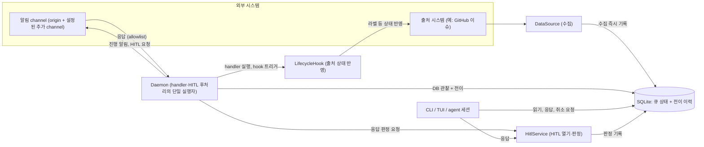
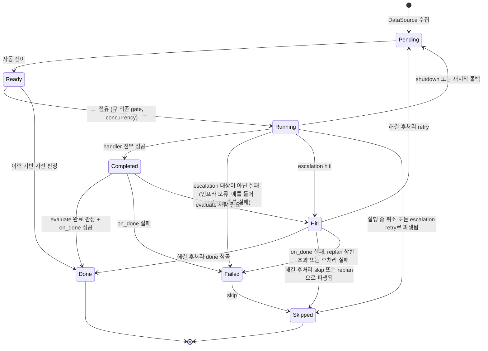
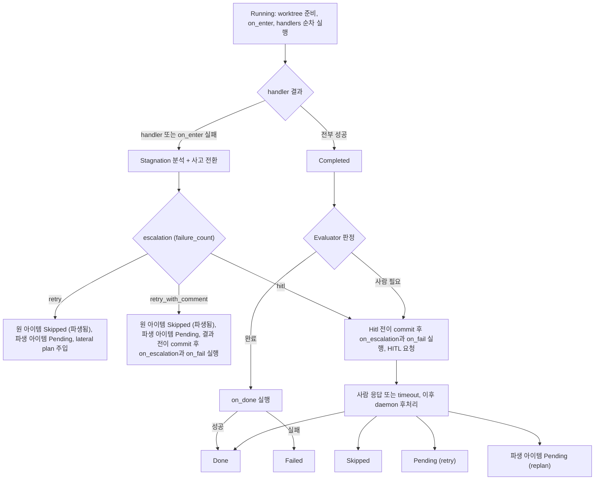
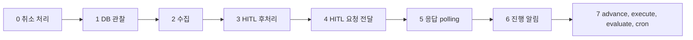
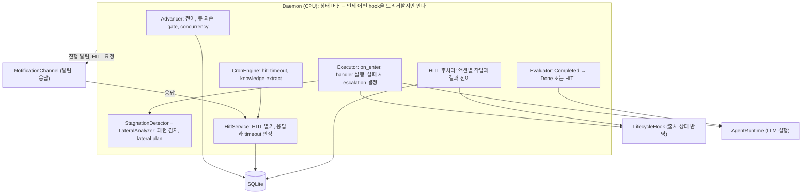

# Belt Spec — Design

---

## 목표

Daemon을 **상태 머신 + 상태 전이를 트리거하는 CPU**로 단순화한다.
handler(prompt/script)가 작업을 수행하고, LifecycleHook이 상태 변화에 반응한다.
실패 시 **패턴을 감지하고 사고를 전환**하여 같은 실수를 반복하지 않는다.

```
Daemon이 아는 것       = 큐 상태 머신 + 언제 어떤 hook을 트리거할지
handler가 실행         = yaml에 정의된 prompt/script (작업 자체)
LifecycleHook이 반응   = 상태 전이 시 출처 시스템에 반영 (DataSource별 구현)
NotificationChannel    = 진행 알림과 HITL 요청을 사람에게 보내고 응답을 받는다
evaluate가 판단        = handler 결과가 충분한지, 사람이 봐야 하는지 (Done or HITL)
stagnation이 감지      = 실패 패턴을 분석하고, 사고를 전환하여 다르게 재시도
```

---

## Actor

| Actor | 역할 | 상호작용 |
|-------|------|---------|
| **운영자** | Belt를 설치·설정·모니터링하는 사람 | workspace.yaml 작성, `belt start`, TUI dashboard, HITL 응답, 실행 중 아이템 취소 |
| **이슈 작성자** | GitHub에 이슈를 등록하는 개발자/PM | 이슈 등록 + belt 라벨 부착 → Belt가 자동 수집 |
| **Belt Daemon** | 자율 실행 프로세스 | 수집 → 분류 → 전이 → 실행 → 반영 루프, handler와 HITL 후처리의 단일 실행자 |
| **LLM Agent** | handler prompt를 실행하는 AI (Claude, Gemini, Codex) | Daemon이 subprocess로 호출, worktree 안에서 실행 |
| **GitHub** | 이슈/PR 소스 시스템 | 이슈 조회, on_done script가 PR 생성, 코멘트로 HITL 응답 가능 (respond.allow 설정 시) |
| **응답자** | HITL 요청에 응답하는 사람 | dashboard, CLI, agent 세션, 설정된 channel(allowlist)에서 응답 |
| **Cron Engine** | 주기 작업 스케줄러 | hitl-timeout, knowledge-extract, log-cleanup 등 내부 주기 실행 |
| **Reviewer** | PR을 리뷰하는 사람 또는 Bot | changes_requested → DataSource가 감지 → 파이프라인 재진입 |

---

## 외부 시스템 연동

Belt는 외부 시스템을 trait으로 추상화한다. 코어는 구체적 시스템을 모른다.

| 경계 | 추상화 | 사용 지점 |
|------|--------|----------|
| **이슈 소스** | `DataSource` | 수집, 컨텍스트 조회 — 읽기 |
| **상태 반응** | `LifecycleHook` | on_enter/on_done/on_fail/on_escalation/on_hitl_opened/on_hitl_resolved — 출처 시스템에 쓰기 |
| **사람 알림·응답** | `NotificationChannel` | 진행 알림과 HITL 요청 발송, 응답 수신 — 사람과의 대화 |
| **LLM 실행** | `AgentRuntime` | handler prompt, evaluate, lateral plan |
| **상태 저장** | SQLite | 큐 상태와 전이 이력의 단일 권위 |
| **코드 격리** | worktree | worktree 생성/정리 |

> **연동 원칙**: 코어는 외부 시스템의 프로토콜/인증을 모른다. 각 구현이 자기 방식으로 연동한다. 새 외부 시스템 추가 = DataSource + LifecycleHook (+ 필요 시 NotificationChannel) 구현 추가, 코어 변경 0. 구체적인 연동 방식은 각 concern 문서([DataSource](./concerns/datasource.md), [LifecycleHook](./concerns/lifecycle-hook.md), [NotificationChannel](./concerns/notification.md), [AgentRuntime](./concerns/agent-runtime.md))에서 정의한다.

---

## 전체 구조



> 사람이 보는 면(CLI/TUI)은 DB를 읽어 표시한다. 알림 channel이 없어도 dashboard에서 모든 진행 상황과 HITL 요청을 보고 응답할 수 있다.

---

## 설계 철학

### 1. 컨베이어 벨트

아이템은 한 방향으로 흐른다. 되돌아가지 않는다. 다시 시도할 일은 기존 아이템을 되돌리지 않고 새 아이템(파생 아이템)으로 벨트에 태운다. 경합이나 처리 중 변경 요청은 오류가 아니라 거절 값(`busy`, `conflict`, `invalid_action`)으로 돌아온다.

### 2. Workspace = 1 Repo

workspace는 하나의 외부 레포와 1:1로 대응한다. GitHub 외 Jira, Slack 등도 지원하기 위한 추상화 (v5~v6는 GitHub에 집중).

### 3. DataSource가 수집을, LifecycleHook이 반응을 소유

DataSource는 외부 시스템에서 아이템을 읽어오고(수집/컨텍스트), LifecycleHook은 상태 변화에 대해 출처 시스템에 쓴다(반응). 같은 외부 시스템이라도 읽기와 쓰기의 관심사가 분리된다. 상세: [DataSource](./concerns/datasource.md), [LifecycleHook](./concerns/lifecycle-hook.md)

### 4. Daemon = CPU

상태 머신을 틱마다 순회하며 전이를 결정하고, 해당 workspace의 LifecycleHook을 트리거한다. Daemon은 hook이 실제로 무엇을 하는지 모른다 — 성공/실패 결과만 받는다. 내부는 Advancer·Executor·HitlService·StagnationDetector·Evaluator 모듈로 분리. 상세: [Daemon](./concerns/daemon.md)

### 5. handler는 작업, hook은 반응

handler(prompt/script)는 yaml에 정의된 작업 자체(분석, 구현, 리뷰). LifecycleHook은 상태 전이 시 출처 시스템 반응(PR 생성, 라벨 변경). Daemon은 handler를 실행하고, 전이가 발생하면 hook을 트리거한다.

### 6. 코드 작업은 항상 worktree

handler prompt는 항상 git worktree 안에서 실행. worktree 생성/정리는 인프라 레이어 담당.

### 7. Progressive Evaluation — 판정은 비용 순으로

Daemon tick은 execute 이후 evaluate 순서로 동작한다. evaluate는 방금 execute에서 Completed된 아이템과 이전 tick에서 Completed된 아이템을 함께 판정하며, 여기서 해제한 concurrency slot은 다음 tick의 advance가 사용한다. 판정 자체는 비용이 낮은 검증(Mechanical)부터 단계적으로 수행하여, 낮은 단계로 판정 가능하면 이후 단계(Semantic 등)를 생략한다. 상세: [Evaluator](./concerns/evaluator.md)

### 8. 아이템 계보 (Lineage)

같은 외부 엔티티에서 파생된 아이템은 `source_id`로 연결된다. escalation retry와 replan은 원 아이템을 끝내고 새 work_id의 파생 아이템을 만들어 파생 원본으로 잇는다. 아이템의 사건은 전이 이력에, 시도 결과는 시도 이력에 append-only로 쌓인다.

### 9. 환경변수 최소화

`WORK_ID` + `WORKTREE` 2개만 주입. 나머지는 `belt context $WORK_ID --json`으로 조회. 상세: [DataSource](./concerns/datasource.md)

### 10. Concurrency 제어

workspace.concurrency (workspace yaml 루트) + daemon.max_concurrent 2단계. evaluate LLM 호출도 slot 소비. 상세: [Daemon](./concerns/daemon.md)

### 11. Cron은 주기 작업

HITL timeout 만료, 지식 추출, 정리 같은 주기 작업을 실행한다. 상세: [Cron 엔진](./concerns/cron-engine.md)

### 12. SQLite가 단일 권위, 모든 전이는 이력

큐 상태는 SQLite 한 곳이 권위이고 모든 전이는 이력으로 남는다. daemon의 메모리는 작업용 사본일 뿐 DB와 다르면 DB를 따른다. 모든 phase 전이는 하나의 전이 계약을 거치고, 결과는 `applied`·`busy`·`conflict`·`invalid_action` 값으로 돌아온다. 상세: [QueuePhase 상태 머신](./concerns/queue-state-machine.md)

### 13. 처리 중인 아이템은 그 처리의 결과로만 바뀐다

handler가 실행 중이거나 HITL 해결 후처리가 진행 중인 아이템은 처리 소유자(daemon)만 바꾼다. 다른 변경 요청은 `busy`로 거절된다. 유일한 예외는 **실행 중 취소**다. 취소는 전이 요청이 아니라 취소 요청으로 접수되고, daemon이 handler를 종료한 뒤 Skipped로 바꾼다. 상세: [QueuePhase 상태 머신](./concerns/queue-state-machine.md#처리-중-잠금)

### 14. 알림과 HITL은 channel과 무관하다

진행 알림과 HITL 요청은 dashboard에 항상 표시되고, 설정된 channel에 추가로 보낸다. HITL 응답은 CLI, TUI, 외부 channel 어디서 오든 같은 경합에 참여한다. **첫 확정 응답이 이기고**, 늦은 응답은 반영하지 않고 "이미 처리됨"으로 회신한다. 상세: [NotificationChannel](./concerns/notification.md)

### 15. Stagnation Detection + Lateral Thinking — 실패하면 다르게 시도

실패 횟수만으로는 "같은 실수 반복"과 "다른 시도 실패"를 구분할 수 없다. 정체 감지는 동일 출력이 반복되는 패턴(SPINNING)과 두 출력을 교대로 반복하는 패턴(OSCILLATION)을 감지한다 — 유사도 판정 기준과 임계값은 현재 고정값이며 설정으로 노출되지 않는다. 패턴 감지 시 내장 페르소나(Lateral Thinking)가 접근법을 전환하여 재시도하며, 모든 retry에 lateral plan이 자동 주입되는 것이 기본 동작이다. 상세: [Stagnation Detection](./concerns/stagnation.md)

### Agent는 대화형 에이전트

`belt agent` / `/agent` 세션. 자연어로 큐 조회, HITL 응답, cron 관리. 상세: [Agent](./concerns/agent-workspace.md)

---

## 전체 상태 흐름



> 위 다이어그램은 큰그림을 위한 요약이다. 허용 전이의 전체 집합은 [QueuePhase 상태 머신](./concerns/queue-state-machine.md)을 따른다.

> Running과 "해결됨 · 처리 중"인 Hitl은 **처리 중** 구간이다. 이 구간의 아이템은 daemon만 바꾸고, 외부 변경 요청은 `busy`로 거절된다(실행 중 취소 제외). 허용 전이의 정의와 worktree 생명주기는 [QueuePhase 상태 머신](./concerns/queue-state-machine.md)이 소유한다.

### Running 이후의 분기



### Tick 순서



> 정확한 단계 정의는 [Daemon](./concerns/daemon.md#실행-루프)을 따른다. 취소 요청은 깨움 신호를 받으면 tick을 기다리지 않고 0번 단계를 즉시 실행한다.
>
> **slot 해제와 확보는 tick 경계를 넘어 순환한다**: advance는 이전 tick의 evaluate가 해제한 slot으로 아이템을 Running에 올린다.

### 상태별 소유 모듈

| Phase | 소유 모듈 | 핵심 동작 | Hook 트리거 |
|-------|----------|----------|------------|
| Pending | Advancer | — | — |
| Ready | Advancer | queue dependency gate + concurrency check | — |
| Running (처리 중) | Executor | worktree + handlers (lateral plan 주입) | on_enter |
| Running → 실패 | StagnationDetector + LateralAnalyzer | 유사도 분석 → 사고 전환 → escalation | on_escalation + on_fail |
| Completed | Evaluator | Progressive Pipeline: Mechanical → Semantic → (Consensus) | — |
| Done | — | worktree 정리 | on_done |
| Hitl (open) | HitlService | 응답 대기 / timeout 만료 판정 | on_hitl_opened |
| Hitl (해결됨, 처리 중) | Daemon 후처리 | 액션별 후처리와 결과 전이 | on_done, on_hitl_resolved |
| Failed | — | on_done 실패, 인프라 오류, 후처리 실패 | — |
| Skipped | — | terminal | — |

---

## Daemon 내부 구조



> Daemon은 hook과 channel이 실제로 무엇을 하는지 모른다. 트리거만 하고 실행 책임은 각 구현이 가진다. 모듈별 상세는 [Daemon](./concerns/daemon.md)이 정의한다.

---

## Stagnation — 정체 감지

정체 감지는 동일 (source_id, state)에서 과거 실패 error와 현재 error를 비교해, 완전 일치·토큰 중복도·압축 유사도의 가중 합성 기준으로 동일 출력 반복(SPINNING)과 교대 반복(OSCILLATION)을 판정한다. 그 외 패턴 감지·유사도 알고리즘 조합은 코어 변경 없이 추가할 수 있는 확장점이다.

상세: [Stagnation Detection](./concerns/stagnation.md)

---

## 관심사 분리

| 레이어 | 책임 | 토큰 |
|--------|------|------|
| Daemon | CPU — DB 관찰 + handler·HITL 후처리의 단일 실행자 + hook 트리거 + cron 스케줄링 | 0 |
| Advancer | Pending→Ready→Running 전이, 큐 의존 gate | 0 |
| Executor | handler 실행, escalation 결정, hook 트리거 | handler별 |
| StagnationDetector | 정체 패턴(SPINNING, OSCILLATION) 감지 | 0 |
| LateralAnalyzer | 내장 페르소나로 대안 접근법 분석, lateral plan 생성 | 0 |
| HitlService | HITL 열기·판정(첫 확정 응답, timeout 만료)의 단일 계약. 후처리와 phase 전이는 하지 않는다 | 0 |
| Evaluator | Completed → Done/HITL 분류 (per-item, CLI 도구 호출) | 분류 시 |
| 인프라 | worktree 생성/정리, 플랫폼 추상화 (셸, IPC) | 0 |
| DataSource | 수집 + 컨텍스트 조회 — 읽기 | 0 |
| LifecycleHook | 상태 전이 시 출처 시스템 상태 반영 — 쓰기 | 0 |
| NotificationChannel | 진행 알림·HITL 요청 발송, 응답 수신·정규화 | 0 |
| AgentRuntime | LLM 실행 추상화 | handler별 |
| Agent | `belt agent` / `/agent` 대화형 에이전트 | 세션 시 |
| Cron | 주기 작업, HITL timeout 만료 경합 | job별 |

---

## OCP 확장점

```
새 외부 시스템     = DataSource + LifecycleHook 구현 추가       → 코어 변경 0
새 알림·응답 경로  = NotificationChannel 구현 추가 + yaml 설정  → 코어 변경 0
새 LLM            = AgentRuntime 구현 추가                    → 코어 변경 0
새 파이프라인 단계  = workspace yaml 수정                       → 코어 변경 0
새 lifecycle 반응  = LifecycleHook 구현 추가/변경              → 코어 변경 0
새 주기 작업       = Cron 등록                                 → 코어 변경 0
새 OS/플랫폼      = ShellExecutor 구현 추가                   → 코어 변경 0
새 유사도 알고리즘  = SimilarityJudge 구현 추가                → 코어 변경 0
```

> **자유 스키마 확장점**: 아이템 컨텍스트의 `source_data`는 DataSource별 자유 스키마 확장을 위한 필드다.
> 각 DataSource는 원본 응답을 소스 종류별 키(예: GitHub는 `issue`) 아래에 담아 소스 간 데이터가 서로 충돌하지 않게 한다.

---

## 상세 문서

| 문서 | 설명 |
|------|------|
| [QueuePhase 상태 머신](./concerns/queue-state-machine.md) | 상태 소유권, 전이 계약, 처리 중 잠금, 실행 중 취소, worktree 생명주기, on_fail 조건 |
| [Daemon](./concerns/daemon.md) | 내부 모듈 구조, 실행 루프, 취소 처리, HITL 후처리, dependency gate, graceful shutdown |
| [NotificationChannel](./concerns/notification.md) | 진행 알림, HITL 요청 전달, 응답 수신, 첫 응답 승리 |
| [Evaluator](./concerns/evaluator.md) | Progressive Evaluation Pipeline — 완료 아이템 판정 |
| [Stagnation Detection](./concerns/stagnation.md) | 정체 패턴(SPINNING, OSCILLATION) 감지, Lateral Thinking 사고 전환 |
| [LifecycleHook](./concerns/lifecycle-hook.md) | 상태 전이 시 출처 상태 반영, DataSource별 구현, workspace 바인딩 |
| [DataSource](./concerns/datasource.md) | 수집/컨텍스트, context 스키마 (source_data), 워크플로우 yaml, escalation |
| [AgentRuntime](./concerns/agent-runtime.md) | LLM 실행 추상화, RuntimeRegistry |
| [Agent](./concerns/agent-workspace.md) | 대화형 에이전트, per-item evaluate, slash command |
| [Cron 엔진](./concerns/cron-engine.md) | 주기 작업, force trigger, hitl-timeout |
| [CLI 레퍼런스](./concerns/cli-reference.md) | 3-layer SSOT, belt context, 전체 커맨드, HITL 응답과 큐 조작 |
| [Cross-Platform](./concerns/cross-platform.md) | OS 추상화 (ShellExecutor, DaemonNotifier) |
| [Data Model](./concerns/data-model.md) | 전이 이력, HITL 요청, 취소 요청, 파생 아이템, source_data, stagnation 타입 |
| [workspace.yaml 스키마](./concerns/workspace-schema.md) | workspace 설정과 `notifications` 필드 |
