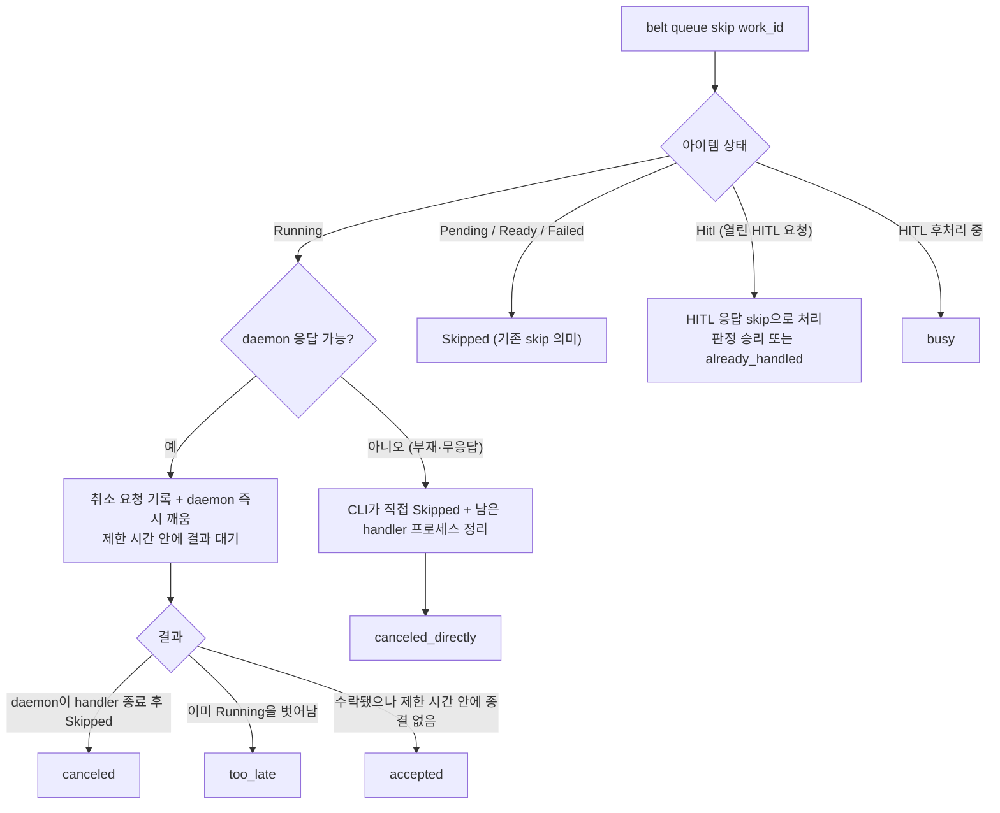

# CLI 레퍼런스 — 3-layer 아키텍처 + 전체 커맨드 트리

> belt CLI는 모든 레이어의 SSOT(Single Source of Truth)이다.

---

## 아키텍처 (3-layer)

```
Layer 1: Slash Command (2개, thin wrapper)
  /auto, /agent

Layer 2: DataSource + AgentRuntime (OCP 확장점)
  → 외부 시스템 워크플로우 + LLM 실행 추상화

Layer 3: belt CLI (SSOT)
  → DB 조작, 상태 전이, 코어 로직
  → 모든 레이어가 CLI를 호출
```

---

## belt CLI 전체 참조

### Phase 1: 코어 CLI

상태 변경, 데몬 제어, CRUD — 직접 CLI로 노출.

```
belt
├── start / stop / restart
├── status [--format text|json|rich]
├── dashboard
├── workspace
│   ├── add / list / show / update / remove / config
├── queue
│   ├── list [--phase <phase>] / show <work_id>      ← 전이 이력(거절 기록·파생 원본 포함) 출력
│   ├── skip <work_id>                      ← phase별 의미: Running이면 취소, 그 밖은 Skipped
│   ├── done <work_id>                      ← evaluate가 호출: Completed → Done (on_done 실행)
│   ├── hitl <work_id> [--reason <msg>]     ← evaluate가 호출: Completed → HITL
│   └── dependency add / remove
├── context <work_id> [--json]               ← script용 정보 조회
├── hitl
│   ├── list / show / respond <hitl_id|work_id> --action <action> / timeout
├── cron
│   ├── list / add / update
│   ├── pause / resume / remove / trigger
├── agent                                    ← 서브커맨드 필수
│   ├── init [--force]                       # agent 워크스페이스 초기화
│   ├── rules                                # 규칙 조회
│   ├── edit [rule]                          # 규칙 편집
│   ├── session [--workspace <name>] [-p/--prompt <prompt>] [--plan] [--json]
│   │                                        # LLM 에이전트 세션 실행
│   ├── plugin [--install-dir]               # /agent 슬래시 커맨드 설치
│   └── context                              # 시스템 컨텍스트 수집 (agent injection용)
├── bootstrap                                ← .claude/rules 컨벤션 파일 생성
│   ├── [--workspace <dir>]                  # 워크스페이스 루트 (기본: 현재 디렉토리)
│   ├── [--rules-dir <dir>]                  # 커스텀 rules 디렉토리 경로
│   ├── [--force]                            # 기존 파일 덮어쓰기
│   ├── [--llm]                              # LLM으로 맞춤 컨벤션 생성
│   ├── [--project-name <name>]              # 프로젝트 이름 (--llm 전용)
│   ├── [--language <lang>]                  # 주 언어 (--llm 전용, e.g., Rust, TypeScript)
│   ├── [--framework <fw>]                   # 프레임워크 (--llm 전용, e.g., tokio, Next.js)
│   ├── [--description <desc>]              # 프로젝트 설명 (--llm 전용)
│   └── [--create-pr]                        # 생성된 컨벤션으로 PR 생성 (--llm 전용)
├── auto                                     ← /auto 슬래시 커맨드 플러그인 관리
│   └── plugin
│       ├── install [--project <dir>] [--force]   # /auto 슬래시 커맨드 설치
│       ├── uninstall [--project <dir>]           # /auto 슬래시 커맨드 제거
│       └── status [--project <dir>]              # 플러그인 설치 상태 확인
```

> `belt claw`는 `belt agent`와 동일한 서브커맨드 집합(`AgentCommands`)을 갖는 deprecated alias다. 신규 사용은 `belt agent`를 쓴다.

### Phase 2: /agent 위임 (읽기 전용)

아래 커맨드는 `/agent` 세션에서 자연어로 접근. 별도 CLI 구현은 `/agent`가 안정화된 후 필요 시 추가.

```
# /agent가 내부적으로 호출하는 조회 커맨드 (구현 우선순위 낮음)
├── decisions list / show
├── board [--format text|json|rich]
├── convention
├── worktree list / clean
├── logs / usage / report
```

> `/agent`는 `belt status --json`, `belt queue list --json` 등 Phase 1 CLI의 JSON 출력을 파싱하여 자연어로 표시한다. Phase 2 커맨드도 동일한 패턴으로, `/agent`가 먼저 커버하고 독립 CLI는 수요가 확인되면 추가.

모든 서브커맨드는 `--json` 또는 `--format json` 출력 지원.

---

## HITL 응답과 큐 조작 상세

HITL 응답은 CLI, TUI, 외부 channel 어디서 오든 같은 경합에 참여한다. 먼저 확정된 응답만 이기고, 이후 응답은 `already_handled`로 거절된다 ([NotificationChannel](./notification.md#첫-응답-승리)). 상태 전이 규칙은 [QueuePhase 상태 머신](./queue-state-machine.md)을 따른다.

### `belt hitl respond`

```bash
belt hitl respond <hitl_id|work_id> --action <done|retry|skip|replan> [--respondent <name>] [--notes <text>] [--json]
```

| 결과 | 의미 | exit | `--json` |
|------|------|------|----------|
| 판정 승리 | 이 응답이 첫 확정 응답이다. 아이템은 "해결됨 · 처리 중"이 되고 phase는 daemon 후처리 뒤에 바뀐다 | 0 | `{"success":true,...}` |
| `already_handled` | 먼저 확정된 응답이 있다. 응답자(by)·경로(via)·어떤 액션·언제를 함께 출력한다 | non-zero | `{"success":false,"reason":"already_handled",...}` |
| `not_found` | 대응하는 HITL 요청이 없다 | non-zero | `reason: "not_found"` |
| `invalid_action` | 허용되지 않는 액션 | non-zero | `reason: "invalid_action"` |

- `work_id`를 주면 그 아이템의 open HITL 요청에 응답한다. 아이템당 open 요청은 최대 하나다. 과거 요청을 특정하려면 `hitl_id`를 쓴다.
- CLI 응답에는 allowlist를 적용하지 않는다. 경로(via)는 이력에 `cli`로 기록되고, 응답자(by)는 `--respondent` 값으로 기록된다. 생략하면 OS 사용자 이름이다. 결과와 `already_handled` 출력은 경로와 응답자를 따로 보여준다.
- daemon이 꺼져 있어도 응답은 확정된다. 후처리는 daemon이 다시 시작된 뒤 수행된다.

### `belt queue skip`

`belt queue skip <work_id>`는 아이템의 phase에 따라 다르게 동작한다. 새 `cancel` 명령은 없다.



| 결과 | 의미 | exit | `--json` reason |
|------|------|------|-----------------|
| `canceled` | daemon이 handler를 종료하고 Running→Skipped | 0 | — (`result: "canceled"`) |
| `canceled_directly` | daemon이 없거나 응답하지 않아 CLI가 직접 Running→Skipped로 바꾸고 handler 프로세스를 정리 | 0 | — (`result: "canceled_directly"`) |
| `accepted` | daemon이 수락했고 종결은 비동기다. 직접 경로로 넘어가지 않는다. 최종 결과는 `belt queue show`로 확인한다 | 0 | — (`result: "accepted"`) |
| `too_late` | 처리 전에 handler가 이미 끝나 Running을 벗어남. phase는 handler 결과를 따른다 | non-zero | `too_late` |
| `busy` | HITL 후처리 중이라 취소·변경 불가 | non-zero | `busy` |
| `already_handled` | 열린 HITL 요청에서 다른 응답이 먼저 확정됨 | non-zero | `already_handled` |

- 취소된 실행의 hook(on_done/on_fail/on_escalation)과 escalation은 실행되지 않는다. 이력에 요청자와 경로(cli/tui)가 남는다.
- Ready에서 daemon의 점유와 경합해 `conflict`가 나면 한 번 다시 판단해 Running 취소 경로로 넘어간다.
- Hitl 아이템은 직접 Skipped로 바뀌지 않는다. HITL에서 나가는 전이는 daemon 후처리만 수행한다.
- Pending/Ready → Skipped와 Failed → Skipped 전이의 허용 여부는 [QueuePhase 상태 머신](./queue-state-machine.md)의 전이 계약을 따른다.

### `belt queue done` / `belt queue hitl`

| 명령 | 아이템 상태 | 결과 |
|------|------------|------|
| `done` | Completed (evaluate가 호출) | Done 전이 |
| `done` | 열린 HITL 요청이 있는 Hitl | HITL 응답 `done`으로 처리 (판정 승리 또는 `already_handled`) |
| `done` | 처리 중 (handler 실행 / 후처리) | `busy` |
| `hitl` | Completed (evaluate가 호출) | Hitl 전이 + HITL 요청 열기 |
| `hitl` | 처리 중 | `busy` |
| `hitl` | 이미 Hitl | `invalid_action` |
| `done` / `hitl` / `skip` | Done · Skipped · Failed 등 전이 간선이 없는 종료 phase (Failed → Skipped skip은 허용) | `invalid_action` |

Failed 아이템을 Done으로 바꾸는 명령은 없다. Failed에서 나가는 전이는 Failed → Skipped뿐이다.

### `belt queue show`

```bash
belt queue show <work_id> [--json]
```

아이템의 현재 상태와 전이 이력을 보여준다.

| 항목 | 내용 |
|------|------|
| 현재 phase | 아이템의 phase |
| 파생 원본·계열 | 파생 원본(직전 아이템의 `work_id`)과 같은 계열의 아이템 |
| 처리 중 여부 | handler 실행 또는 HITL 후처리 중인지 |
| 전이 이력 | 시간순. 요청자와 경로(cli/tui/channel 이름)를 포함한다 |
| 거절 기록 | `busy` · `conflict` · `invalid_action` · `unauthorized` · `already_handled` · `not_found` 종류별 |

allowlist 밖 외부 응답은 거절 기록(`unauthorized`)으로 여기서만 확인한다.

### 실패 결과와 exit code

위 명령들은 거절을 값으로 돌려준다. 거절은 non-zero exit와 `--json` `{"success":false,"reason":...}`로 낸다. 모든 거절은 아이템 이력에 남는다.

| reason | 의미 |
|--------|------|
| `busy` | 처리 중이라 변경 불가 |
| `conflict` | 다른 경로의 전이가 먼저 적용됨. 현재 phase를 함께 출력한다 |
| `invalid_action` | 현재 상태에서 허용되지 않는 요청 |
| `already_handled` | 먼저 확정된 HITL 응답이 있음 |
| `not_found` | 대상 아이템·HITL 요청 없음 |
| `too_late` | 취소 요청이 도착하기 전에 아이템이 Running을 벗어남 |

### `belt hitl show`

HITL 요청의 현재 상태를 보여준다.

| 항목 | 내용 |
|------|------|
| 해결 정보 | 액션, 응답자, 경로(cli/tui/channel 이름), 시각, 직접 응답인지 자연어 확정인지 |
| 처리 상태 | 열림 / 해결됨·후처리 대기 / 후처리 중 / 후처리 완료 |
| channel별 전달 상태 | 대기 / 전송됨 / 실패 (실패 시 시도 횟수) |

---

## `belt context` 상세

script가 아이템 정보를 조회하는 유일한 방법.

```bash
# 기본 사용 (on_done/on_fail script 내에서)
CTX=$(belt context $WORK_ID --json)
ISSUE=$(echo $CTX | jq -r '.issue.number')
REPO=$(echo $CTX | jq -r '.source.url')

# 특정 필드만 조회 (jq 없이)
belt context $WORK_ID --field issue.number    # → 42
belt context $WORK_ID --field source.url      # → https://github.com/org/repo
```

context 스키마는 DataSource별로 다르다. 상세는 [DataSource](./datasource.md) 참조.

---

## `belt bootstrap` 상세

워크스페이스에 `.claude/rules` 컨벤션 파일을 생성한다. 정적 템플릿 또는 LLM 기반 맞춤 생성을 지원.

```bash
# 기본 사용 (정적 템플릿)
belt bootstrap

# 특정 디렉토리에 생성
belt bootstrap --workspace /path/to/project

# 기존 파일 덮어쓰기
belt bootstrap --force

# LLM으로 맞춤 컨벤션 생성
belt bootstrap --llm \
  --project-name my-app \
  --language Rust \
  --framework tokio \
  --description "비동기 웹 서버"

# LLM 생성 후 PR까지 자동 생성
belt bootstrap --llm --create-pr
```

| 플래그 | 기본값 | 설명 |
|--------|--------|------|
| `--workspace` | 현재 디렉토리 | 워크스페이스 루트 경로 |
| `--rules-dir` | `<workspace>/.claude/rules` | 커스텀 rules 디렉토리 |
| `--force` | false | 기존 파일 덮어쓰기 |
| `--llm` | false | LLM 기반 맞춤 생성 |
| `--project-name` | — | 프로젝트 이름 (`--llm` 필요) |
| `--language` | — | 주 프로그래밍 언어 (`--llm` 필요) |
| `--framework` | — | 프레임워크/런타임 (`--llm` 필요) |
| `--description` | — | 프로젝트 설명 (`--llm` 필요) |
| `--create-pr` | false | 컨벤션 PR 생성 (`--llm` 필요) |

---

## `belt auto` 상세

`/auto` 슬래시 커맨드 플러그인을 프로젝트의 `.claude/commands/`에 설치, 제거, 상태 확인한다.

```bash
# 플러그인 설치
belt auto plugin install
belt auto plugin install --project /path/to/project
belt auto plugin install --force    # 기존 파일 덮어쓰기

# 플러그인 제거
belt auto plugin uninstall

# 설치 상태 확인
belt auto plugin status
```

| 서브커맨드 | 설명 |
|-----------|------|
| `plugin install` | `/auto` 슬래시 커맨드 파일을 `.claude/commands/`에 설치 |
| `plugin uninstall` | 설치된 `/auto` 슬래시 커맨드 파일 제거 |
| `plugin status` | 플러그인 설치 여부 확인 |

| 플래그 | 적용 대상 | 기본값 | 설명 |
|--------|----------|--------|------|
| `--project` | install, uninstall, status | 현재 디렉토리 | 프로젝트 루트 경로 |
| `--force` | install | false | 기존 파일 덮어쓰기 |

---

### 관련 문서

- [DESIGN](../DESIGN.md) — 전체 아키텍처
- [DataSource](./datasource.md) — context 스키마
- [Agent](./agent-workspace.md) — /agent 세션
- [NotificationChannel](./notification.md) — HITL 응답 경합, 거절 값
- [QueuePhase 상태 머신](./queue-state-machine.md) — 전이 계약, 처리 중, 취소
