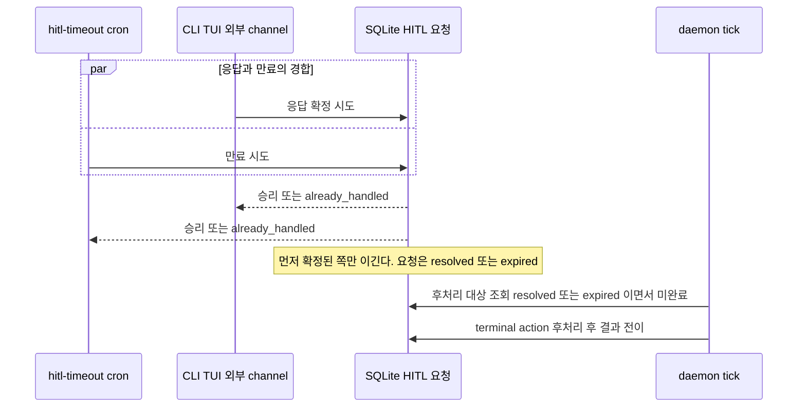

# Cron 엔진 — 주기 실행 + 품질 루프

> 주기적으로 실행되는 작업을 관리한다.
> 파이프라인은 1회성, 품질은 Cron이 지속 감시하여 새 아이템을 생성.

---

## 두 가지 역할

```
1. 인프라 유지 — hitl-timeout, log-cleanup, daily-report (결정적)
2. 품질 루프 — gap-detection, knowledge-extract (LLM 사용)

※ evaluate는 Daemon tick 루프의 정규 단계로 이동. 상세: [Evaluator](./evaluator.md)
```

---

## 품질 루프

파이프라인이 아이템을 처리한 후, Cron이 지속적으로 결과물을 검증한다.

```
Pipeline: issue → analyze → implement → review → Done
                                                   │
Cron: gap-detection ─── 스펙 vs 코드 비교 ──────────┘
        │
        ▼
      gap 발견 → 중복 검사 → 새 이슈 생성 → DataSource.collect() → 파이프라인 재진입
```

부족하면 되돌아가는 게 아니라 **새 아이템이 생긴다**.

### Dedupe 가드

gap-detection이 이슈를 생성하기 전, DataSource의 현재 open 아이템 목록을 조회하여 **동일 gap에 대한 아이템이 이미 존재하면 skip**한다.

```
gap 발견 → DataSource에서 open 아이템 조회 (Pending/Ready/Running)
  → 동일 gap에 해당하는 아이템 존재 → skip (이미 처리 중)
  → 해당 아이템 없음 → 새 이슈 생성
```

이를 통해 동일 문제에 대한 이슈 무한 증식을 방지한다.

---

## 기본 Cron Jobs

### 인프라 (Global, 결정적, 토큰 0)

| Job | 주기 | 동작 |
|-----|------|------|
| hitl-timeout | 5분 | 기한이 지난 open HITL 요청을 만료 경합에 올림 (후처리는 daemon tick) |
| daily-report | 매일 06시 | 일간 리포트 |
| log-cleanup | 매일 00시 | 오래된 로그/worktree 삭제 |

### 품질 루프 (Per-workspace, LLM 사용)

| Job | 주기 | 동작 |
|-----|------|------|
| gap-detection | 1시간 | 스펙-코드 대조, gap 발견 시 이슈 생성 |
| knowledge-extract | 1시간 | merged PR 지식 추출 |

### 사용자 정의 (예시)

| Job | 주기 | 동작 |
|-----|------|------|
| qa-test | 30분 | 테스트 실행, 실패 시 이슈 생성 |
| security-scan | 2시간 | 보안 취약점 스캔 |

---

## hitl-timeout과 첫 응답 승리

hitl-timeout은 기한이 지난 open HITL 요청을 **만료(expire) 시도**로 HitlService에 올린다. 사람의 응답과 같은 경합에 참여하고, 먼저 확정된 쪽이 이긴다.



- 만료도 응답과 마찬가지로 한 번만 확정된다. 응답이 먼저면 만료 시도는 `already_handled`로 끝나고 아이템에 영향이 없다.
- cron은 phase를 직접 바꾸지 않는다. 만료된 요청의 terminal action 적용(worktree 정리 포함)과 결과 전이는 daemon tick의 후처리가 한다. 상세: [Daemon](./daemon.md#hitl-해결-후처리)
- 만료 시점부터 후처리가 끝날 때까지 아이템은 처리 중이고, 다른 경로의 전이는 `busy`다. 상세: [QueuePhase 상태 머신](./queue-state-machine.md#처리-중-잠금)
- 경합 규칙의 전체는 [Notification](./notification.md)을 따른다.

---

## Force Trigger

force_trigger는 cron job을 다음 tick에서 우선 실행하도록 스케줄링한다.

```
force_trigger(job_name):
  job.last_run_at = NULL → 다음 tick에서 즉시 실행
```

- 동기적으로 실행하지 않는다. cron의 `last_run_at`을 리셋할 뿐.
- gap-detection 등 품질 루프 job에 사용.

> **evaluate는 cron job이 아니라 Daemon tick의 정규 단계다**. Completed 아이템은 Evaluator가 다음 tick에서 Progressive Pipeline으로 판정한다. 상세: [Evaluator](./evaluator.md)

---

## Daemon 주입 환경변수 (Cron 전용)

Cron 스크립트에는 workspace 정보가 필요하므로 추가 변수를 주입한다.

| 변수 | 예시 |
|------|------|
| `WORKSPACE` | `auth-project` |
| `BELT_HOME` | `~/.belt` |
| `BELT_DB` | `~/.belt/belt.db` |

> **참고**: handler/on_done/on_fail script에는 `WORK_ID` + `WORKTREE`만 주입된다. Cron은 아이템 단위가 아니라 workspace 단위로 실행되므로 다른 환경변수 세트를 사용한다.

---

## Built-in vs Custom

| | Built-in | Custom |
|---|---|---|
| 생성 | workspace 등록 시 자동 | `belt cron add` |
| 제거 | 불가 (pause/resume) | 자유 |
| Guard | 내장 | 사용자 정의 |

---

## 수용 기준

- [ ] hitl-timeout은 HITL 요청을 만료 경합에 올리고, 응답과 만료 중 먼저 확정된 쪽만 이긴다
- [ ] 응답이 먼저 확정되면 만료 시도는 `already_handled`로 끝나고 아이템에 영향이 없다
- [ ] hitl-timeout은 phase를 직접 바꾸지 않고, 후처리와 결과 전이는 daemon tick이 수행한다
- [ ] 만료 후 후처리 중에는 외부 전이가 `busy`다

---

### 관련 문서

- [DESIGN](../DESIGN.md) — evaluate 아키텍처
- [DataSource](./datasource.md) — belt context 스키마
- [Daemon](./daemon.md) — HITL 후처리
- [QueuePhase 상태 머신](./queue-state-machine.md) — 처리 중 잠금
- [Agent](./agent-workspace.md) — evaluate와 Agent의 관계
- [Stagnation Detection](./stagnation.md) — handler 실패 시 패턴 감지 (cron이 아닌 동기 실행)
