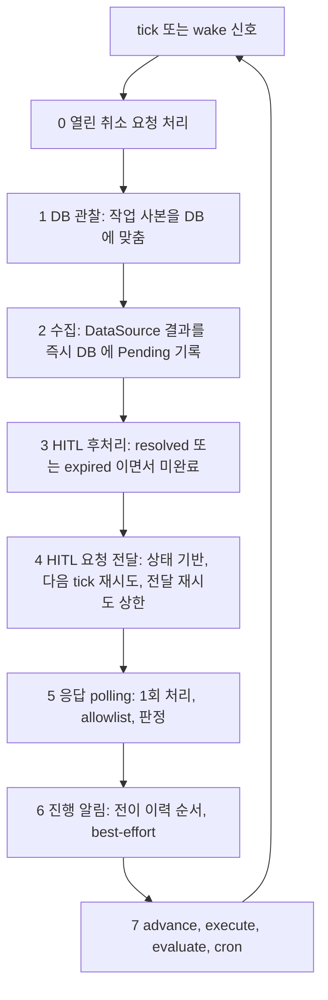
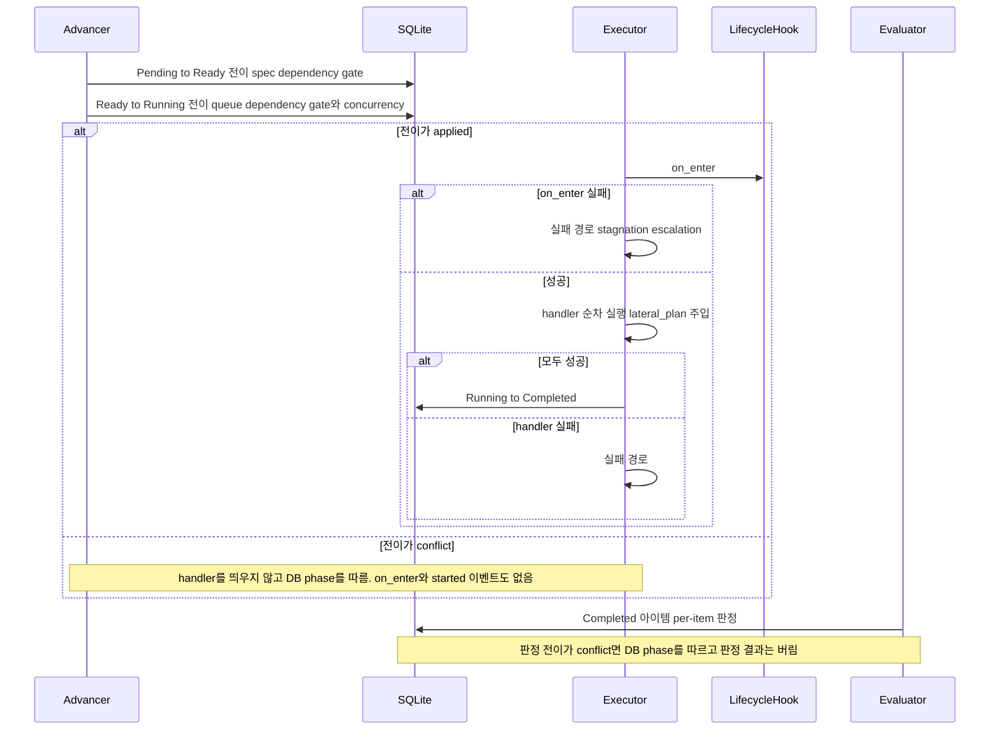
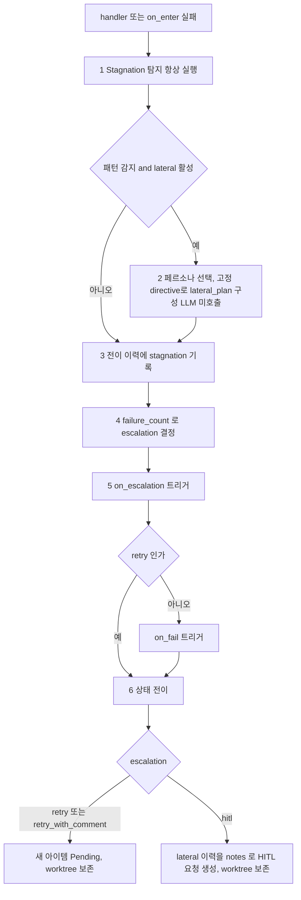
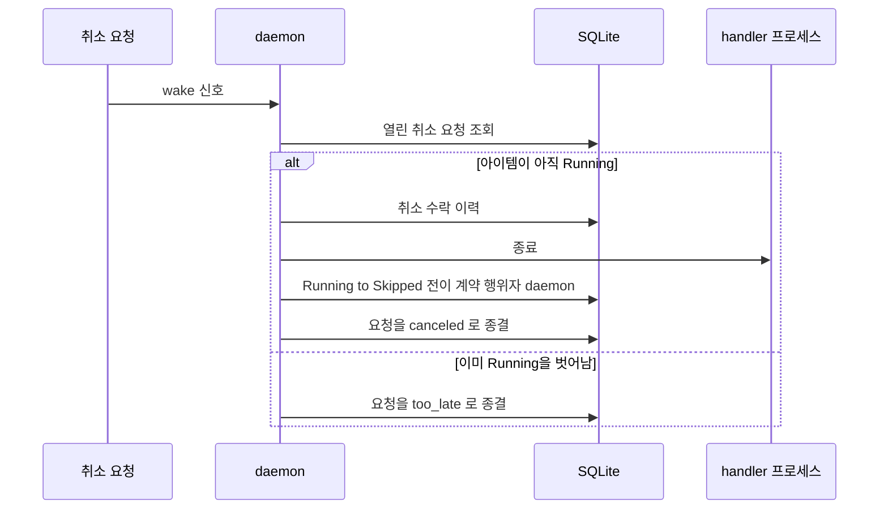
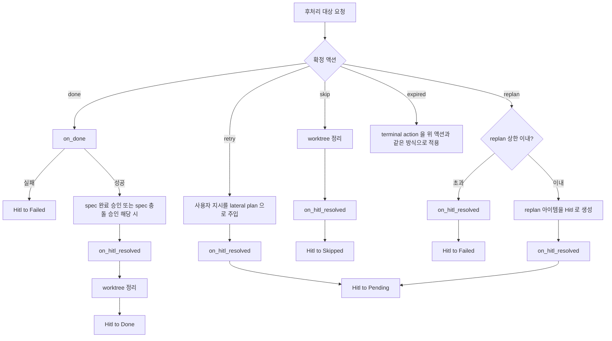
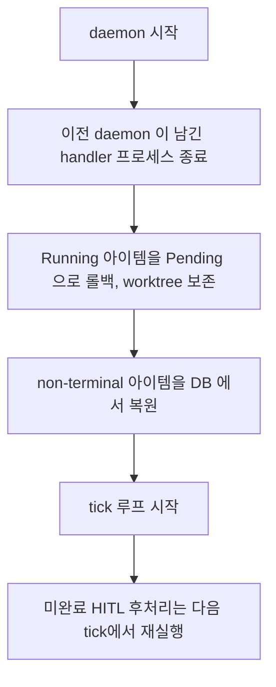
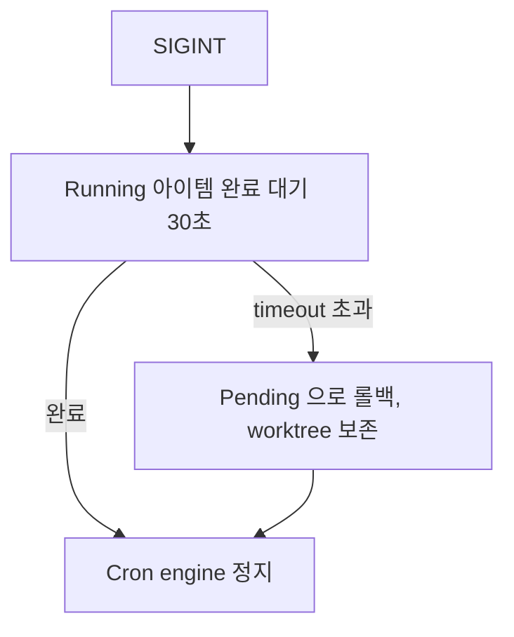

# Daemon — State Machine CPU

> Daemon은 DB를 관찰하며 틱마다 전이를 결정하고 hook을 트리거하는 CPU다.
> handler(prompt/script)를 실행하고, 취소 요청과 HITL 해결 후처리를 단독으로 수행한다.
> GitHub 라벨, PR 생성 같은 도메인 로직을 모른다 — hook의 결과만 받을 뿐.
> 내부는 Advancer·Executor·Evaluator·HitlService·CronEngine 역할로 나뉜다. 실패 시 Stagnation 탐지와 Lateral 분석이 사고를 전환하여 재시도한다.

---

## 역할

```
1. 관찰: 매 tick마다 DB를 기준으로 작업 사본을 맞춘다
2. 수집: DataSource 수집 → 즉시 DB에 Pending으로 기록
3. 전이: Pending → Ready → Running (자동, concurrency 제한). Ready→Running이 곧 점유
4. 트리거: Running 진입 시 on_enter hook 트리거
5. 실행: yaml에 정의된 handler(prompt/script) 실행
6. 완료: handler 성공 → Completed 전이
7. 분류: evaluate가 Completed → Done or HITL 판정 (per-item)
8. 반응: 상태 전이 시 on_done/on_fail/on_escalation hook 트리거
9. 취소: 실행 중 취소 요청을 받아 handler를 종료
10. 후처리: 확정된 HITL 응답의 후속 작업을 수행 (유일한 실행자)
11. 알림: 진행 알림 발송, HITL 요청 전달, 외부 응답 polling
12. 스케줄: Cron engine으로 주기 작업 실행

Daemon이 아는 것: 상태 머신 + 언제 어떤 hook을 트리거할지
Daemon이 모르는 것: hook이 실제로 무엇을 하는지 (결과만 받음)
```

---

## 구성 요소

| 구성 요소 | 책임 |
|-----------|------|
| **Advancer** | Pending→Ready→Running 전이, dependency gate (DB), spec 충돌 검출 |
| **Executor** | handler 실행 + hook 트리거, 실패 시 stagnation 분석 + lateral plan + escalation |
| **Evaluator** | Completed → Done/HITL 분류 (per-item) |
| **HitlService** | HITL 열기·판정·timeout 만료의 단일 계약. 후처리와 phase 전이는 하지 않는다 |
| **CronEngine** | cron tick, force_trigger |

- 구성 요소 간 의존은 순환하지 않고, 각 요소는 독립적으로 테스트할 수 있다.
- Stagnation 탐지는 패턴 판정기와 유사도 판정기를 교체할 수 있는 확장 지점(OCP)이다. 상세: [Stagnation Detection](./stagnation.md)
- HITL 판정(확정 응답 기록)과 HITL 후처리(phase 전이 포함)는 분리되어 있다. 판정은 CLI·TUI·channel·cron 어디서든 일어나고, 후처리는 daemon만 한다.

---

## Concurrency 제어

두 레벨로 동시 실행을 제어한다.

- **workspace.concurrency** (기본 1): workspace yaml 루트에 정의. "이 프로젝트에 동시에 몇 개까지 돌릴까". 모든 source의 아이템 합산 기준.
- **daemon.max_concurrent** (기본 4): "머신 리소스 한계". handler 실행과 Evaluator의 LLM 호출 모두 동일한 slot 풀을 소비한다.

> yaml 스키마 상세: [workspace-schema.md](./workspace-schema.md)

Advancer는 `Ready → Running` 전이 시 두 제한을 모두 확인한다.

---

## 실행 루프

wake 신호나 주기 tick이 오면 아래 순서로 한 바퀴를 돈다. **취소 요청이 가장 먼저**다.



- 4단계의 HITL 요청 전달은 실패하면 이후 tick에서 다시 시도하며, **전달 재시도 상한**에 이르면 멈춘다. 상한의 값은 구현이 정한다. 이 값은 [HITL 해결 후처리](#hitl-해결-후처리)의 **후처리 실패 상한**(N)과 별개의 카운터다.
- wake 신호는 취소 요청처럼 tick을 기다리면 안 되는 용도를 **다른 용도의 wake와 구분**해야 한다. 구분 없이 일반 깨움으로 취급하면 취소 처리가 tick 간격만큼 늦어진다. 구분 수단은 구현이 정한다.
- wake 신호를 받으면 0번부터 즉시 실행한다.
- **handler 실행 중에도 취소 요청을 받을 수 있어야 한다.** 한 바퀴가 handler 완료를 기다리며 막히지 않는다.
- 각 단계의 실패는 다른 단계를 멈추지 않는다. 실패는 값으로 분류해 기록한다.

### 7단계 — advance, execute, evaluate



### 실패 경로 — Stagnation, Lateral, Hook



lateral_plan은 retry로 생성된 새 아이템이 다시 Running에 진입할 때 handler prompt에 추가 컨텍스트로 주입된다.

```
원래 prompt: "이슈를 구현해줘"

주입 후:
  "이슈를 구현해줘

   ⚠ Stagnation Analysis (attempt 2/3)
   Pattern: SPINNING | Persona: HACKER

   실패 원인: 이전 2회 시도에서 동일한 컴파일 에러 반복
   대안 접근법: tower-sessions crate 활용
   실행 계획: 1. Cargo.toml 수정  2. 타입 교체  3. middleware 등록
   주의: 이전과 동일한 접근은 같은 실패를 반복합니다"
```

---

## 취소 처리

wake 신호나 tick을 받으면 열린 취소 요청을 먼저 처리한다. 취소 요청의 진입과 결과 값은 [실행 중 취소](./queue-state-machine.md#실행-중-취소)가 정의한다.



- 취소된 실행의 hook(on_done / on_fail / on_escalation)과 escalation은 실행하지 않는다.
- 시도 이력에는 `skipped`로 남겨 failure_count에 영향이 없게 한다. 토큰 사용량은 기록한다.
- worktree는 Skipped 규칙(정리)을 따른다.
- daemon 부재 중 CLI가 직접 Skipped로 만든 아이템은 daemon 재시작 시 DB를 따른다.

---

## DB 관찰과 자기 전이 conflict

daemon의 작업 사본은 DB와 어긋날 수 있다(CLI·TUI·evaluator의 전이, 직접 DB 조작). tick마다 결정에 앞서 DB를 따른다. daemon 자신의 전이도 전이 계약을 거치므로 `conflict`를 받을 수 있다.

| daemon 자기 전이 | conflict일 때 |
|------------------|---------------|
| 점유 (Ready→Running) | handler를 띄우지 않는다. on_enter와 `started` 이벤트도 없다. DB phase를 따른다 |
| evaluator 판정 전이 (Completed→Hitl 등) | DB phase를 따르고 판정 결과를 버린다. 이미 쓴 평가 비용은 버려진다 |
| 그 밖의 결과 전이 (Running→X) | 잠금 덕분에 정상 흐름에서는 없다. 무응답 오판이나 수동 DB 조작에서만 생긴다. DB phase를 따르고, **그 실행의 hook과 escalation을 실행하지 않는다**. 시도 이력은 쓰지 않고 토큰 사용량은 기록한다. `transition_conflict`를 이력에 남긴다 |

- Running에서 나가는 결과 전이는 그 결과에 따른 `on_fail`·`on_escalation`보다 먼저 commit된다. 그래서 conflict로 끝난 실행은 이 hook을 실행하지 않는다.
- `on_done`은 Done 전이의 선행 조건이다. 정상 완료와 HITL 후처리 모두 on_done이 성공한 뒤에만 Done이 되고, 실패하면 Failed가 된다.
- worktree는 DB에 남은 phase의 생명주기 규칙을 따른다. 상세: [QueuePhase 상태 머신](./queue-state-machine.md#worktree-생명주기)

---

## HITL 해결 후처리

> 후처리의 유일한 실행자는 daemon이다. 판정이 어느 경로에서 확정되든 phase 전이와 부수 작업은 daemon tick이 수행한다.

대상은 확정(`resolved`)되거나 만료(`expired`)됐고 후처리가 끝나지 않은 HITL 요청이다. tick마다 상태로 찾는다. 이 구간의 아이템은 처리 중이고 phase는 Hitl을 유지한다.



| 규칙 | 내용 |
|------|------|
| 전달 보장 | **at-least-once**. 완료 표시 전에 crash하면 재실행된다 |
| 마지막 전이 | 결과 전이와 후처리 완료 표시는 한 트랜잭션이다 |
| 멱등 | 아이템 생성(이미 같은 replan 아이템이 있으면 no-op)과 spec 상태 전이(이미 목표 상태면 no-op)는 멱등이다 |
| on_done | 사용자 script를 포함해 **두 번 실행될 수 있다** |
| on_done 실패 | Hitl→Failed. on_done 계약을 HITL 경로에서도 지킨다 |
| 그 밖의 단계 실패 | 비치명. `post_processing_error`를 이력에 남기고 dashboard에 경고한 뒤 다음 단계로 진행한다 |
| 결과 전이 실패 | 다음 tick에 재시도하고 dashboard에 "후처리 재시도 중"을 표시한다 |
| 연속 N회 결과 전이 실패 | Hitl→Failed로 탈출하고 `post_processing_failed`를 이력에 남긴다. 이후는 Failed 아이템의 기존 경로를 따른다. N(후처리 실패 상한)의 기본값은 구현이 정한다. 전달 재시도 상한과는 별개다 |

> 후처리가 처리 중 잠금을 영원히 쥐지 않는다. 결과 전이가 계속 실패해도 N회 뒤 Failed로 빠져 아이템이 영구히 `busy`로 남지 않는다.

범위는 HITL 해결 후처리로 한정한다. `belt queue done/skip/hitl` CLI의 부수 효과 정리는 이 문서의 범위 밖이다.

---

## 시작 시 복원



- **단일 daemon 전제**: 한 DB에는 daemon이 하나만 동작한다. 그래서 시작 시 남아 있는 handler 프로세스는 모두 이전 daemon의 것이고, 롤백 전에 안전하게 종료할 수 있다.
- 종료 대상은 handler 프로세스 식별 정보에 기록된 프로세스(하위 프로세스 포함)다. 종료하지 않으면 롤백 뒤에도 worktree를 계속 수정할 수 있다.
- 후처리 중이던 HITL은 상태 기반이라 재시작 뒤 다시 실행되고 누락되지 않는다.
- daemon이 꺼져 있는 동안 CLI가 응답한 HITL도 재시작 후 후처리된다. 정지 중 일어난 전이의 진행 알림은 보내지 않는다.

---

## Dependency Gate

### Spec Dependency Gate

Pending→Ready 전이 시 스펙 간 의존 관계를 확인한다.

### Queue Dependency Gate

Ready→Running 전이 시 확인한다. dependency phase 확인은 **DB 조회 기반**이다.

| dependency 상태 | 판정 |
|-----------------|------|
| Done | gate open |
| DB에 없음 (orphan) | gate open |
| Failed / Skipped | gate blocked (영구 차단, 수동 해제 필요) |
| Hitl | gate blocked (사람 응답 대기) |
| Pending / Ready / Running / Completed | gate blocked (진행 대기) |

| 케이스 | 정책 | 이유 |
|--------|------|------|
| **순환 의존** | 등록 시점에 탐지 → 거부 | 런타임에 교착이 발생하면 복구 불가 |
| **orphan** | gate open | 삭제된 아이템에 의존하면 영원히 차단됨 |
| **dependency가 Failed/Skipped** | gate blocked | 전제 조건 미충족 — 운영자가 해결하거나 의존 관계를 제거해야 함 |
| **자기 자신에 의존** | 등록 시점에 거부 | 순환의 특수 케이스 |

### Conflict Gate

entry_point 겹침을 DB 기반으로 감지한다.

---

## Handler와 Hook의 분리

### Handler — yaml에 정의된 작업

```yaml
handlers:
  - prompt: "..."    # → LLM 실행 (worktree 안에서)
  - script: "..."    # → bash 실행 (결정적, WORK_ID + WORKTREE 주입)
```

handler는 Daemon이 직접 실행한다. 작업의 핵심 로직.

### Hook — LifecycleHook

| hook | 트리거 시점 | 실행 책임 |
|------|-----------|----------|
| `on_enter` | Running 진입 후, handler 실행 전 | Hook impl |
| `on_done` | evaluate Done 판정 후, HITL done 후처리 | Hook impl |
| `on_fail` | 실패 시 (retry 제외) | Hook impl |
| `on_escalation` | escalation 결정 후 | Hook impl |
| `on_hitl_resolved` | HITL 후처리 중 | Hook impl (비치명) |

Daemon은 hook을 트리거만 한다. 취소된 실행과 conflict로 끝난 실행의 hook은 트리거하지 않는다. 상세: [LifecycleHook](./lifecycle-hook.md)

---

## 환경변수

| 변수 | 설명 |
|------|------|
| `WORK_ID` | 큐 아이템 식별자 |
| `WORKTREE` | worktree 경로 |

나머지는 `belt context $WORK_ID --json`으로 조회.

---

## Graceful Shutdown



---

## 수용 기준

### Daemon = CPU

- [ ] Daemon은 상태 머신 순회 + hook 트리거만 담당한다
- [ ] 상태 전이 시 workspace의 LifecycleHook을 트리거한다
- [ ] hook의 실행 결과만 받고, 구체적 동작을 모른다

### 실행 루프와 취소

- [ ] 각 tick은 취소 요청 처리 → DB 관찰 → 수집 → HITL 후처리 → HITL 요청 전달 → 응답 polling → 진행 알림 → advance/execute/cron 순서다
- [ ] wake 신호를 받으면 tick을 기다리지 않고 취소 처리를 즉시 시작한다
- [ ] wake 신호는 취소와 다른 깨움 용도를 계약 수준에서 구분한다
- [ ] daemon은 handler 실행 중에도 tick 완료를 기다리지 않고 취소 요청을 받아 handler를 종료할 수 있어야 한다
- [ ] 취소된 실행은 hook과 escalation을 실행하지 않고, 시도 이력에 `skipped`로 남는다

### DB 관찰과 conflict

- [ ] tick마다 결정에 앞서 작업 사본을 DB에 맞춘다
- [ ] 수집한 아이템은 즉시 DB에 Pending으로 기록된다
- [ ] 점유가 conflict면 handler를 띄우지 않고 on_enter와 `started` 이벤트도 없다
- [ ] evaluator 판정 전이가 conflict면 판정 결과를 버린다
- [ ] Running에서 나가는 결과 전이는 on_fail·on_escalation보다 먼저 commit되어, conflict로 끝난 실행은 이 hook을 실행하지 않는다
- [ ] on_done은 Done 전이의 선행 조건이어서, 성공해야 Done이 되고 실패하면 Failed가 된다 (정상 완료와 HITL 후처리 모두)
- [ ] Running→X conflict 시 시도 이력은 쓰지 않고 토큰 사용량은 기록하며 `transition_conflict`가 남는다

### HITL 후처리

- [ ] CLI·TUI 판정의 후처리가 다음 tick에 실행되고 재시작 뒤에도 누락되지 않는다
- [ ] 후처리는 at-least-once이고, 아이템 생성과 spec 전이는 멱등이며, on_done은 두 번 실행될 수 있다
- [ ] 후처리 대상에 spec 완료 승인과 spec 충돌 승인이 포함된다
- [ ] on_done 실패는 Hitl→Failed이고, on_done 외 단계가 실패해도 결과 전이에 도달한다
- [ ] 결과 전이가 연속 N회 실패하면 Hitl→Failed와 `post_processing_failed` 이력으로 끝나 아이템이 영구히 busy로 남지 않는다

### 시작 시 복원

- [ ] 시작 시 non-terminal 아이템을 DB에서 복원한다
- [ ] Running→Pending 롤백 전에 이전 daemon이 남긴 handler 프로세스를 종료한다
- [ ] 위 정리는 한 DB에 daemon이 하나라는 전제에 의존한다

### 구성 요소

- [ ] phase 전이는 Advancer, handler 실행+hook 트리거+stagnation+lateral은 Executor, HITL 열기·판정은 HitlService, 후처리는 daemon tick이 맡는다
- [ ] 각 구성 요소는 독립적으로 테스트 가능하고 순환 의존이 없다

### Stagnation + Lateral 통합

- [ ] handler/on_enter 실패 시(과거 실패 이력이 있으면) Stagnation 탐지가 항상 실행된다
- [ ] 완전 일치·토큰 중복도·압축 유사도의 가중 합성 유사도로 error 메시지를 검사한다 (spinning·oscillation 감지)
- [ ] 패턴 감지 시 페르소나를 선택하고 고정 directive로 lateral_plan을 구성한다 (LLM 미호출)
- [ ] lateral_plan이 retry 시 handler prompt에 추가 컨텍스트로 주입된다
- [ ] hitl 도달 시 모든 lateral 시도 이력이 HITL 메모에 첨부된다
- [ ] stagnation 사건이 전이 이력에 기록된다

### Dependency Gate

- [ ] queue dependency의 phase 확인은 DB 조회 기준이고 재시작 후에도 정확하다
- [ ] dependency가 Failed/Skipped이면 blocked, DB에 없으면 open
- [ ] 순환 의존과 자기 의존은 등록 시점에 거부한다

### Concurrency

- [ ] workspace.concurrency + daemon.max_concurrent 2단계 제한
- [ ] evaluate LLM 호출도 concurrency slot 소비

### Graceful Shutdown

- [ ] SIGINT → 30초 대기 → Pending 롤백 + worktree 보존

### 환경변수

- [ ] handler/script에 WORK_ID, WORKTREE 2개만 주입

---

### 관련 문서

- [DESIGN](../DESIGN.md) — 전체 상태 흐름 + 설계 철학
- [LifecycleHook](./lifecycle-hook.md) — 상태 전이 반응 trait
- [QueuePhase 상태 머신](./queue-state-machine.md) — 상태 소유권, 처리 중 잠금, 취소
- [Data Model](./data-model.md) — 전이 이력, HITL 요청, 취소 요청
- [Notification](./notification.md) — 알림과 HITL 응답 수신
- [Stagnation Detection](./stagnation.md) — Composite Similarity + Lateral Thinking
- [DataSource](./datasource.md) — 수집/컨텍스트 추상화
- [AgentRuntime](./agent-runtime.md) — LLM 실행 추상화
- [Cron 엔진](./cron-engine.md) — 품질 루프, hitl-timeout
