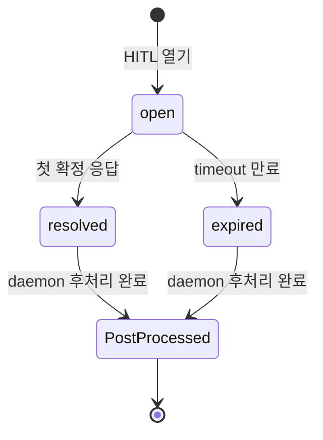
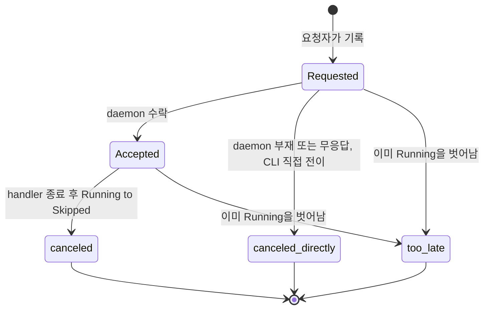
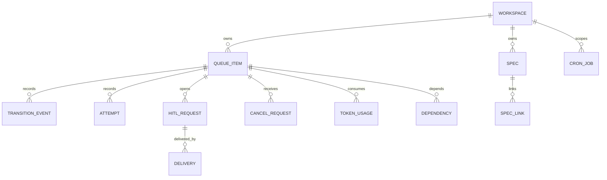

# Data Model

> 관련 문서: [DESIGN](../DESIGN.md), [QueuePhase 상태 머신](./queue-state-machine.md), [DataSource](./datasource.md), [LifecycleHook](./lifecycle-hook.md), [Evaluator](./evaluator.md), [Cron 엔진](./cron-engine.md), [Stagnation](./stagnation.md), [Notification](./notification.md)

Belt의 모든 상태는 SQLite 단일 파일(`~/.belt/belt.db`)에 저장된다. 이 문서는 **밖에서 관찰되는 데이터 계약** — 어떤 기록이 있고, 어떤 생명주기를 따르며, 어떤 보장을 하는가 — 을 정의한다. 저장 형식(테이블 구조, 컬럼, 직렬화)은 코드가 단일 출처이고 이 문서의 대상이 아니다.

---

## 기록 개요

| 기록 | 역할 | 쓰기 규칙 |
|------|------|-----------|
| 큐 아이템 | 컨베이어 벨트 위의 작업 단위. phase의 유일한 권위 | 전이 계약으로만 phase 변경 |
| 전이 이력 | 아이템별 사건 기록 (phase 전이 + 부가 사건) | append-only, phase 변경과 같은 트랜잭션 |
| 시도 이력 | 작업 시도 결과. failure_count와 stagnation 입력 | append-only |
| HITL 요청 | HITL 인스턴스. 응답 확정의 권위 | 첫 응답만 확정 |
| HITL 요청 전달 기록 | HITL 요청 알림의 channel별 전달 상태 | 상태 기반 재시도 |
| 외부 응답 기록 | 외부 channel 응답의 1회 처리 보장 | 유일성 보장 |
| 취소 요청 | 실행 중 아이템의 취소 의도와 결과 | 아이템당 열린 요청 하나 |
| handler 프로세스 식별 정보 | Running 아이템의 handler 프로세스 정리용 | Running 동안만 유효 |
| 아이템 의존 | 아이템 간 실행 순서 제약 | 순환 거부 |
| 스펙 / 스펙 연결 | 스펙 정의와 외부 리소스 연결 | — |
| 워크스페이스 / cron job | 등록 정보 | — |
| 토큰 사용량 | LLM 호출 비용 | append-only |
| 지식 베이스 | PR에서 추출한 지식 | — |

> 큐 아이템은 하나의 워크플로우 상태(analyze, implement 등)에 대응하며, 식별자는 `{source_id}:{state}` 형태의 `work_id`다. 같은 외부 엔티티(`source_id`)를 공유하는 아이템들은 서로 연결된다.

---

## 큐 상태 소유권

> 큐 아이템과 phase의 유일한 권위는 SQLite다. daemon의 in-memory 큐는 작업용 사본이고, 어긋나면 DB를 따른다. 상세: [QueuePhase 상태 머신](./queue-state-machine.md#상태-소유권)

---

## 전이 이력과 시도 이력

두 이력은 역할이 다르다.

| | 전이 이력 | 시도 이력 |
|---|---|---|
| 질문 | "이 아이템에 무슨 일이 있었는가" | "이 작업을 몇 번 시도했고 어떻게 실패했는가" |
| 단위 | 아이템(work_id) | 아이템 계열(source_id + state) |
| 입력으로 쓰는 곳 | dashboard, 진행 알림, 감사 | failure_count, stagnation 분석 |
| phase 권위 | 아니오 (상태를 재구성하지 않는다) | 아니오 |

### 전이 이력 계약

- **append-only**다. 쓰기만 하고 수정하지 않는다.
- phase 전이는 **phase 변경과 같은 트랜잭션**에서 기록된다. phase는 바뀌었는데 이력이 없거나 그 반대인 상태가 없다.
- **전역 단조 증가 순서**를 가진다. log-cleanup 등으로 기록이 삭제되어도 순서 번호는 재사용되지 않는다. 진행 알림 같은 소비자는 이 순서를 따라 읽는다.
- 새 아이템을 처음부터 Hitl로 만드는 경우에도 생성 사건이 기록된다 (이전 phase 없음).
- 누가 했는지(actor)를 남긴다: daemon, cli, tui, cron, 외부 channel 이름.
- 전이가 아닌 사건도 종류(kind)로 남긴다.

| 사건 종류 | 의미 |
|-----------|------|
| phase 전이 | phase 진입 |
| hook | LifecycleHook 트리거 결과 |
| stagnation | 탐지 패턴, confidence, reason, 추천 페르소나 |
| `transition_rejected` | 처리 중 아이템에 대한 전이가 `busy`로 거절됨 |
| `transition_conflict` | 기대 phase가 달라져 `conflict`로 끝남 (daemon 자기 전이 포함) |
| `hitl_resolved` | HITL 요청 확정 (응답 또는 만료) |
| `hitl_response_rejected` | 거절된 HITL 응답 (`already_handled`, `unauthorized` 등) |
| `notification_failed` | 진행 알림 또는 거절 회신 발송 실패 |
| `cancel_requested` / `cancel_accepted` / `cancel_closed` | 취소 요청 접수, daemon의 수락, 결과 종결 |
| `post_processing_error` | HITL 후처리의 비치명 단계 실패 |
| `post_processing_failed` | 후처리 결과 전이가 연속 실패해 Hitl→Failed로 탈출 |

### 시도 이력 계약

- append-only이고 읽기 전용으로 조회한다.
- `failure_count`는 같은 아이템 계열의 실패 기록 수다. on_enter 실패도 포함한다.
- stagnation 분석은 같은 `source_id`의 이전 실패 에러 메시지를 입력으로 쓴다. 상세: [Stagnation Detection](./stagnation.md)
- 취소된 실행은 `skipped`로 기록되어 failure_count에 영향이 없다.
- 전이 `conflict`로 버려진 실행은 기록하지 않는다 (failure_count 왜곡 방지). 이미 쓴 토큰 사용량은 기록한다.

| QueuePhase | 시도 이력 상태 | 비고 |
|------------|---------------|------|
| Pending, Ready | — | 시도 아님 |
| Running | `running` | handler 실행 중 |
| Completed | — | 전이 상태 |
| Done | `done` | 완료 |
| Hitl | `hitl` | 사람 대기 |
| Failed | `failed` | 실패 |
| Skipped | `skipped` | 건너뜀, 취소 포함 |

---

## HITL 요청

HITL 요청은 아이템과 별개의 **인스턴스**다. 같은 `work_id`가 HITL에 재진입(retry)할 수 있으므로, 아이템 id만으로 응답을 연결하면 이전 HITL에 대한 늦은 응답이 새 HITL을 닫는다. 요청마다 고유 `hitl_id`를 가진다.



| 단계 | 아이템 phase | 처리 중 잠금 |
|------|--------------|--------------|
| open | Hitl | 아니오 |
| resolved / expired, 후처리 미완료 | Hitl 유지 | 예 (후처리) |
| 후처리 완료 | 결과 전이로 Done / Failed / Skipped / Pending | 해제 |

- **열기 계약** (한 트랜잭션): 모든 HITL 진입은 아래 둘 중 하나다.
  - 기존 아이템: 전이 계약(X→Hitl) + 요청 open
  - 새 아이템을 Hitl로 생성: 아이템 생성 + 생성 이력 + 요청 open (replan, spec 완료 경로)
- **확정 계약**: 요청은 open일 때만 확정(resolved)되거나 만료(expired)된다. 동시 응답과 timeout은 하나만 이기고 나머지는 `already_handled`로 끝난다. DB 에러로 끝나지 않는다.
- 확정 정보: 응답 액션, 응답자, 응답 경로(직접 / 자연어 확정), 시각, 메모. 만료 시각과 만료 시 terminal action도 요청에 속한다.
- 후처리 완료 시각은 crash-safe 후처리 계약의 일부다. 결과 전이와 완료 표시는 한 트랜잭션이다.
- **불변식**: open 요청이 있으면 그 아이템의 phase는 Hitl이다.

HITL 사유(`HitlReason`)는 생성 경로를 구분한다.

| 사유 | 설명 |
|------|------|
| `evaluate_failure` | evaluate 반복 실패 |
| `retry_max_exceeded` | 재시도 횟수 초과 |
| `timeout` | 실행 타임아웃 |
| `manual_escalation` | 사용자 수동 요청 |
| `spec_conflict` | 스펙 파일 겹침 |
| `spec_completion_review` | 스펙 완료 최종 확인 |
| `spec_modification_proposed` | Agent 수정 제안 |
| `stagnation_detected` | 반복 패턴 감지 + lateral thinking |

### HITL 요청 전달 기록

HITL 요청 알림이 channel별로 어디까지 전달됐는지의 기록이다. 상세: [Notification](./notification.md)

- `hitl_id` × channel 단위로 하나이고, 상태는 pending / sent / failed다.
- 전달된 메시지의 참조(message_ref)를 남겨 외부 응답을 요청에 연결한다.
- 상태 기반으로 다음 tick에 재시도하고 상한 뒤 failed가 된다. failed는 dashboard에 노출된다.

### 외부 응답 기록

- `(channel, external_response_id)`는 유일하다. 같은 외부 응답은 재시작 후에도 한 번만 처리된다.
- 승자의 응답을 다시 polling해도 거절로 처리되지 않는다.

---

## 취소 요청

실행 중 아이템의 취소 의도를 담는 기록이다. 상세 경로: [실행 중 취소](./queue-state-machine.md#실행-중-취소)



- 아이템당 **열린 요청은 하나**다. 중복 요청은 같은 요청으로 본다.
- 요청자(respondent)와 경로(cli / tui), 요청 시각, 결과를 남긴다.
- 결과는 `canceled`, `canceled_directly`, `too_late` 중 하나이고 dashboard에 노출된다.

## handler 프로세스 식별 정보

- Running 진입 시 기록하고 Running을 벗어나면 비운다.
- daemon이 없을 때 CLI의 직접 취소와 daemon 시작 시 정리가, 남은 handler 프로세스(하위 프로세스 포함)를 종료하는 데 쓴다.
- 프로세스 식별 형식과 재사용 오인 방지는 구현이 맡는다.

---

## 아이템 의존

`depends_on` 아이템이 Done이 아니면 해당 아이템은 Ready→Running 점유가 블로킹된다. 확인은 **DB 조회 기반**이라 재시작 후에도 정확하다. 순환과 자기 의존은 등록 시점에 거부한다. 상세: [Daemon](./daemon.md#dependency-gate)

---

## 도메인 어휘

### 스펙 상태

| 상태 | 설명 |
|------|------|
| `draft` | 초기 상태 |
| `active` | 활성 (이슈 생성/처리 진행) |
| `paused` | 일시 중단 |
| `completing` | 모든 이슈 Done + gap 없음, HITL 대기 |
| `completed` | 최종 완료 |
| `archived` | 소프트 삭제 |

### Escalation 액션

| 액션 | on_fail 트리거 | 설명 |
|------|:--------------:|------|
| `retry` | 아니오 | 조용한 재시도 |
| `retry_with_comment` | 예 | on_fail + 재시도 |
| `hitl` | 예 | on_fail + HITL 생성 |
| `skip` | 예 | on_fail + Skipped |
| `replan` | 예 | on_fail + HITL(replan) |

모든 액션에서 `on_escalation(action)`이 트리거되고, `on_fail`은 `retry`를 제외하고 추가로 트리거된다. HITL 요청의 terminal action은 이 중 허용된 값만 가진다. 유효하지 않은 값은 거부된다.

### Stagnation 패턴과 페르소나

| 패턴 | 설명 | 친화 페르소나 |
|------|------|---------------|
| `spinning` | 동일/유사 출력 반복 | `hacker` |
| `oscillation` | 교대 반복 | `architect` |
| `no_drift` | 진행 점수 정체 | `researcher` |
| `diminishing_returns` | 개선폭 감소 | `simplifier` |
| (복합/기타) | — | `contrarian` |

현재 실제로 감지되는 패턴은 spinning·oscillation이다. 상세: [Stagnation Detection](./stagnation.md)

---

## 액션 타입

handler와 lifecycle hook은 서로 다른 설정을 사용한다.

| 구분 | 설정 | 실행 |
|------|------|------|
| handler | `prompt` 또는 `script` | Daemon이 직접 실행. prompt는 LLM(worktree 안), script는 bash |
| lifecycle 반응 | `on_enter` / `on_done` / `on_fail` script | script 어댑터가 LifecycleHook으로 감싸 실행 |

```yaml
handlers:
  - prompt: "이슈를 분석하세요"
    runtime: claude            # optional
    model: sonnet              # optional
  - script: "cargo test"

on_done:
  - script: "gh pr create ..."
```

> workspace yaml 전체 스키마는 [workspace-schema](./workspace-schema.md)가 단일 출처다. 상세: [LifecycleHook](./lifecycle-hook.md)

---

## 컨텍스트 모델 (belt context 출력)

`belt context $WORK_ID --json`이 반환하는 구조. script가 정보를 조회하는 유일한 방법이다.

| 키 | 내용 |
|----|------|
| `work_id`, `workspace` | 아이템과 소속 workspace |
| `queue` | 현재 phase, state, source_id |
| `source` | source 종류, URL, 기본 브랜치 |
| `issue`, `pr` | 정제된 이슈·PR 정보 (PR은 리뷰 포함) |
| `history` | 같은 source의 시도 기록 |
| `worktree` | worktree 경로 |
| `source_data` | DataSource가 채우는 자유 스키마 확장점 |

- `source_data`는 소스 원본 응답을 가공 없이 담는다. GitHub은 이슈 원본을 `issue` 키 아래에 둔다. 소스 종류별로 키를 나눠 다른 원본이 추가돼도 충돌하지 않는다.
- 이슈 조회에 실패하면 `source_data`는 비고, 비어 있으면 JSON 출력에서 키가 생략된다. 상세: [DataSource](./datasource.md)

> `source_data` 도입의 단계적 마이그레이션 구상은 [source_data와 stagnation 로드맵](../../plans/source-data-and-stagnation-roadmap.md)에 기록되어 있다.

---

## 타임스탬프 규칙

모든 기록 시각은 RFC3339 문자열(UTC)로 표현된다 (예: `2026-03-27T12:30:45Z`).

---

## 기록 관계



> 참고: 기록 간 정합성은 애플리케이션 계층이 보장한다. 외래 키 제약은 선언하지 않는다.

---

## 수용 기준

### 전이 이력

- [ ] 모든 phase 전이는 같은 트랜잭션으로 전이 이력에 남는다
- [ ] 전이 이력의 순서는 전역 단조 증가이고, 기록이 삭제되어도 재사용되지 않는다
- [ ] `busy` 거절, `conflict`, 취소 요청·수락·종결, 후처리 오류가 이력 종류로 남는다
- [ ] 시도 이력은 failure_count와 stagnation 입력으로만 쓰이고 phase 권위가 아니다

### HITL 요청

- [ ] HITL 요청마다 고유 식별자를 가지고, 같은 work_id의 재진입이 이전 요청에 대한 응답과 섞이지 않는다
- [ ] 동시 응답과 timeout 중 하나만 확정되고 나머지는 `already_handled`다
- [ ] 결과 전이와 후처리 완료 표시는 한 트랜잭션이다
- [ ] open 요청이 있는 아이템의 phase는 항상 Hitl이다
- [ ] 같은 외부 응답은 재시작 후에도 한 번만 처리된다

### 취소 요청

- [ ] 아이템당 열린 취소 요청은 하나이고, 요청자·경로·결과가 남는다
- [ ] Running 진입 시 handler 프로세스 식별 정보가 기록되고 Running을 벗어나면 비워진다

### 일반

- [ ] queue dependency의 phase 확인은 DB 조회 기준이다
- [ ] 순환 의존과 자기 의존은 등록 시점에 거부된다
- [ ] 모든 시각은 RFC3339 UTC 문자열이다
