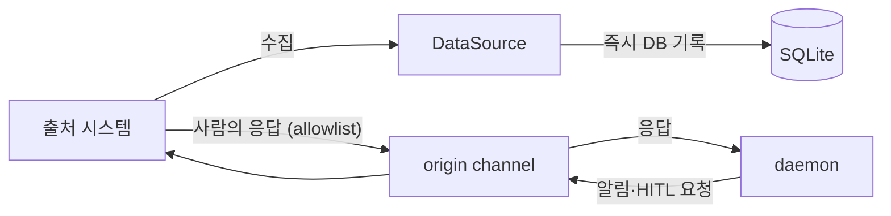

# DataSource — 외부 시스템 추상화 + 워크플로우 정의

> 외부 시스템(GitHub, Slack, Jira, ...)을 추상화하고, 각 시스템의 언어로 자동화 워크플로우를 정의한다.
> 새 외부 시스템 추가 = 새 DataSource impl + yaml 설정, 코어 변경 0 (OCP).

---

## 역할

```
DataSource가 소유하는 것 (읽기):
  1. 수집 — 어떤 조건에서 아이템을 감지하는가 (collect)
  2. 컨텍스트 — 해당 아이템의 외부 시스템 정보를 어떻게 조회하는가 (get_context)

LifecycleHook이 소유하는 것 (출처 상태 쓰기):
  3. 상태 반영 — 상태 전이 시 출처 시스템의 상태를 어떻게 바꾸는가 (라벨 추가·제거 등)

NotificationChannel이 소유하는 것 (사람과의 소통):
  4. 알림·HITL 요청 발송, HITL 응답 수신

yaml이 소유하는 것:
  5. 처리 — 감지된 아이템을 어떻게 처리하는가 (handlers: prompt/script)
  6. 실패 정책 — 실패 시 어떻게 escalation하는가 (escalation)

코어는 DataSource/LifecycleHook/NotificationChannel 내부를 모른다. 수집 결과를 큐에 넣고, 상태 전이 시 hook과 channel을 트리거할 뿐.
상세: [LifecycleHook](./lifecycle-hook.md), [NotificationChannel](./notification.md)
```

---

## DataSource의 책임

DataSource는 수집과 컨텍스트 조회 두 책임만 가진다.

| 책임 | 내용 |
|------|------|
| 수집 | 외부 시스템에서 trigger 조건에 매칭되는 새 아이템을 감지한다. 수집한 아이템은 즉시 DB에 Pending으로 기록한다 |
| 컨텍스트 조회 | 아이템의 외부 시스템 컨텍스트를 조회한다. `belt context` CLI가 사용한다 |

- 상태 전이 시 출처 상태 반영 → [LifecycleHook](./lifecycle-hook.md)으로 분리
- 알림·HITL 요청·응답 수신 → [NotificationChannel](./notification.md)로 분리
- worktree 셋업 → 인프라 레이어가 항상 처리
- escalation → yaml의 escalation 정책을 코어가 결정, hook과 channel이 반응

### origin channel 짝

각 DataSource에는 출처 시스템에 알림을 보내는 origin channel이 짝으로 대응한다 (GitHub의 경우 이슈 코멘트). 설정이 없으면 알림은 origin channel로만 간다.



> 출처 시스템에 올라온 HITL 응답을 받는 일은 DataSource가 아니라 origin channel의 책임이다. DataSource는 응답 수신을 위해 바뀌지 않는다. origin channel 구현이 없는 출처는 dashboard only로 동작한다.

`get_context()`가 반환하는 아이템 컨텍스트에는 `source_data` 필드가 있다. DataSource가 자신의 고유 데이터를 자유 스키마로 채울 수 있도록 예약된 OCP 확장점이다. GitHub DataSource는 이슈 조회에 성공하면 원본 이슈 응답(제목·본문·라벨·작성자·상태)을 가공 없이 `issue` 키 아래에 담는다 — `issue` 최상위 필드가 사람이 읽기 좋게 정제한 뷰라면, `source_data.issue`는 그 원본이다. 소스 종류별로 키를 나누는 이유는 향후 PR 등 다른 원본 데이터가 추가돼도 서로 충돌하지 않게 하기 위해서다. 이슈 조회가 실패하면 `Null`로 남는다. `source_data`가 `Null`이면 `belt context`의 JSON 출력에서 해당 키 자체가 생략된다. 활용 계획은 [source_data와 stagnation 로드맵](../../plans/source-data-and-stagnation-roadmap.md) 참조.

---

## `belt context` — 스크립트용 조회 CLI

script가 아이템 정보를 조회하는 유일한 방법. DataSource.get_context()를 내부적으로 호출한다.

```bash
belt context $WORK_ID --json
```

### 왜 환경변수 대신 CLI인가

Daemon이 `$ISSUE_NUMBER`, `$REPO_URL` 같은 환경변수를 주입하면 DataSource마다 변수가 끝없이 늘어난다 (GitHub: `$ISSUE_NUMBER`, Jira: `$TICKET_KEY`, Slack: `$THREAD_TS`, ...). 대신 `belt context`로 통일하고, DataSource별 context 스키마를 정의한다.

Daemon이 주입하는 환경변수는 **2개만**:

| 변수 | 설명 |
|------|------|
| `WORK_ID` | 큐 아이템 식별자 |
| `WORKTREE` | worktree 경로 |

### GitHub context 스키마

GitHub DataSource는 `issue`/`pr` 필드에 정제된 데이터를 채우고, `source_data.issue`에는 이슈 조회 원본 응답을 그대로 담는다.

```json
{
  "work_id": "github:org/repo#42:implement",
  "workspace": "auth-project",
  "queue": {
    "phase": "running",
    "state": "implement",
    "source_id": "github:org/repo#42"
  },
  "source": {
    "type": "github",
    "url": "https://github.com/org/repo",
    "default_branch": "main"
  },
  "issue": {
    "number": 42,
    "title": "JWT middleware 구현",
    "body": "...",
    "labels": ["belt:implement"],
    "author": "irene"
  },
  "pr": {
    "number": 87,
    "head_branch": "feat/jwt-middleware",
    "review_comments": []
  },
  "source_data": {
    "issue": {
      "title": "JWT middleware 구현",
      "body": "...",
      "labels": [{ "name": "belt:implement" }],
      "author": { "login": "irene" },
      "state": "OPEN"
    }
  },
  "history": [
    { "state": "analyze", "status": "done", "attempt": 1, "summary": "구현 가능" },
    { "state": "implement", "status": "failed", "attempt": 1, "error": "compile error" },
    { "state": "implement", "status": "running", "attempt": 2 }
  ],
  "worktree": "/tmp/belt/auth-project-42"
}
```

### history는 append-only

같은 `source_id`의 모든 이벤트가 시간순으로 축적된다. 실패 횟수는 history에서 계산:

```bash
# on_fail script에서 실패 횟수 조회
FAILURES=$(echo $CTX | jq '[.history[] | select(.status=="failed" and .state=="implement")] | length')
```

별도 `failure_count` 컬럼 없이 history 조회만으로 충분.

### Jira context 스키마 (확장 예시 — 미구현)

Jira DataSource는 아직 구현되지 않았다. 아래는 `source_data`를 통한 OCP 확장이 어떤 형태가 될지 보여주는 예시다.

```json
{
  "work_id": "jira:BE-123:analyze",
  "workspace": "backend-tasks",
  "queue": {
    "phase": "running",
    "state": "analyze",
    "source_id": "jira:BE-123"
  },
  "source": {
    "type": "jira",
    "url": "https://jira.company.com/project/BE"
  },
  "source_data": {
    "ticket": {
      "key": "BE-123",
      "summary": "...",
      "status": "In Progress",
      "assignee": "irene"
    }
  },
  "history": []
}
```

> Jira DataSource는 `source_data.ticket`에 데이터를 채운다. `issue`/`pr` 필드는 없음 — `source_data`만으로 OCP 달성.

---

## 상태 기반 워크플로우

각 DataSource는 자기 시스템의 상태 표현으로 워크플로우를 정의한다. 현재 구현은 GitHub DataSource에 집중되어 있다.

### GitHub (라벨 기반)

> 전체 yaml 스키마: [workspace-schema.md](./workspace-schema.md)

```yaml
sources:
  github:
    url: https://github.com/org/repo
    scan_interval_secs: 300

    states:
      analyze:
        trigger: { label: "belt:analyze" }
        handlers:
          - prompt: "이슈를 분석하고 구현 가능 여부를 판단해줘"
        on_done:
          - script: |
              CTX=$(belt context $WORK_ID --json)
              ISSUE=$(echo $CTX | jq -r '.source_data.issue.number // .issue.number')
              REPO=$(echo $CTX | jq -r '.source.url')
              gh issue edit $ISSUE --remove-label "belt:analyze" -R $REPO
              gh issue edit $ISSUE --add-label "belt:implement" -R $REPO

      implement:
        trigger: { label: "belt:implement" }
        handlers:
          - prompt: "이슈를 구현해줘"
        on_done:
          - script: |
              CTX=$(belt context $WORK_ID --json)
              ISSUE=$(echo $CTX | jq -r '.source_data.issue.number // .issue.number')
              REPO=$(echo $CTX | jq -r '.source.url')
              TITLE=$(echo $CTX | jq -r '.source_data.issue.title // .issue.title')
              gh pr create --title "$TITLE" --body "Closes #$ISSUE" -R $REPO
              gh issue edit $ISSUE --remove-label "belt:implement" -R $REPO
              gh issue edit $ISSUE --add-label "belt:review" -R $REPO

      review:
        trigger: { label: "belt:review" }
        handlers:
          - prompt: "PR을 리뷰하고 품질을 평가해줘"
        on_done:
          - script: |
              CTX=$(belt context $WORK_ID --json)
              ISSUE=$(echo $CTX | jq -r '.source_data.issue.number // .issue.number')
              REPO=$(echo $CTX | jq -r '.source.url')
              gh issue edit $ISSUE --remove-label "belt:review" -R $REPO
              gh issue edit $ISSUE --add-label "belt:done" -R $REPO

    escalation:
      1: retry
      2: retry_with_comment
      3: hitl
      terminal: skip          # hitl timeout 시 적용 (skip 또는 replan)
```

> **주의**: 위 `on_done` script는 hook 로딩 우선순위상 실제로 실행되지 않는다. github source에는 `GitHubLifecycleHook`이 항상 우선 적용되고(`ScriptLifecycleHook`은 전용 Hook이 없는 source_type에만 폴백으로 쓰인다), `GitHubLifecycleHook`은 yaml script를 실행하지 않고 HITL 라벨 추가·제거만 수행한다(이슈 코멘트는 origin channel이 작성한다). 라벨 전환·PR 생성을 이 방식으로 하려면 현재는 `LifecycleHook` impl을 직접 확장해야 한다. 상세: [LifecycleHook](./lifecycle-hook.md)

### 향후 확장

새 DataSource 구현을 추가하면 코어 변경 없이 새 외부 시스템을 연결할 수 있다. `source_data`를 통해 코어 타입 변경도 불필요.

| 시스템 | 상태 표현 | trigger 예시 | source_data |
|--------|----------|-------------|-------------|
| Jira | 티켓 status | `{ status: "To Analyze" }` | `source_data.ticket` |
| Slack | 리액션 | `{ reaction: "robot_face" }` | `source_data.message` |
| Linear | 라벨/status | `{ label: "belt" }` | `source_data.issue` |

---

## Handler

handler는 **prompt** 또는 **script** 두 가지 타입. 동일한 통합 액션 타입을 사용한다.

```yaml
handlers:
  - prompt: "이슈를 분석해줘"          # LLM (AgentRuntime.invoke(), worktree 안에서)
  - script: "scripts/lint-check.sh"   # 결정적 (bash, WORK_ID + WORKTREE 주입)
```

- **prompt**: 순수 작업 지시만 담당. 린트/컨벤션은 hooks와 rules가 단계 진입 시 자동 보장
- **script**: `belt context $WORK_ID --json`으로 필요한 정보를 조회하여 사용

handler 배열은 Running 상태에서 순차 실행. 하나라도 실패 시 on_fail → escalation.

---

## Lifecycle Hook — 출처 상태 반영

on_done/on_fail/on_enter/on_escalation/on_hitl_resolved는 LifecycleHook이 맡는다. Daemon은 상태 전이 시 hook을 트리거만 하고, 실행 책임은 DataSource 유형별 hook 구현이 가진다. 사람 대상 메시지는 hook이 아니라 [NotificationChannel](./notification.md)이 보낸다.

상세: [LifecycleHook](./lifecycle-hook.md)

| hook | 트리거 시점 | 실패 시 |
|------|-----------|--------|
| `on_enter` | Running 진입 후, handler 실행 전 | handler 건너뛰고 escalation |
| `on_done` | evaluate가 Done 판정 후 | Failed 상태로 전이 |
| `on_fail` | handler/on_enter 실패 시 (retry 제외) | — |
| `on_escalation` | escalation 결정 후 | — |
| `on_hitl_resolved` | HITL 해결 후처리 중 | — (비치명) |

---

## Escalation 정책

workspace yaml에서 실패 정책을 정의하고, 코어가 실행한다.

Escalation level은 **순차 실행 구간**과 **대안 선택 구간**으로 나뉜다:

- Level 1~3: 순차적으로 적용 (1회 실패 → retry, 2회 → retry_with_comment, 3회 → hitl)
- Level 4: **terminal 분기** — hitl 응답에서 사람이 선택하거나, `terminal` 설정으로 자동 적용

```yaml
escalation:
  1: retry                # 같은 state에서 재시도 (on_fail 트리거 안 함)
  2: retry_with_comment   # on_fail 트리거 + 재시도
  3: hitl                 # on_fail 트리거 + HITL 요청 생성
  terminal: skip          # hitl에서 사람이 결정하지 않으면 (timeout) 적용되는 최종 액션
                          # 선택지: skip (종료) 또는 replan (스펙 수정 제안)
```

> **Stagnation과 Escalation의 관계**: escalation은 failure_count 기반으로 결정되고, stagnation은 lateral_plan 주입에 집중한다. 두 관심사는 직교한다 — escalation이 "언제 멈출지"를 결정하고, stagnation이 "다르게 시도할지"를 결정한다. escalation 발생 시 LifecycleHook의 `on_escalation`이 출처 상태를 반영하고 channel이 알림을 보낸다. 상세: [LifecycleHook](./lifecycle-hook.md)

### on_fail 실행 조건

`retry`만 `on_fail`을 트리거하지 않는다. 나머지(`retry_with_comment`, `hitl`)는 `on_fail` 트리거 후 해당 액션을 수행한다.

```
1회 실패 → retry           → 조용히 재시도 (worktree 보존)
2회 실패 → retry_with_comment → 외부 시스템에 실패 알림 + 재시도
3회 실패 → hitl            → 외부 시스템에 알림 + 사람 대기
                              └── 사람 응답: done / retry / skip / replan
                              └── timeout  → terminal 액션 적용 (skip 또는 replan)
```

failure_count는 history의 append-only 이벤트에서 계산. 코어는 `history | filter(state, failed) | count` → escalation 매핑만 알면 된다.

### Retry와 worktree

retry 시 worktree를 보존하여 이전 작업 위에서 재시도한다. 새 아이템이 같은 source_id로 생성되며, worktree 경로가 이전 아이템에서 인계된다.

---

## 아이템 계보 (Lineage)

같은 외부 엔티티에서 파생된 아이템들은 `source_id`로 연결된다.

```
source_id = "github:org/repo#42"

큐 아이템 예시:
  work_id              | source_id            | state     | phase
  github:org/repo#42:a | github:org/repo#42   | analyze   | Done
  github:org/repo#42:i | github:org/repo#42   | implement | Running
  github:org/repo#42:r | github:org/repo#42   | review    | Pending
```

`belt context $WORK_ID`는 source_id 기반으로 같은 엔티티의 이전 단계 이력(`history`)을 포함한다.

---

### 관련 문서

- [DESIGN](../DESIGN.md) — 전체 아키텍처
- [LifecycleHook](./lifecycle-hook.md) — 출처 상태 반영
- [NotificationChannel](./notification.md) — 알림·HITL 응답 채널
- [AgentRuntime](./agent-runtime.md) — handler prompt 실행
- [Stagnation Detection](./stagnation.md) — 실패 패턴 감지
- [Cron 엔진](./cron-engine.md) — 품질 루프
- [CLI 레퍼런스](./cli-reference.md) — belt context CLI
- [Data Model](./data-model.md) — QueueItem/아이템 컨텍스트 스키마
