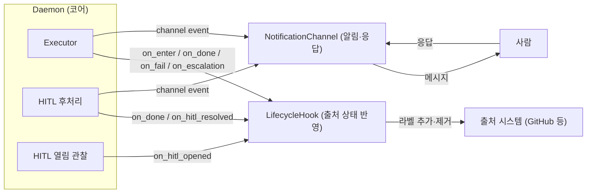
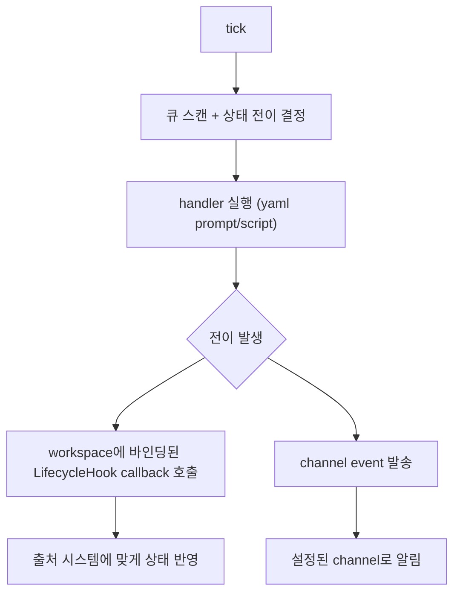
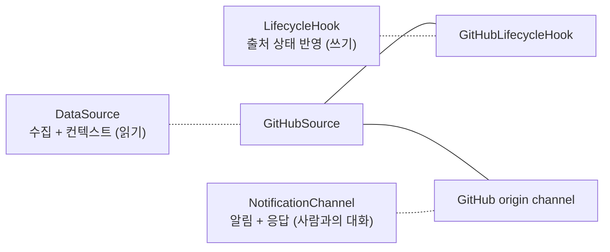
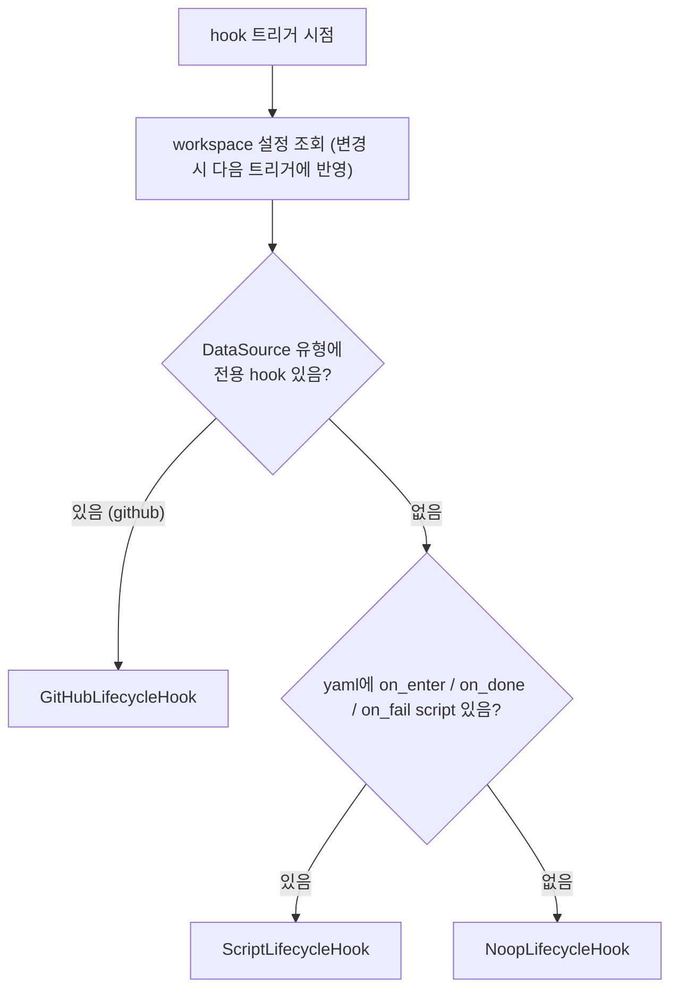
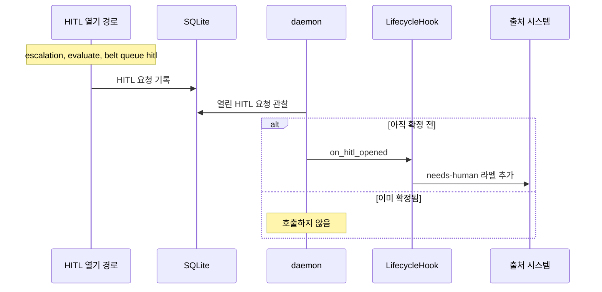
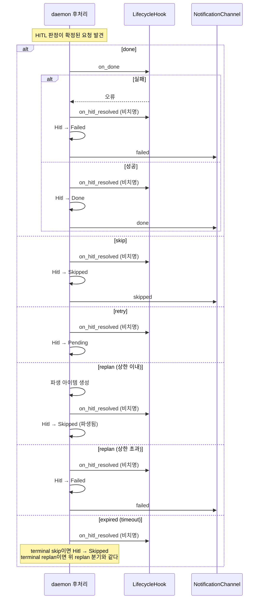
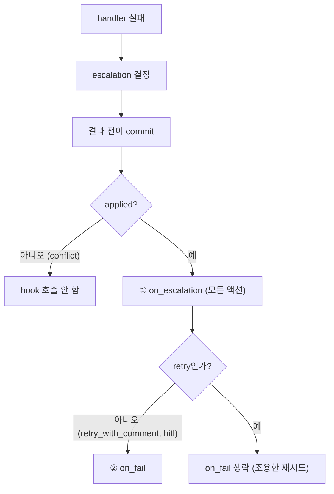

# LifecycleHook — 출처 상태 반영 추상화

> Daemon이 상태를 전이할 때, 해당 workspace의 LifecycleHook이 **출처 시스템의 상태**를 반영한다 (라벨 추가·제거 등).
> handler(prompt/script)는 "무엇을 실행할지", hook은 "상태가 바뀌었을 때 출처 시스템에 무엇을 반영할지".
> 사람에게 보내는 메시지(코멘트, 진행 알림, HITL 요청)와 사람의 응답 수신은 hook이 아니라 [NotificationChannel](./notification.md)이 맡는다.
> 새 DataSource 유형 추가 = LifecycleHook 구현 추가, 코어 변경 0 (OCP).

---

## 설계 — handler, hook, channel의 분리

| | handler | hook | channel |
|---|---------|------|---------|
| **역할** | 작업 자체 (분석, 구현, 리뷰) | 출처 시스템의 상태 반영 | 사람에게 알림·HITL 요청, 응답 수신 |
| **정의** | workspace yaml (prompt/script) | DataSource 유형별 구현 + workspace 설정 | workspace yaml `notifications` |
| **실행 주체** | Daemon Executor | Daemon이 트리거, hook 구현이 실행 | Daemon이 발송·polling |
| **예시** | "이슈를 구현해줘" | `belt:needs-human` 라벨 추가·제거 | 시작 코멘트, 실패 알림, HITL 요청 |
| **실패 영향** | handler 실패 → escalation | callback에 따라 다름 (아래 표) | phase에 영향 없음 |



### Daemon = CPU 비유



### 전이 지점별 callback과 channel event

전이 지점과 hook callback, channel event의 대응은 [NotificationChannel](./notification.md#전이-지점-매핑)의 매핑 표가 단일 기준이다.

---

## DataSource, LifecycleHook, NotificationChannel 관계



| 시스템 | DataSource | LifecycleHook | origin channel |
|--------|-----------|---------------|----------------|
| GitHub | 구현됨 | 구현됨 | 구현됨 |
| Jira | 미구현 | 미구현 | 미구현 |

> Slack 짝은 어느 계층에도 구현되어 있지 않다. 새 외부 시스템은 DataSource, LifecycleHook, origin channel을 각각 추가한다.

분리 이유:
- **단일 책임**: DataSource는 읽기(수집/조회), Hook은 출처 상태 쓰기, Channel은 사람과의 소통
- **독립 테스트**: hook만 대체해 상태 전이를 테스트할 수 있다
- **조합 가능**: 같은 DataSource에 다른 hook·channel 구성을 조합할 수 있다

---

## workspace 바인딩과 hook 선택

LifecycleHook은 workspace마다 인스턴스가 생성된다. 같은 GitHub DataSource라도 workspace별로 다른 hook 동작이 가능하다. 사용자가 hook 유형을 직접 지정하지 않는다. workspace의 DataSource 유형이 hook 유형을 결정한다.



- Daemon 재시작 없이 `belt workspace add`로 등록한 workspace는 다음 tick부터 동작한다.
- yaml을 수정하면 다음 hook 트리거에서 최신 설정이 반영된다.

### 내장 hook의 동작

| hook | 동작 |
|------|------|
| GitHubLifecycleHook | `on_hitl_opened` 시 이슈에 라벨(기본 `belt:needs-human`) 추가. `on_hitl_resolved` 시 그 라벨 제거. 그 밖의 callback은 사람 대상 메시지를 보내지 않는다 |
| ScriptLifecycleHook | yaml `on_enter`/`on_done`/`on_fail` script를 실행하는 어댑터. 전용 hook이 없는 DataSource에 쓰인다. `on_escalation`·`on_hitl_opened`·`on_hitl_resolved`는 무동작이다 |
| NoopLifecycleHook | 아무 것도 하지 않는다 |

> GitHub 이슈 코멘트(시작·실패·escalation·HITL 요청)는 hook이 아니라 GitHub origin channel이 작성한다. 라벨 추가·제거는 hook에 남는다.

> github source에는 `GitHubLifecycleHook`이 항상 우선 적용된다. 이 hook은 PR 생성이나 라벨 전환(`belt:implement` → `belt:review`)을 하지 않는다. 이 작업은 workspace yaml의 `on_done` script에서 구현한다. daemon은 evaluate 성공 후 hook과 무관하게 해당 state의 `on_done` script를 실행한다.

`jira` 등 다른 source는 전용 hook이 없어 `ScriptLifecycleHook` 또는 `NoopLifecycleHook`으로 동작한다. 새 DataSource 유형은 hook 구현을 추가하는 것으로 연결하며 코어를 바꾸지 않는다.

---

## callback과 에러 처리 정책

| callback | 호출 시점 | 실패 시 | 이유 |
|----------|----------|---------|------|
| `on_enter` | Running 진입 후, handler 실행 전 | handler 건너뛰고 escalation 경로 | 전제 조건 미충족 — handler 실행 의미 없음 |
| `on_done` | evaluate가 Done 판정 후. HITL done 후처리에서도 호출 | Failed 상태로 전이 (HITL done 후처리에서는 Hitl→Failed) | 외부 반영 실패 — 수동 확인 필요 |
| `on_fail` | handler 또는 on_enter 실패의 escalation 결과 전이가 applied로 commit된 뒤 (retry 제외) | 이력 기록, 상태 전이에 영향 없음 | 이미 실패 경로 — 2차 실패로 흐름 중단하지 않음 |
| `on_escalation` | escalation 결과 전이가 applied로 commit된 뒤 (모든 액션) | 이력 기록, escalation 진행 | 알림 실패가 escalation 자체를 막으면 안 됨 |
| `on_hitl_opened` | HITL 요청이 열린 뒤 daemon이 관찰할 때 한 번. 이미 확정된 요청은 건너뜀 | 이력 기록, 재시도 없음 (비치명) | 라벨 반영 실패가 HITL을 막으면 안 됨 |
| `on_hitl_resolved` | daemon의 HITL 해결 후처리에서, 결과 전이 전 | 이력 기록, 후처리 진행 (비치명) | 해결 사실의 외부 반영 실패가 해결 자체를 되돌리면 안 됨 |

```
원칙:
  - on_enter/on_done 실패 → 상태 전이에 영향 (치명적)
  - on_fail/on_escalation/on_hitl_opened/on_hitl_resolved 실패 → 이력만 기록 (비치명적)
  - 모든 hook 실패는 전이 이력에 hook 오류로 기록
```

> GitHub 시작 코멘트는 channel `started` 이벤트가 작성한다. 코멘트 작성 실패는 handler 실행을 막지 않고 dashboard에 표시된다. `on_enter` 실패가 handler를 건너뛰게 하는 것은 hook이 상태 반영에 실패한 경우(ScriptLifecycleHook의 사용자 script 등)에 한정된다.

### on_hitl_opened

HITL 요청이 열리면 daemon이 이를 관찰해 `on_hitl_opened`를 한 번 호출한다. 열린 경로(escalation, evaluate, `belt queue hitl`)와 무관하게 같다. GitHub 구현은 `belt:needs-human` 라벨을 붙인다. 관찰 시점에 이미 확정된 요청이면 호출하지 않는다. 실패해도 재시도하지 않고 이력에 기록한다.



### on_hitl_resolved

HITL 판정이 확정된 뒤 daemon 후처리가 호출한다. GitHub 구현은 `belt:needs-human` 라벨을 제거한다. 어느 경로(GitHub 코멘트, CLI, TUI, timeout)로 해결됐든 같다. 후처리는 at-least-once이므로 `on_hitl_resolved`는 두 번 호출될 수 있고, 구현은 멱등이어야 한다(이미 없는 라벨 제거는 성공으로 본다).



### on_escalation과 on_fail 호출 순서

handler 또는 on_enter가 실패하면 escalation 결과 전이를 먼저 commit하고, 전이가 applied일 때만 두 callback을 순차 호출한다.



> on_escalation은 escalation 유형(retry/hitl/...)을 받아 유형별로 반응할 수 있다. on_fail은 "실패했다"는 사실만 전달한다. hook 실패는 상태를 되돌리지 않는다.

---

## 기존 yaml on_done/on_fail/on_enter와의 호환

`ScriptLifecycleHook`은 기존 workspace yaml의 `on_enter`/`on_done`/`on_fail` script를 그대로 실행한다. `handlers`만 필수이고 이 세 필드는 비워도 된다. 전용 hook이 있는 DataSource에서도 daemon은 evaluate 성공 후 state의 `on_done` script를 실행한다. PR 생성 같은 출처 작업은 이 script가 맡는다.

GitHub 이슈 코멘트 여부는 [workspace.yaml 스키마](./workspace-schema.md)의 `notifications` 이벤트 선택으로 정한다.

---

## 수용 기준

- [ ] Daemon Executor는 상태 전이 시 hook callback을 트리거한다
- [ ] hook callback의 구체적 동작은 DataSource 유형별 구현이 결정한다
- [ ] LifecycleHook은 workspace별로 인스턴스가 생성된다
- [ ] `ScriptLifecycleHook`이 기존 yaml script와 호환을 유지한다
- [ ] on_escalation·on_fail은 escalation 결과 전이가 applied로 commit된 뒤 호출되고, on_escalation → on_fail 순서다. on_fail은 retry를 제외하고 호출된다
- [ ] 결과 전이가 conflict면 hook을 호출하지 않는다
- [ ] on_enter/on_done 실패 시 상태 전이에 영향을 준다 (escalation / Failed)
- [ ] on_fail/on_escalation/on_hitl_opened/on_hitl_resolved 실패 시 이력만 기록하고 흐름을 중단하지 않는다. hook 실패는 상태를 되돌리지 않는다
- [ ] 모든 HITL 열기(escalation, evaluate, `belt queue hitl`)에서 `on_hitl_opened`가 한 번 호출되고 GitHub는 `belt:needs-human`을 붙인다
- [ ] HITL done 후처리에서 on_done이 실패하면 Hitl→Failed로 전이하고, 이때도 `on_hitl_resolved`가 호출된다
- [ ] `on_hitl_resolved`는 daemon 후처리에서 모든 해결 결과(done 성공, done의 on_done 실패, skip, retry, replan 상한 이내, replan 상한 초과, 만료)마다 결과 전이 직전에 호출되고, 실패해도 후처리가 결과 전이까지 진행한다
- [ ] GitHub는 HITL 해결 후 `belt:needs-human` 라벨을 제거한다 (GitHub 코멘트, CLI, TUI, timeout 어느 경로든 같다)
- [ ] 내장 hook 구현(GitHubLifecycleHook, NoopLifecycleHook)은 사람 대상 메시지를 보내지 않는다. 사람 대상 메시지는 channel이 보낸다 (사용자 정의 script를 실행하는 ScriptLifecycleHook은 제외)
- [ ] 시작 코멘트 작성 실패가 handler 실행을 막지 않는다
- [ ] 모든 hook 실패는 전이 이력에 기록된다
- [ ] 새 DataSource 유형 추가 시 코어 변경 없이 hook 구현만 추가하면 된다
- [ ] handler(prompt/script), hook(출처 상태 반영), channel(알림·응답)이 명확히 분리된다

---

## 미결

없음

---

### 관련 문서

- [DESIGN](../DESIGN.md) — 설계 철학 (Daemon = Orchestrator)
- [NotificationChannel](./notification.md) — 알림·HITL 응답 채널
- [DataSource](./datasource.md) — 수집/컨텍스트 추상화
- [Daemon](./daemon.md) — 실행 루프, Executor, HITL 후처리
- [QueuePhase 상태 머신](./queue-state-machine.md) — 상태 전이 규칙
