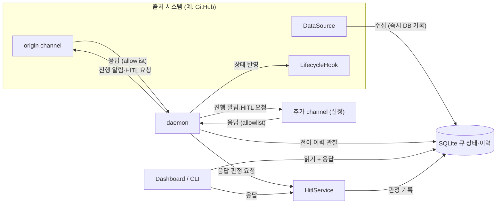
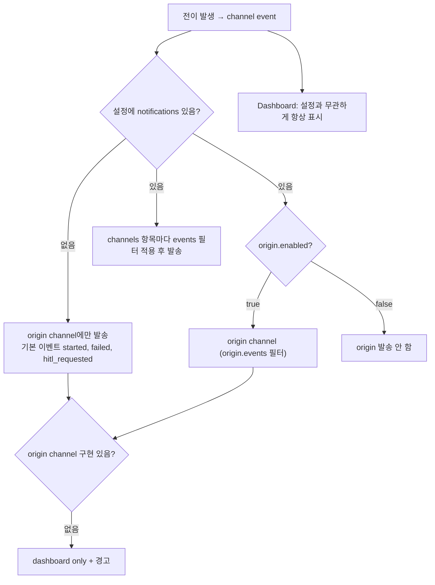
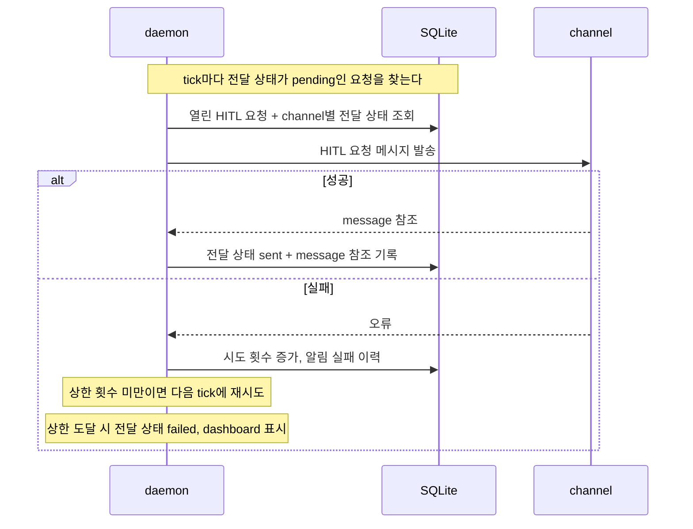
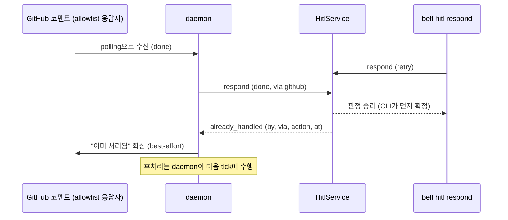
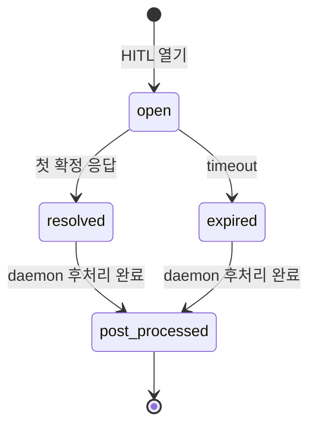
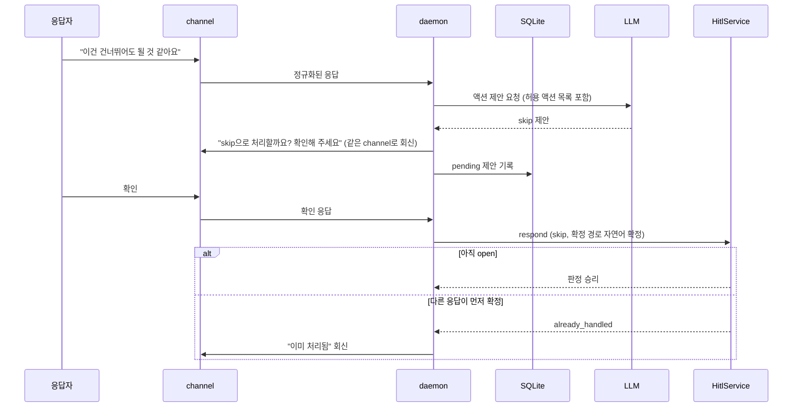

# NotificationChannel — 진행 알림과 HITL 응답 채널

> 사람에게 보내는 메시지(진행 알림, HITL 요청)와 사람에게서 오는 응답은 `NotificationChannel`이 맡는다.
> 출처 시스템의 상태 반영(라벨 등)은 [LifecycleHook](./lifecycle-hook.md)에 남는다.
> 알림과 HITL 응답은 채널과 무관하다. 첫 확정 응답이 이기고, 늦은 응답은 반영하지 않고 "이미 처리됨"으로 회신한다.

---

## 경계

| 구성요소 | 맡는 것 | 맡지 않는 것 |
|----------|---------|--------------|
| DataSource | 수집, 컨텍스트 조회. 수집한 아이템은 즉시 DB에 기록 | 응답 수신, 알림 |
| LifecycleHook | 출처 시스템의 상태 반영(라벨 추가·제거 등), 사용자 정의 script 실행 | 사람 대상 메시지(내장 구현 기준), 응답 수신 |
| NotificationChannel | 발송, 선택적 수신·정규화 | 판정, phase 전이 |
| HitlService | HITL 열기·첫 응답 판정·timeout·자연어 확정 경합 | 후처리, phase 전이 |
| daemon | 알림 발송, 응답 polling, HITL 후처리 | 응답 해석 정책 |
| Dashboard / CLI | DB를 읽어 표시. 항상 켜져 있고 응답 가능 | 알림 설정 대상이 아님 |

> 응답 수신은 channel의 책임이다. DataSource는 응답을 받지 않는다.

---

## 전이 지점 매핑

한 전이가 hook callback과 channel event를 모두 만들 수 있다. 두 어휘가 따로 자라지 않도록 아래 표를 단일 기준으로 한다.

| 전이 지점 | LifecycleHook callback | channel event | 비고 |
|-----------|------------------------|---------------|------|
| Ready→Running (점유) | `on_enter` | `started` | 이 시점부터 처리 중(handler 실행) |
| Running→Skipped (취소) | 없음 (그 실행의 hook·escalation 미실행) | `skipped` | daemon 경유든 CLI 직접이든 같다 |
| Completed→Done (evaluate) | `on_done` | `done` | |
| handler 실패 → escalation retry | `on_escalation(retry)` (결과 전이 commit 뒤) | — | 원 아이템 Skipped(파생됨, `skipped` 없음), 파생 아이템 Pending. 조용한 재시도 |
| escalation retry_with_comment | `on_escalation` + `on_fail` (결과 전이 commit 뒤) | `failed` | 원 아이템 Skipped(파생됨, `skipped` 없음) |
| X→Hitl (escalation hitl, evaluate 사람 필요, `belt queue hitl`) | `on_escalation(hitl)` (escalation 경로만), 모든 경로에서 `on_hitl_opened` | `hitl_requested` | HITL 요청 전달 경로 |
| HITL 판정 확정 (응답 / timeout) | — | — (내부 `hitl_resolved`) | 이 시점부터 처리 중(후처리) |
| 후처리: Hitl→Done | `on_done` → `on_hitl_resolved` | `done` | on_done 실패 시 Hitl→Failed, `failed` |
| 후처리: Hitl→Skipped (skip 응답, terminal skip) | `on_hitl_resolved` | `skipped` | |
| 후처리: Hitl→Skipped (replan 이내, 파생됨) | `on_hitl_resolved` | — | 파생 아이템 Pending |
| 후처리: Hitl→Pending (retry) | `on_hitl_resolved` | — | 같은 아이템 |
| 후처리: Hitl→Failed (replan 상한 초과) | `on_hitl_resolved` | `failed` | |
| →Skipped, →Failed (그 밖의 경로) | 기존 규칙 | `skipped` / `failed` | |

> 파생으로 끝난 원 아이템(escalation retry의 Running→Skipped, replan 이내의 Hitl→Skipped)은 `skipped`를 내지 않는다. 작업은 파생 아이템에서 이어지기 때문이다. `skipped`는 계열이 끝나는 Skipped에만 낸다: skip 응답, terminal skip, 실행 중 취소, Pending·Ready·Failed의 skip.

> 처리 중, 후처리, 취소의 의미는 [QueuePhase 상태 머신](./queue-state-machine.md)과 [Daemon](./daemon.md)이 정한다.

---

## 이벤트와 라우팅

### 이벤트 어휘

| 이벤트 | 의미 | 채널에서 선택 가능 |
|--------|------|-------------------|
| `started` | 아이템이 Running으로 진입 | O |
| `done` | 아이템이 Done으로 완료 | O |
| `failed` | escalation으로 on_fail이 호출되는 실패(retry_with_comment, hitl), Completed·Hitl에서 Failed로 끝남 | O |
| `skipped` | 아이템이 Skipped로 끝나고 계열이 이어지지 않음(skip, terminal skip, 취소). 파생으로 끝난 Skipped는 제외 | O |
| `hitl_requested` | HITL 요청이 열림 | O |
| `hitl_resolved` | HITL 판정이 확정됨 | X (내부 이벤트) |

> `hitl_resolved`는 모든 채널에 알리지 않는다. 해결 공지 fan-out은 없고, 늦게 응답한 채널에만 `already_handled`를 회신한다.

### 라우팅 규칙

| 항목 | 규칙 |
|------|------|
| 설정 없음 | origin channel에만 보낸다. 기본 이벤트는 `[started, failed, hitl_requested]`이고 외부 응답은 받지 않는다 |
| origin | `enabled`, `events`, `respond.allow`를 설정한다. 기본 `enabled`는 true |
| 추가 channel | `channels` 목록으로 fan-out한다. 이름은 workspace 안에서 고유하다 |
| 이벤트 필터 | channel마다 선택한다. 필터에 없는 이벤트는 그 channel로 나가지 않는다 |
| 응답 회신 | 확인 요청·`already_handled` 같은 회신은 이벤트 필터와 무관하게 응답을 보낸 channel로 간다 |
| 설정 반영 | `notifications` 변경은 daemon 재시작 시 반영된다 |
| Dashboard | 설정과 무관하게 항상 표시되고, TUI·CLI에서 응답할 수 있다 |
| origin 구현 없음 | 해당 출처 시스템에 origin channel 구현이 없으면 dashboard only로 동작하고 경고를 남긴다 |

### Fail Fast

> 지원하지 않는 channel `type`이 설정에 있으면 workspace 설정 로드가 실패한다. 알 수 없는 type을 무시하거나 다른 type으로 대체하지 않는다.

필드 정의는 [workspace.yaml 스키마](./workspace-schema.md)의 `notifications`를 따른다.

---

## 발송

발송은 두 갈래다. 실패는 어느 쪽도 아이템의 phase에 영향을 주지 않는다.

| 구분 | 진행 알림 | HITL 요청 전달 |
|------|-----------|----------------|
| 대상 이벤트 | `started`, `done`, `failed`, `skipped` | `hitl_requested` |
| 보장 | best-effort. 실패는 이력에 남기고 dashboard에 표시 | channel별 전달 상태를 추적하고 재시도 |
| 재시도 | 없음 | 다음 tick에 재시도. 상한 횟수를 넘으면 `failed` 상태로 두고 dashboard에 표시. 백오프는 없다 |
| 중복 | 없음 | at-least-once이므로 같은 요청의 메시지가 중복될 수 있다 |
| daemon 정지 중 전이 | 알리지 않는다. 재시작 후에도 소급해 보내지 않는다 | 재시작 후 아직 전달되지 않은 요청을 보낸다 |

HITL 요청 전달 상태는 `belt hitl show`와 dashboard에서 channel별로 볼 수 있다. 전달 재시도 상한([Daemon](./daemon.md#실행-루프))의 값은 구현이 정하며, daemon의 "후처리 실패 상한"과는 별개다.

---

## 수신

### 수신 조건

> 외부 응답은 channel의 `respond.allow`가 비어 있지 않을 때만 받는다. 비어 있으면 그 channel은 발송 전용이다.

| 구분 | 규칙 |
|------|------|
| allowlist | channel별 응답자 목록. 목록에 없는 응답자의 응답은 `unauthorized`로 기록하고 회신하지 않는다 |
| Dashboard / CLI | allowlist를 적용하지 않는다. 로컬 사용자는 신뢰한다 |
| 수신 방식 | tick마다 channel을 polling한다. daemon에 HTTP 서버가 없다. daemon이 꺼진 동안 온 응답은 재시작 후 소급 수신한다. 그 사이 다른 경로가 확정했으면 `already_handled`다 |

### 정규화와 상관관계

- channel은 외부 응답을 공통 형태로 바꾼다. 공통 형태는 응답자, 외부 응답 id, 본문, 어느 HITL 요청에 대한 응답인지 가리키는 단서로 구성된다.
- 어느 HITL 요청에 대한 응답인지는 메시지에 심은 `hitl_id` 토큰이나 발송한 메시지에 대한 답글 관계로 찾는다.
- 찾지 못한 응답은 `not_found`로 기록하고 반영하지 않는다.

### 1회 처리

> `(channel, 외부 응답 id)`는 재시작 후에도 한 번만 처리한다. polling이 같은 응답을 다시 읽어도 이미 처리한 응답은 건너뛴다. 승자 응답을 재polling해도 `already_handled`가 아니다.

### 첫 응답 승리

HITL 요청에 대한 응답은 CLI, TUI, 외부 channel 어디서 오든 같은 경합에 참여한다. 먼저 확정된 응답만 이기고, 이후 응답은 `already_handled`로 거절된다. 이긴 응답 직후 아이템은 "해결됨 · 처리 중"이 되고, phase는 daemon 후처리의 결과로만 바뀐다. 후처리는 [Daemon](./daemon.md), 판정 단위와 저장은 [Data Model](./data-model.md)을 따른다.

timeout도 같은 경합에 참여한다. 만료가 먼저 확정되면 사람의 응답은 `already_handled`다.

### HITL 요청 생명주기

> `open → resolved | expired` 전이는 하나만 성공한다. 같은 아이템이 HITL에 다시 들어가면 새 요청이 생기고, 이전 요청에 대한 늦은 응답은 새 요청을 닫지 않는다.

### 자연어 응답

자연어 응답은 LLM이 액션을 제안하고, 응답자가 확인한 뒤에만 확정한다. 경합에 참여하는 것은 확정된 액션이다.

| 규칙 | 내용 |
|------|------|
| 제안 대상 | 허용된 액션(`done`, `retry`, `skip`, `replan`) 중 하나. 해석할 수 없으면 `invalid_action`으로 회신한다 |
| 확인 전 | 제안은 경합에 참여하지 않는다. 확인 대기 중에도 다른 응답이 이길 수 있다 |
| 패배 | 다른 응답이 이기면 pending 제안은 대체(superseded)된다. 이후 확인이 오면 `already_handled`로 회신한다 |
| 대체 | 같은 응답자의 새 자연어 응답은 이전 pending 제안을 대체한다. 확인은 최신 제안에만 적용된다 |
| 기록 | 제안은 DB에 남고 HITL이 확정되면 종결된다([Data Model](./data-model.md)). 판정 이력에 확정 경로(직접 / 자연어 확정)를 남긴다 |

---

## 거절 값과 회신 규칙

| 값 | 의미 | 회신 |
|----|------|------|
| `already_handled { by, via, action, at }` | 먼저 확정된 응답이 있음 | 응답을 보낸 channel로 best-effort 회신 |
| `busy { processing }` | 처리 중이라 변경 불가 | CLI·TUI에 표시 |
| `unauthorized` | allowlist에 없는 응답자 | 회신하지 않는다 (스팸 증폭 방지). 이력에 기록 |
| `not_found` | 대응하는 HITL 요청 없음 | 기록, 외부 channel에는 회신하지 않는다 |
| `invalid_action` | 허용되지 않는 액션 또는 해석 불가 | 외부 channel은 best-effort 회신 |

| 구분 | 표시 방식 |
|------|-----------|
| 외부 channel | 회신 메시지. 회신 실패는 알림 실패로 이력에 남고 판정에 영향 없다 |
| CLI | non-zero exit와 `--json` reason ([CLI 레퍼런스](./cli-reference.md)) |
| TUI | 토스트 |

모든 거절은 아이템 이력에 남는다.

---

## 수용 기준

- [ ] 설정이 없으면 origin channel에만 기본 이벤트(`started`, `failed`, `hitl_requested`)가 나가고 외부 응답은 받지 않는다
- [ ] 지원하지 않는 channel type은 설정 로드를 실패시킨다
- [ ] 이벤트 필터에 없는 이벤트는 해당 channel로 나가지 않는다
- [ ] Dashboard는 설정과 무관하게 진행 상황과 HITL 요청을 보여주고 응답할 수 있다
- [ ] 알림 발송 실패는 phase에 영향을 주지 않고 dashboard에 보인다
- [ ] daemon 정지 중 일어난 전이의 진행 알림은 재시작 후에도 보내지 않는다
- [ ] HITL 요청 전달은 다음 tick에 재시도되고 상한 횟수 뒤 `failed`로 표시된다. 중복 메시지는 허용된다
- [ ] allowlist가 비어 있는 channel의 외부 응답은 받지 않는다
- [ ] daemon이 꺼진 동안 온 외부 응답은 재시작 후 소급 수신되고, 그 사이 다른 경로가 확정했으면 `already_handled`다
- [ ] 파생으로 끝난 Skipped는 `skipped` 이벤트를 내지 않는다
- [ ] allowlist 밖 응답은 `unauthorized`로 기록되고 회신되지 않는다
- [ ] 같은 `(channel, 외부 응답 id)`는 재시작 후에도 한 번만 처리된다
- [ ] 동시 응답은 하나만 승리하고 나머지는 `already_handled`다. DB 에러로 끝나지 않는다
- [ ] 승자 응답을 다시 polling해도 거절이 아니다
- [ ] timeout과 사람 응답이 경합하면 하나만 이긴다
- [ ] 자연어 응답은 확인 후에만 확정되고, 확인 대기 중 다른 응답이 이기면 `already_handled`다
- [ ] HITL 확정 뒤 온 자연어 확인은 `already_handled`다
- [ ] 늦은 응답은 `already_handled { by, via, action, at }`로 응답을 보낸 channel에 회신된다
- [ ] 같은 아이템이 HITL에 재진입해도 이전 요청에 대한 늦은 응답이 새 요청을 닫지 않는다

---

## 미결

없음

---

### 관련 문서

- [DESIGN](../DESIGN.md) — 전체 아키텍처
- [LifecycleHook](./lifecycle-hook.md) — 출처 상태 반영
- [DataSource](./datasource.md) — 수집과 origin channel 짝
- [workspace.yaml 스키마](./workspace-schema.md) — `notifications` 설정
- [CLI 레퍼런스](./cli-reference.md) — `belt hitl`, `belt queue skip`
- [QueuePhase 상태 머신](./queue-state-machine.md) — 전이 계약, 처리 중, 취소
- [Daemon](./daemon.md) — HITL 후처리, tick 단계
- [Data Model](./data-model.md) — HITL 요청·전이 이력
