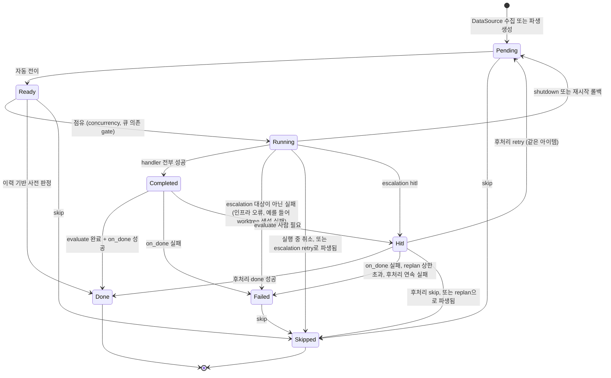
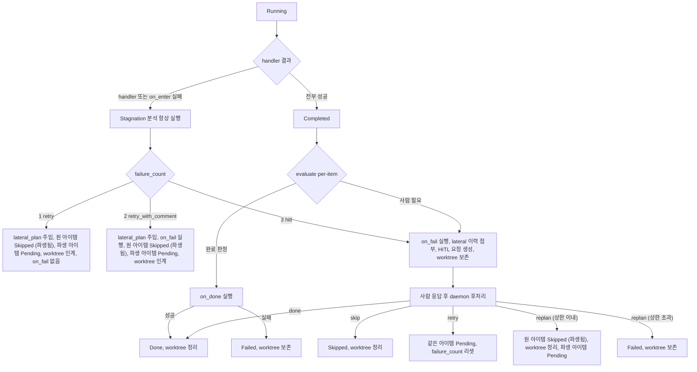
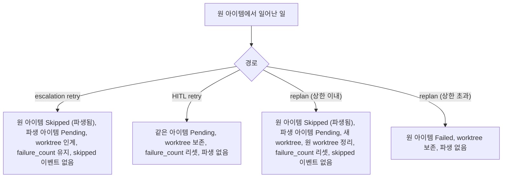
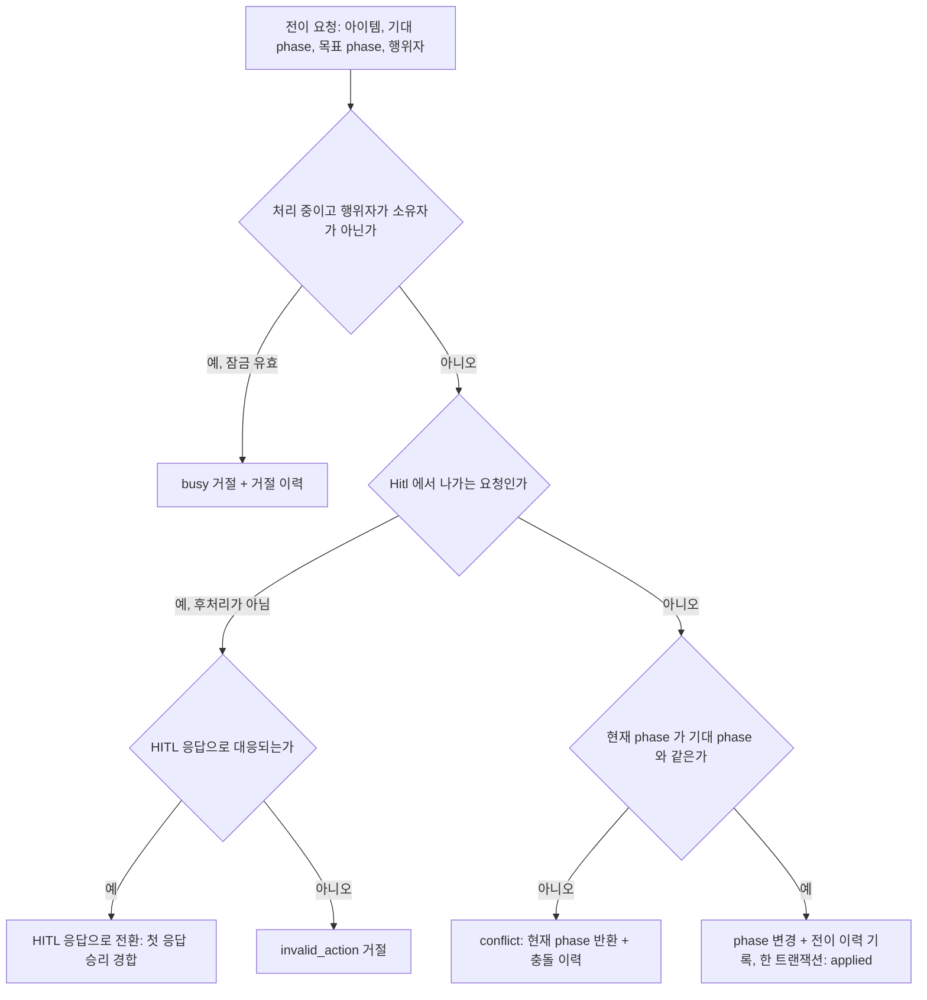
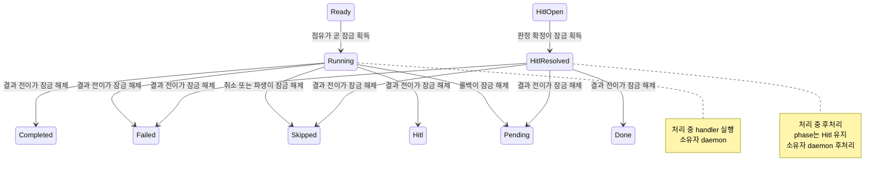
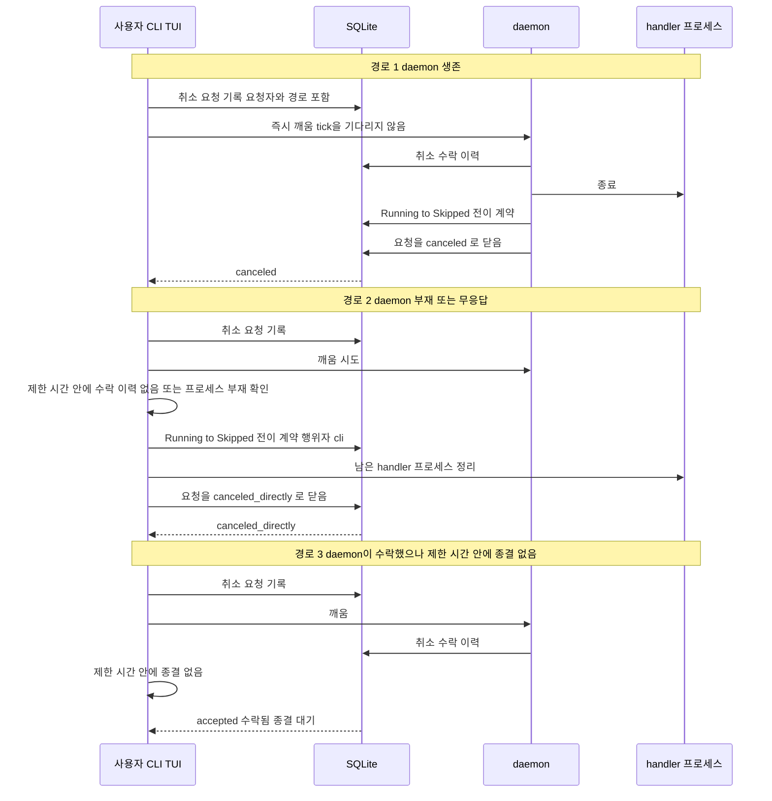
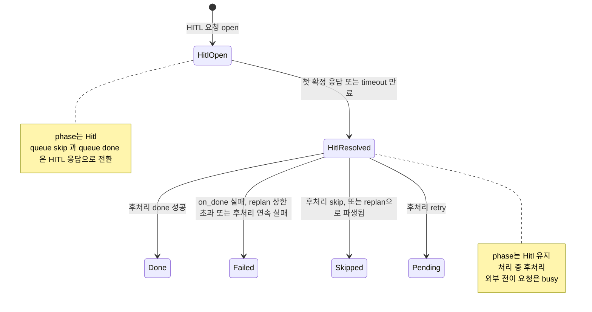
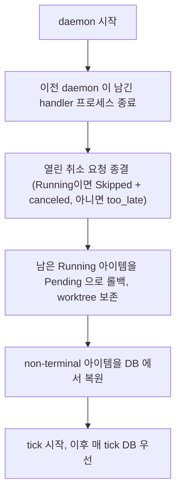

# QueuePhase 상태 머신

> 큐 아이템의 전체 생명주기와 상태 소유권을 정의한다.
> 상위 설계는 [DESIGN](../DESIGN.md) 참조.

---

## Phase 정의

| Phase | 설명 |
|-------|------|
| **Pending** | DataSource가 감지, 큐 대기 |
| **Ready** | 실행 준비 완료 (자동 전이) |
| **Running** | worktree 생성 + handler 실행 중 (처리 중 잠금) |
| **Completed** | handler 전부 성공, evaluate 대기 (잠금 아님) |
| **Done** | evaluate 완료 판정 + on_done script 성공 (terminal) |
| **Hitl** | 사람 판단 필요 (응답 확정 후 후처리 중이면 처리 중 잠금) |
| **Skipped** | escalation skip, preflight 실패, 실행 중 취소, escalation retry·replan으로 파생됨 (terminal) |
| **Failed** | on_done script 실패, 인프라 오류, replan 상한 초과, HITL 후처리 실패 등. 나가는 길은 skip뿐이다 |

---

## 상태 소유권

> 큐 아이템과 phase의 유일한 권위는 SQLite다. daemon의 in-memory 큐는 작업용 사본이며, 사본과 DB가 다르면 DB를 따른다.

| 행위자 | 상태에 대한 권한 |
|--------|------------------|
| daemon | 처리 소유자. handler 실행·HITL 후처리의 결과로 phase를 바꾼다 |
| CLI / TUI | 전이 계약을 통해서만 phase를 바꾼다. 처리 중인 아이템에는 취소 요청만 남긴다 |
| evaluator | Completed 아이템을 전이 계약으로 Done 또는 Hitl로 바꾸는 정당한 행위자다 |
| cron (hitl-timeout 등) | HITL 요청을 만료시키는 경합에 참여한다. phase는 직접 바꾸지 않는다 |

- 모든 phase 전이는 전이 이력에 남는다 ([Data Model](./data-model.md) 참조).
- 한 DB에는 daemon이 하나만 동작한다는 전제다. 처리 소유자 "daemon"은 이 단일 인스턴스를 뜻한다.

---

## 전체 상태 전이

> 다이어그램의 전이는 허용된 전이의 집합이다. 허용되지 않은 전이 요청은 `invalid_action`으로 거절된다.
> Failed에서 나가는 전이는 Skipped뿐이다. Failed를 Done으로 바꾸는 경로는 없다.
> handler·on_enter 실패는 항상 escalation 대상이고 결과는 Skipped(파생) 또는 Hitl이다. `Running --> Failed`는 handler를 시작하기 전 인프라 단계가 실패한 경우에만 쓴다.
> `Hitl --> Pending`은 HITL retry 전용이다. replan은 원 아이템 Skipped와 파생 아이템 Pending으로 나타난다.

### Running 이후의 분기

---

## 파생 아이템과 계열

escalation retry와 replan은 원 아이템을 다시 쓰지 않고 새 `work_id`의 **파생 아이템**을 만든다. 파생 아이템은 직전 아이템의 `work_id`를 **파생 원본**으로 기록한다. 같은 최초 아이템에서 이어진 아이템들을 **계열**이라 부른다. `belt queue show`와 `belt context`가 파생 원본을 보여준다.

| 항목 | 규칙 |
|------|------|
| 식별자 | `(source_id, state)`에서 처음 만들어지는 아이템의 `work_id`는 `{source_id}:{state}`다. 그 뒤 같은 `(source_id, state)`에서 만들어지는 아이템은 파생이든 재수집이든 `{source_id}:{state}:{n}`이다. `n`은 `(source_id, state)` 단위로 2부터 1씩 단조 증가하고 `work_id`는 재사용되지 않는다 |
| 파생 원본 | 파생 아이템은 직전 아이템의 `work_id`를 기록한다. HITL retry는 파생이 아니라 같은 아이템이 Pending으로 돌아간다 |
| escalation retry | 원 아이템은 Running→Skipped(사유 파생됨)로 끝난다. worktree는 정리하지 않고 파생 아이템에 **인계**한다. 인계 뒤 worktree의 소유자는 파생 아이템이다 |
| replan (상한 이내) | 원 아이템은 Hitl→Skipped(사유 파생됨)로 끝나고 worktree는 정리된다. 같은 출처로 파생 아이템을 Pending으로 만든다. 파생 아이템은 이전 시도 이력·lateral 이력·HITL 메모를 주입받아 처음부터 계획을 다시 세우고 새 worktree를 만든다. 시작 state는 원 아이템의 state다 |
| replan 상한 | 계열 전체에서 replan으로 파생된 횟수가 3회다. 이미 3회 파생된 계열에서 replan이 확정되면 Hitl→Failed이고 worktree는 보존한다. 사람 응답과 HITL 만료(terminal `replan`)가 같다. 상한 값은 설정으로 노출하지 않는다 |
| failure_count | 계열의 시도 이력에서 마지막 **리셋 지점** 이후의 실패 수다. 리셋 지점은 HITL retry 확정과 replan 파생이다. 리셋 뒤 다음 실패는 escalation 1단계(retry)부터 다시 적용된다. 취소·conflict로 버려진 실행은 세지 않는다 |
| `skipped` 이벤트 | 파생으로 끝난 Skipped는 channel event `skipped`를 내지 않는다. 작업이 파생 아이템에서 이어지기 때문이다. 계열이 끝나는 Skipped(skip 응답, terminal skip, 실행 중 취소, Pending·Ready·Failed의 skip)에만 낸다 |

> 재수집 아이템(예를 들어 changes-requested 피드백 루프나 라벨이 남아 다시 수집된 경우)은 파생 원본이 없는 **새 계열의 첫 아이템**이며 다음 `n`을 받는다. 재수집이 허용되는 조건은 [DataSource](./datasource.md)의 수집 규칙을 따른다.
> 큐 의존의 선행 아이템이 파생되면 "선행 아이템 Done 대기" gate는 그 계열의 최신 아이템 phase로 판정한다.

---

## 전이 계약

모든 phase 전이는 하나의 계약을 거친다. 어느 행위자도 phase를 직접 덮어쓰지 않는다.

| 결과 | 의미 |
|------|------|
| `applied` | phase 변경과 전이 이력이 함께 기록되었다 |
| `busy` | 처리 중인 아이템에 소유자가 아닌 행위자가 요청했다. 처리 종류(handler / 후처리)를 함께 알린다. 거절도 이력에 남는다 |
| `conflict` | 잠기지 않은 phase(Pending, Ready, Completed, Failed)에서 기대 phase가 이미 달라졌다. 정상 경합의 결과이며 현재 phase를 함께 알린다 |
| `invalid_action` | 목표 phase가 허용된 전이 집합 밖이거나 대응되는 HITL 액션이 없다 |

- 결과 집합은 `applied`, `busy`, `conflict`, `invalid_action` 네 값이다.
- `busy`, `conflict`, `invalid_action`은 오류가 아니라 값이다. 호출자는 non-zero 종료와 `--json` reason, TUI 토스트로 확인한다.
- 동시 전이는 하나만 `applied`이고 나머지는 위 값 중 하나로 끝난다.
- `conflict`의 예: Ready에서 사람의 skip과 daemon의 점유가 경합한다. Completed에서 evaluator와 사람의 조작이 경합한다.
- 목표 phase가 허용된 전이 집합 밖이면 거절된다. 허용 집합은 위 상태 전이 다이어그램이다.

---

## 처리 중 잠금

> 처리 중인 아이템은 처리 소유자만 바꾼다. 새 phase나 별도 잠금 값을 두지 않고 기존 상태에서 파생한다.

| 처리 중 | 조건 | 소유자 | 풀리는 시점 |
|---------|------|--------|-------------|
| (i) handler | phase가 Running | daemon | Running에서 나가는 결과 전이 (Completed, Failed, Skipped, Hitl, Pending) |
| (ii) 후처리 | phase가 Hitl이고 그 HITL 요청이 확정(resolved 또는 expired)됐으나 후처리 미완료 | daemon 후처리 | Hitl에서 나가는 결과 전이 (Done, Failed, Skipped, Pending) |

- **Completed는 잠금이 아니다.** evaluator가 전이 계약으로 전이하는 정당한 행위자이기 때문이다. 평가 중 사람의 조작이 이기면 evaluator의 판정은 `conflict`로 버려진다.
- **잠금 무효**: 소유자 daemon이 없거나 응답하지 않으면 처리 중 (i) 잠금은 무효다. 무효 판정은 [실행 중 취소](#실행-중-취소) 경로에서만 쓰고, 그 밖의 외부 전이는 여전히 `busy`다.

| 판정 | 기준 |
|------|------|
| 부재 | 기록된 daemon 프로세스가 살아 있지 않다. 즉시 무효 |
| 무응답 | 프로세스는 살아 있지만, 취소 요청으로 깨운 뒤 제한 시간 안에 daemon이 취소 수락을 이력에 남기지 않았다 |

- 무응답 판정이 틀려 daemon이 살아 있었다면, 이후 daemon의 결과 전이는 `conflict`가 되고 daemon은 DB를 따른다 ([Daemon](./daemon.md#db-관찰과-자기-전이-conflict) 참조).
- crash로 남은 잠금: (i)은 시작 시 Running→Pending 롤백으로, (ii)는 상태 기반 후처리가 재시작 뒤 다시 실행되어 풀린다.

---

## 실행 중 취소

실행 중 아이템 취소는 전이 요청이 아니라 **취소 요청**이다. 처리 중 잠금에서 `busy`로 거절되지 않는 유일한 외부 의도다. 진입점은 `belt queue skip`과 TUI 취소 키다.

### 대상 phase별 의미

| 아이템 상태 | `skip`의 의미 |
|-------------|---------------|
| Running | 취소 (아래 두 경로) |
| Pending, Ready, Failed | 전이 계약으로 바로 Skipped. Ready에서 점유와 경합해 `conflict`면 한 번 다시 판단해 취소 경로로 넘어간다 |
| Hitl (open) | HITL 응답 skip으로 전환되어 첫 응답 승리 경합에 참여한다 |
| Hitl (후처리 중) | `busy` |

### 취소 경로

| 결과 | 의미 |
|------|------|
| `canceled` | daemon이 handler를 종료하고 Running→Skipped로 바꿨다 |
| `canceled_directly` | daemon 부재 또는 무응답으로 CLI가 직접 Running→Skipped로 바꾸고 남은 handler를 정리했다 |
| `accepted` | daemon이 수락했으나 제한 시간 안에 종결되지 않았다. CLI는 직접 경로로 넘어가지 않고 exit 0으로 끝난다. 최종 결과는 `belt queue show`로 확인한다 |
| `too_late` | 처리 전에 이미 Running을 벗어났다. phase는 그 결과를 따른다 |
| `busy` | HITL 후처리 중이다 |

- 소유자가 살아 있으면 상태는 소유자만 바꾸고 외부는 요청만 남긴다. 소유자가 없을 때만 외부가 바꾼다.
- 취소 요청과 결과는 아이템 이력에 요청자와 경로(cli / tui)와 함께 남는다. 아이템당 열린 취소 요청은 하나이고 중복 요청은 같은 요청으로 본다.
- 취소된 실행의 hook(on_done / on_fail / on_escalation)과 escalation은 실행하지 않는다. 시도 이력에는 `skipped`로 남아 failure_count에 영향이 없다. 토큰 사용량은 기록한다.
- 취소된 아이템의 worktree는 Skipped 규칙(정리)을 따른다.
- daemon 부재 중 CLI가 Skipped로 만든 아이템은 daemon이 재시작할 때 DB를 따른다.
- 취소는 channel event `skipped`를 낸다. origin 기본 이벤트에 `skipped`가 없으므로 기본 설정에서는 외부로 나가지 않는다. 파생으로 끝난 Skipped는 `skipped`를 내지 않는다. 상세: [Notification](./notification.md)

---

## Hitl 출구 규칙

> Hitl에서 나가는 전이는 daemon 후처리만 수행한다. 다른 행위자의 요청은 HITL 응답으로 바꾸거나 `invalid_action`으로 거절한다.

| 요청 | 결과 |
|------|------|
| `belt queue skip` / `belt queue done` (open HITL) | HITL 응답 skip / done으로 전환. 판정 승리 또는 `already_handled` |
| 대응되는 HITL 액션이 없는 요청 (예: 이미 Hitl인 아이템에 `belt queue hitl`) | `invalid_action` |
| HITL 후처리 중 외부 전이 | `busy` |

- **불변식**: open HITL 요청이 있으면 그 아이템의 phase는 Hitl이다. 후처리는 open이 아닌(resolved / expired) 요청에서만 시작되므로 open 요청이 주인 없이 남지 않는다.
- 응답 직후에도 phase는 Hitl이고 화면에는 "해결됨 · 처리 중"으로 보인다. phase는 후처리의 결과로만 바뀐다. 상세: [Daemon](./daemon.md#hitl-해결-후처리)

---

## Worktree 생명주기

| Phase / 이벤트 | Worktree |
|----------------|----------|
| Running | 생성 (또는 인계받은 worktree·롤백으로 보존된 worktree 재사용) |
| Completed | 유지 (evaluate 대기) |
| Done | **정리** |
| Hitl | 보존 (사람 확인 후 결정) |
| Failed | 보존 (디버깅용) |
| Skipped (취소 포함) | 정리 |
| escalation retry로 파생됨 | **인계** (정리 안 함, 소유자가 파생 아이템으로 바뀜) |
| HITL retry (Hitl→Pending) | 보존 (이전 작업 위에서 재시도) |
| Graceful shutdown 또는 재시작 롤백 (Running→Pending) | **보존** (재사용) |
| log-cleanup cron | 보존된 worktree 중 TTL 초과분 정리 (전이 이력 등 기록은 대상 아님) |

**정리 원칙**: worktree는 그 worktree를 소유한 아이템이 **Done 또는 Skipped**가 될 때만 정리한다. 만료로 끝난 HITL도 이 규칙을 따른다. escalation retry로 인계된 worktree의 소유자는 파생 아이템이므로 원 아이템의 Skipped로는 정리되지 않는다. 롤백 시에는 재사용을 위해 보존한다. 나머지 보존분(Failed 등)은 `log-cleanup` cron이 TTL(기본 7일) 기준으로 주기 정리한다. 전이 결과가 `conflict`인 실행의 worktree는 DB에 남은 phase의 규칙을 따른다.

---

## DB 로드와 시작 시 복원

- 시작 시 non-terminal 아이템을 DB에서 복원한다. in-memory 큐가 DB보다 앞서 존재하지 않는다.
- 롤백 전에 이전 daemon이 남긴 handler 프로세스를 종료한다. 단일 daemon 전제이므로 남은 프로세스는 모두 이전 daemon의 것이다.
- 프로세스 정리 뒤 열린 취소 요청(Requested·Accepted)을 먼저 종결한다. 대상 아이템이 Running이면 Pending 롤백 대신 Running→Skipped로 바꾸고 요청을 `canceled`로 닫는다. Running이 아니면 `too_late`로 닫는다. 그다음 남은 Running을 Pending으로 롤백한다.
- daemon 부재 중 CLI가 만든 Skipped처럼 DB에 기록된 phase는 그대로 따른다.
- 수집한 아이템은 즉시 Pending으로 DB에 기록된다.

---

## on_fail 실행 조건

| Escalation | on_fail 실행 | 동작 |
|------------|-------------|------|
| retry | 안 함 | 조용한 재시도 |
| retry_with_comment | 실행 | 외부 알림 + 재시도 |
| hitl | 실행 | 외부 알림 + 사람 대기 |

`retry`만 on_fail을 실행하지 않는다. "조용한 재시도"로 외부 시스템에 노이즈를 주지 않는다.

> 레벨 값(`1`, `2`, `3`…)은 `retry`, `retry_with_comment`, `hitl`만 허용하고 `terminal`은 `skip`, `replan`만 허용한다. 그 밖의 값은 workspace 설정을 로드할 때 거부한다. 실패 횟수가 정의된 최고 레벨을 넘으면 최고 레벨의 값을 재사용한다. `skip`과 `replan`은 hitl의 응답 경로 또는 hitl timeout 시 `terminal` 설정으로 적용되며 독립적인 escalation level이 아니다. 상세는 [DataSource](./datasource.md)의 Escalation 정책 참조.

failure_count는 계열의 시도 이력(append-only)에서 마지막 리셋 지점 이후의 실패 수다. 리셋 지점은 HITL retry 확정과 replan 파생이며, 리셋 뒤 다음 실패는 escalation 1단계부터 다시 적용된다. 취소·conflict로 버려진 실행은 세지 않는다. on_enter 실패도 handler 실패와 동일하게 포함된다.

> 과거 실패 이력이 있는 모든 실패에서 완전 일치·토큰 중복도·압축 유사도의 가중 합성 기준으로 유사도 분석을 수행한다. 패턴이 감지되면 내장 페르소나 중 하나가 선택되고, 그 페르소나의 고정 directive로 lateral_plan을 구성하여 retry 시 handler prompt에 주입한다. escalation 자체는 failure_count 기반 그대로이되, **패턴이 감지된 retry는 lateral plan으로 강화**된다. 상세: [Stagnation Detection](./stagnation.md)

---

## Evaluate 원칙

### 판단 원칙

1. **의심스러우면 HITL** (safe default) — evaluate가 확신할 수 없으면 Done이 아니라 HITL로 분류한다. 잘못된 Done보다 불필요한 HITL이 낫다.

2. **"충분한가?"만 판단** — "이 handler의 결과물이 다음 단계로 넘어가기에 충분한가?"만 본다. 품질 판단(좋은 코드인가?)은 Cron 품질 루프가 담당한다.

3. **state별 구체 기준은 agent-workspace rules에 위임** — state별 Done 조건은 agent-workspace의 분류 정책 rules에 정의한다. 코어는 rules를 모르고, `belt agent`가 rules를 참조하여 판단한다.

### Per-Item 판정

evaluate는 **per-work_id 단위**로 LLM 판정을 실행한다. 각 Completed 아이템에 대해 개별 판정을 발행하고, 해당 아이템의 context를 포함한다. 판정 결과는 `belt queue done` 또는 `belt queue hitl` 호출로 전이 계약에 전달된다.

- 개별 판정 실패 시 해당 아이템만 Completed에 머물고, 다른 아이템 판정에 영향 없다
- evaluate LLM 호출도 `daemon.max_concurrent` slot을 소비한다 — 별도 batch 제어 없음
- 판정이 `conflict`로 지면 DB phase를 따르고 그 판정 결과는 버린다. 이미 쓴 평가 비용은 버려진다.

### 실패 원칙

Completed는 **안전한 대기 상태**. evaluate가 실패하든 CLI가 실패하든 Completed에서 멈추고, 다음 기회에 재시도한다.

| 실패 유형 | 동작 | 상태 |
|-----------|------|------|
| evaluate LLM 오류/timeout | Completed 유지, 다음 Daemon tick에서 재시도 | Completed |
| evaluate 반복 실패 (3회) | HITL로 에스컬레이션 | → Hitl |
| CLI 호출 실패 (`belt queue done/hitl`) | Completed 유지 + 에러 로그, 다음 tick 재시도 | Completed |
| on_done script 실패 | Failed 상태 (on_fail은 실행하지 않음 — handler 실패가 아니므로) | → Failed |

---

## 수용 기준

### 상태 소유권과 전이 계약

- [ ] 큐 아이템과 phase의 권위는 SQLite 하나이고, daemon의 사본과 다르면 DB를 따른다
- [ ] 모든 phase 전이는 전이 계약을 거치고, 전이마다 전이 이력이 같은 트랜잭션으로 남는다
- [ ] 전이 결과는 `applied | busy | conflict | invalid_action` 값이고 DB 에러로 끝나지 않는다
- [ ] 동시 전이는 하나만 `applied`다
- [ ] 허용되지 않은 전이 요청은 거절된다
- [ ] Done, Skipped는 terminal — 이후 전이 불가

### 처리 중 잠금

- [ ] Running 아이템에 대한 외부 전이는 `busy`로 거절되고 phase는 변하지 않으며 거절 이력이 남는다 (`belt queue skip`의 취소 요청은 예외)
- [ ] 해결된 HITL의 후처리 중에는 외부 전이와 취소가 모두 `busy`다
- [ ] Completed는 잠금이 아니다. 평가 중 사람의 조작이 이기면 evaluator의 판정은 `conflict`로 버려진다
- [ ] Ready에서 skip과 점유가 경합하면 하나만 `applied`이고, 점유가 지면 handler가 시작되지 않는다
- [ ] 잠금 무효 판정(daemon 부재 또는 무응답)은 취소 경로에서만 적용된다

### 실행 중 취소

- [ ] 실행 중 `belt queue skip`은 handler를 종료하고 Skipped로 바꾸며, 그 실행의 hook은 실행하지 않고, 이력에 요청자와 경로가 남는다
- [ ] daemon이 살아 있으면 tick 간격과 무관하게 취소 처리가 시작된다
- [ ] daemon 부재 시 CLI가 직접 Skipped로 바꾸고 남은 handler 프로세스를 정리하며, daemon 재시작 후에도 Skipped다
- [ ] 무응답 판정 뒤 daemon이 늦게 결과를 내도 그 실행의 hook은 실행되지 않는다
- [ ] handler가 먼저 끝난 경우 `too_late`이고 phase는 handler 결과를 따른다
- [ ] daemon이 수락했으나 제한 시간 안에 종결되지 않으면 CLI는 직접 경로로 넘어가지 않고 `accepted`(exit 0)로 끝난다
- [ ] 결과 값 `canceled | canceled_directly | accepted | too_late | busy`가 호출자에게 전달된다
- [ ] 파생으로 끝난 Skipped는 `skipped` 이벤트를 내지 않고, 계열이 끝나는 Skipped는 낸다

### 파생 아이템과 계열

- [ ] 같은 `(source_id, state)`의 두 번째 이후 아이템은 파생이든 재수집이든 `{source_id}:{state}:{n}`이고 `n`은 2부터 단조 증가하며 재사용되지 않는다
- [ ] 파생 아이템은 파생 원본을 기록하고, 재수집 아이템은 파생 원본이 없다
- [ ] replan(상한 이내)은 원 아이템을 Skipped(파생됨)로 끝내고 원 worktree를 정리하며 새 worktree의 파생 아이템을 Pending으로 만든다

### Hitl 출구

- [ ] open HITL 아이템에 `belt queue skip/done`을 요청하면 HITL 응답으로 경합하고, Hitl에서 직접 빠져나가지 않는다
- [ ] open HITL 요청이 있는 아이템의 phase는 항상 Hitl이다
- [ ] 대응되는 HITL 액션이 없는 Hitl 전이 요청은 `invalid_action`이다

### 시작 시 복원

- [ ] 시작 시 non-terminal 아이템을 DB에서 복원한다
- [ ] Running→Pending 롤백 전에 이전 daemon이 남긴 handler 프로세스를 종료하고 worktree는 보존한다
- [ ] 열린 취소 요청은 롤백보다 먼저 종결된다. 대상이 Running이면 Skipped와 `canceled`, 아니면 `too_late`다

### 상태 전이 규칙

- [ ] Pending→Ready 전이는 Daemon tick마다 자동 수행된다
- [ ] Ready→Running 전이는 workspace.concurrency와 daemon.max_concurrent 모두 만족할 때만 수행된다
- [ ] 아이템 의존에 미완료(Done이 아닌) 의존이 있으면 Ready→Running 전이가 블로킹된다

### Escalation 정책

- [ ] failure_count=1일 때 `retry`가 적용되면 on_fail을 실행하지 않고, 원 아이템은 Skipped(파생됨)가 되며 새 `work_id`의 파생 아이템으로 재시도한다
- [ ] failure_count=2일 때 `retry_with_comment`가 적용되면 on_fail 실행 후 같은 방식으로 파생 아이템으로 재시도한다
- [ ] escalation retry의 worktree는 정리되지 않고 파생 아이템에 인계된다
- [ ] HITL retry 뒤 다음 실패는 escalation 1단계부터 다시 적용된다
- [ ] replan 상한 3회는 계열 단위이고, 초과하면 Failed이며 worktree를 보존한다
- [ ] 설정의 escalation 레벨 값이 허용 범위 밖이면 로드 시 거부된다. 실패 횟수가 최고 레벨을 넘으면 최고 레벨을 재사용한다
- [ ] failure_count=3일 때 `hitl`이 적용되면 on_fail 실행 후 HITL 요청이 생성된다
- [ ] on_enter 실패도 failure_count에 포함된다
- [ ] 모든 실패에서 stagnation 분석이 실행되고, 패턴 감지 시 lateral_plan이 retry에 주입된다

### Evaluate (per-item)

- [ ] evaluate는 per-work_id 단위로 LLM 판정을 실행한다
- [ ] 각 판정에 해당 아이템의 context가 포함된다
- [ ] 개별 판정 실패 시 해당 아이템만 Completed에 머물고, 다른 아이템에 영향 없다
- [ ] evaluate 반복 실패(3회)로 HITL 에스컬레이션 시 사유가 `evaluate_failure`로 기록된다
- [ ] on_done script 실패 시 Failed 전이되고, on_fail은 실행하지 않는다

### Worktree 생명주기

- [ ] Running 진입 시 worktree가 생성된다 (인계받은 worktree는 재사용)
- [ ] worktree를 소유한 아이템이 Done 또는 Skipped가 될 때 정리된다. 파생으로 인계된 worktree는 정리되지 않는다
- [ ] Hitl, Failed 전이 시 worktree가 보존된다
- [ ] log-cleanup cron이 TTL(7일) 초과 보존 worktree만 정리하고 전이 이력 등 기록은 정리하지 않는다

---

### 관련 문서

- [DESIGN](../DESIGN.md) — 설계 철학
- [Daemon](./daemon.md) — 실행 루프, 취소 처리, HITL 후처리
- [Data Model](./data-model.md) — 전이 이력, HITL 요청, 취소 요청
- [Notification](./notification.md) — 알림과 HITL 응답 수신
- [Stagnation Detection](./stagnation.md) — 반복 패턴 감지 + lateral thinking
- [LifecycleHook](./lifecycle-hook.md) — 상태 전이 반응 trait
- [DataSource](./datasource.md) — 수집/컨텍스트 + escalation 정책
- [Cron 엔진](./cron-engine.md) — 품질 루프, hitl-timeout
- [실패 복구와 HITL](../flows/04-failure-and-hitl.md) — 실패/HITL 시나리오
