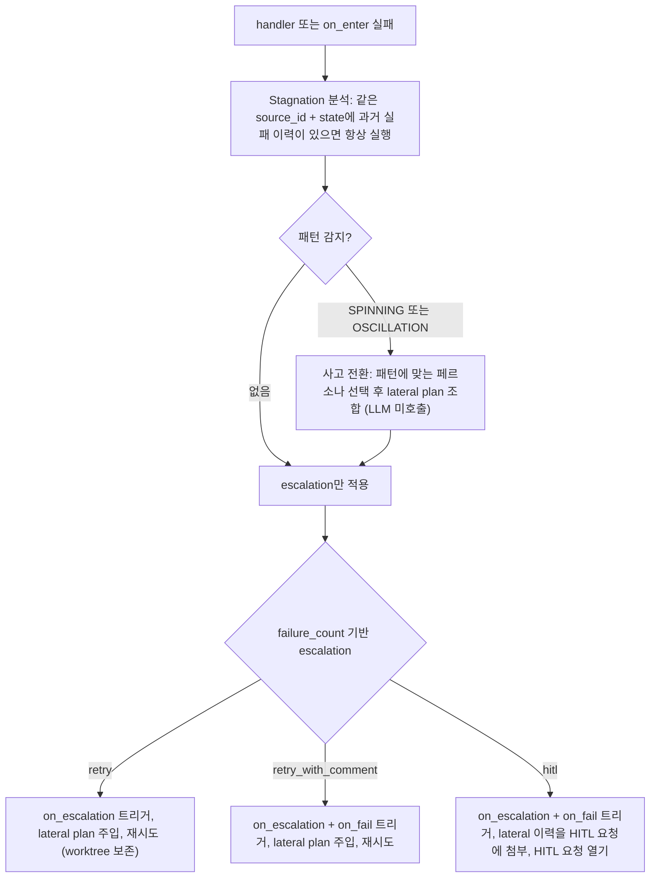
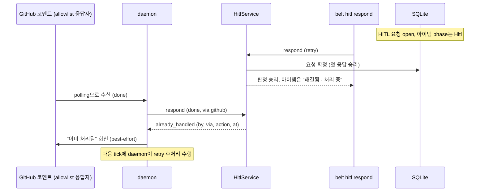
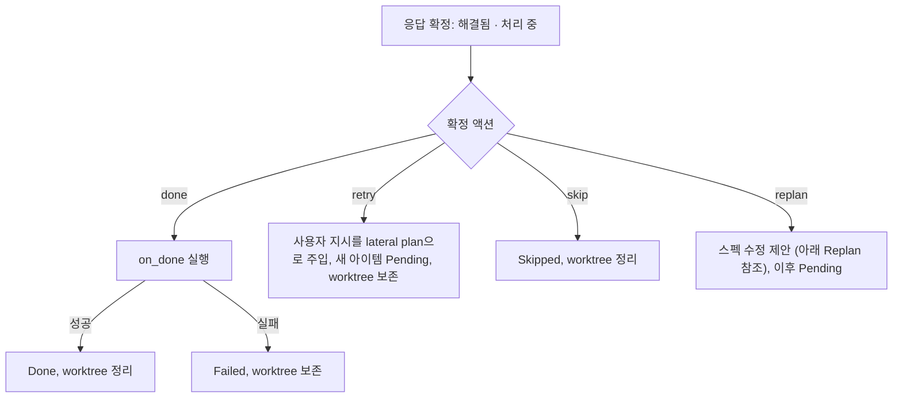
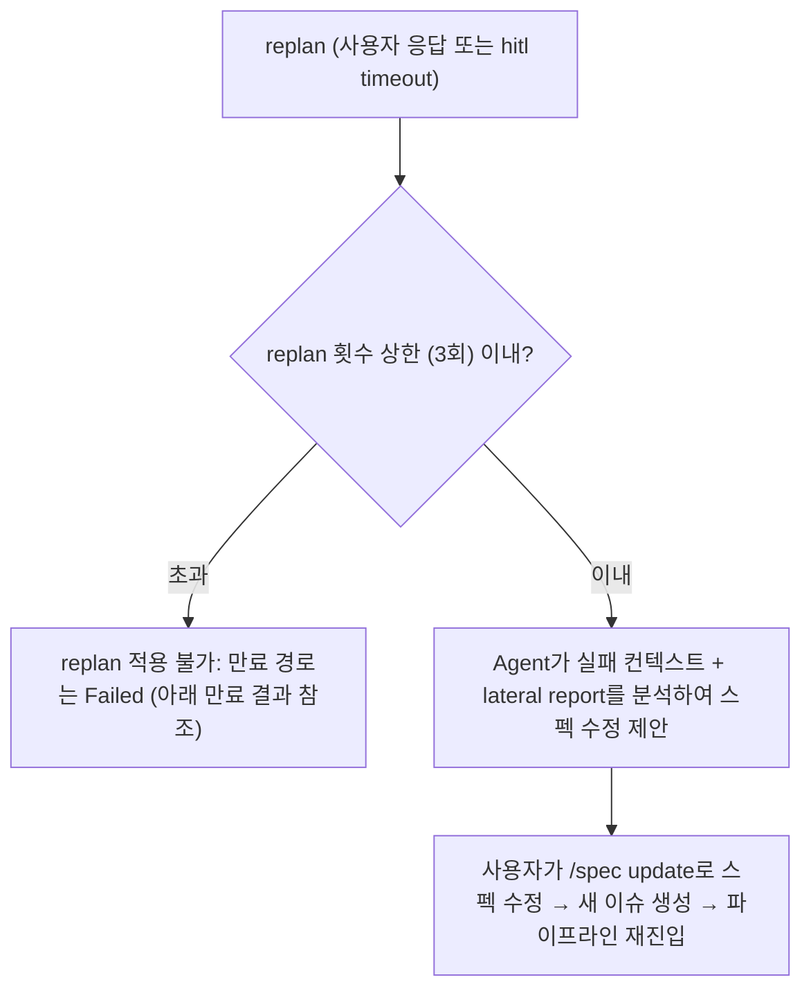
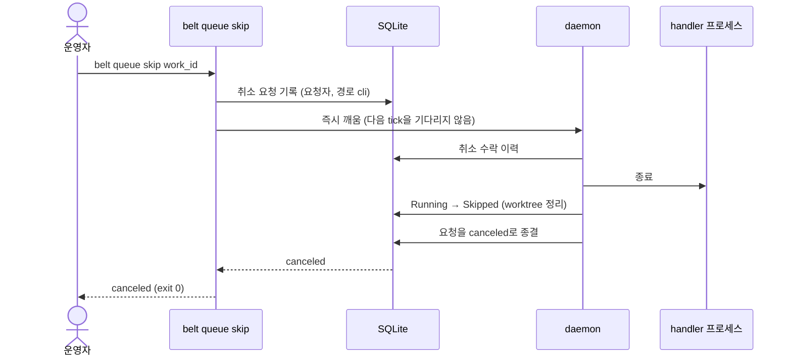
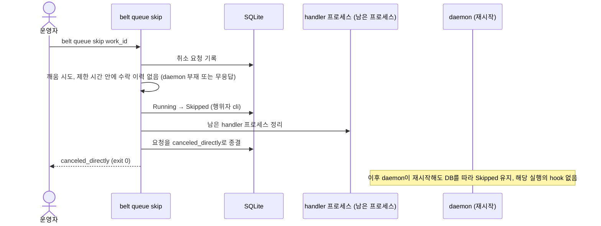
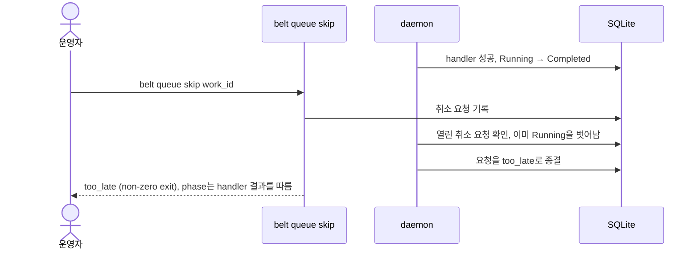
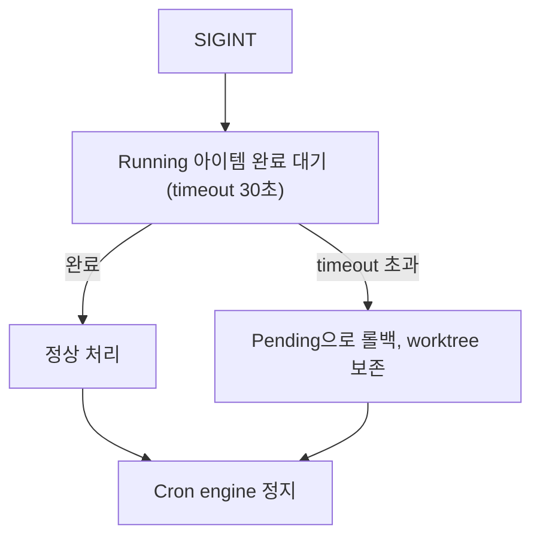

# Flow 4: 실패 복구와 HITL

> handler 실패 시 stagnation 분석 + lateral thinking으로 사고를 전환하여 재시도하고, evaluate가 HITL로 분류하면 사람의 판단을 요청한다. 사람은 어느 경로로 응답하든 첫 확정 응답만 반영되고, 실행 중인 아이템은 언제든 취소할 수 있다.

---

## 실패 경로



- 패턴은 같은 실패 반복(SPINNING)과 두 실패를 교대 반복(OSCILLATION)이다. 비교는 완전 일치·토큰 중복도·압축 유사도의 가중 합성 기준이다. 상세: [Stagnation Detection](../concerns/stagnation.md)
- 사람의 응답이 필요하면 HITL로 넘어가고, 응답은 done / retry / skip / replan 중 하나다. 응답이 없으면 timeout이 terminal 액션(skip 또는 replan)을 적용한다.

> `retry`만 on_fail을 트리거하지 않는다. "조용한 재시도"로 외부 시스템에 노이즈를 주지 않는다. Daemon은 hook을 트리거만 하고, 실행 책임은 workspace의 LifecycleHook 구현이 가진다.

---

## Lateral Plan 주입 예시

retry로 생성된 새 아이템이 다시 Running에 진입하면, lateral plan이 handler prompt에 추가 컨텍스트로 주입된다. daemon은 선택된 페르소나의 고정 directive 문구로 아래 형태의 텍스트를 조립해 handler prompt 뒤에 붙인다(LLM을 호출해 맞춤 분석을 생성하지 않는다).

```
원래 handler prompt:
  "이슈를 구현해줘"

lateral retry 시 합성:
  "이슈를 구현해줘

   ## Lateral Plan
   Stagnation Analysis (attempt 2)
   Pattern: spinning | Persona: hacker

   Take the most pragmatic shortcut. Hardcode, monkey-patch, or use an
   escape hatch — make it work first, clean up later.

   Warning: Previous approaches produced similar failures. You MUST try
   a fundamentally different approach."
```

---

## Escalation 정책 (workspace yaml 소유)

```yaml
sources:
  github:
    escalation:
      1: retry
      2: retry_with_comment
      3: hitl
      terminal: skip          # hitl timeout 시 (skip 또는 replan)

stagnation:
  enabled: true
  lateral:
    enabled: true
```

- escalation 레벨은 failure_count 기반이다
- stagnation + lateral은 패턴이 감지된 retry에 한해 lateral plan을 얹는 내장 레이어다
- `stagnation.enabled: false`이면 stagnation 분석 자체를 건너뛰고 failure_count 기반 escalation만 적용된다

### on_fail script 예시

```yaml
on_fail:
  - script: |
      CTX=$(belt context $WORK_ID --json)
      ISSUE=$(echo $CTX | jq -r '.source_data.issue.number // .issue.number')
      REPO=$(echo $CTX | jq -r '.source.url')
      FAILURES=$(echo $CTX | jq '[.history[] | select(.status=="failed")] | length')
      gh issue comment $ISSUE --body "실패 (시도 횟수: $FAILURES)" -R $REPO
```

> on_fail script는 사용자가 정의하는 알림 경로다. 사람 대상 알림과 HITL 응답 수신은 NotificationChannel이 맡는다. 상세: [NotificationChannel](../concerns/notification.md)

---

## HITL (Human-in-the-Loop)

### 생성 경로

| 경로 | 트리거 |
|------|--------|
| Escalation | handler/on_enter 실패 → failure_count=3 → hitl |
| evaluate | handler 성공 → evaluate가 "사람이 봐야 한다" 판단 |
| 스펙 완료 | 모든 linked issues Done → 최종 확인 요청 |
| 충돌 | spec 충돌 감지 |

### HITL 진입 — 알림은 channel과 무관하다

HITL 요청이 열리면 다음이 일어난다.

| 대상 | 동작 |
|------|------|
| Dashboard (TUI/CLI) | 설정과 무관하게 **항상** 요청을 표시하고 응답을 받는다 |
| origin channel, 추가 channel | `notifications` 설정에 따라 HITL 요청 메시지를 보낸다. 설정이 없으면 origin에만 보낸다 |
| 출처 시스템 | LifecycleHook이 상태를 반영한다 (예: GitHub는 `belt:needs-human` 라벨 추가) |

- 전달에 실패하면 daemon이 다음 tick에 다시 보내고, 상한 횟수를 넘으면 channel별 전달 상태를 `failed`로 두고 dashboard에 표시한다. 중복 메시지는 허용된다.
- daemon이 꺼져 있는 동안 열린 요청의 알림은 재시작 후에 보낸다. 상세: [NotificationChannel](../concerns/notification.md#발송)

#### LLM이 질문을 구성한다

HITL에 진입하면 LLM이 상황(lateral report, 이력, HITL 경로)을 분석하여 **맥락에 맞는 질문과 추천 선택지**를 구성한다. 고정된 4개 선택지가 아니라, 상황별로 다른 제안이 나온다.

##### 예시: Escalation HITL (handler 3회 실패)

```
"JWT middleware 구현이 3회 실패했습니다.

 시도 이력:
   1회: compile error (Session not found)
   2회: tower-sessions 시도 → 다른 에러 발생
   3회: trait object 시도 → 컴파일 성공, 테스트 실패

 추천:
   1. axum-sessions crate로 전환하여 재시도
   2. Session 관련 코드를 별도 이슈로 분리
   3. 현재 결과로 PR 생성 (부분 완료)
   4. 이 이슈 건너뛰기
   또는 직접 지시를 입력하세요"
```

##### 예시: Evaluate HITL (완료 여부 불확실)

```
"JWT middleware 구현 결과를 검토했으나 확신이 부족합니다.

 현재 상태:
   - 컴파일 성공, 테스트 18/20 통과
   - 실패 테스트: session expiry, concurrent access

 추천:
   1. 실패 테스트 2건을 수정하여 재시도
   2. 현재 상태로 PR 생성 (실패 테스트는 후속 이슈로)
   3. 전체 접근 방식을 재검토
   또는 직접 지시를 입력하세요"
```

##### 예시: Spec 완료 HITL

```
"스펙 'JWT 인증 시스템'의 모든 이슈가 완료되었습니다.

 완료된 이슈: #42 middleware, #43 token 발급, #44 refresh
 gap-detection: 추가 gap 미발견
 테스트 커버리지: 87%

 추천:
   1. 스펙 완료 승인
   2. 추가 검증 항목 지정하여 재검토
   또는 직접 지시를 입력하세요"
```

### 응답 처리

#### 응답 경로

| 경로 | 방법 | 비고 |
|------|------|------|
| TUI | HITL 오버레이의 액션 키 | allowlist 없음 |
| CLI | `belt hitl respond <hitl_id\|work_id> --action <done\|retry\|skip\|replan>` | allowlist 없음. daemon이 꺼져 있어도 확정된다 |
| `/agent` 세션 | 자연어 | |
| origin / 추가 channel | 응답 메시지 | `respond.allow`에 있는 응답자만. 비어 있으면 그 channel은 발송 전용 |

번호 선택 또는 자연어로 응답한다. 자연어 응답은 LLM이 **액션을 제안하고, 응답자가 확인한 뒤에만 확정**한다. 확인 대기 중에는 경합에 참여하지 않으므로 다른 응답이 먼저 확정될 수 있다.

#### 첫 확정 응답이 이긴다

> 응답이 어느 경로에서 오든 같은 경합에 참여한다. 먼저 확정된 응답만 반영되고, 이후 응답은 `already_handled`로 거절된다.



- 같은 응답을 polling이 다시 읽어도 한 번만 처리된다. 승자 응답을 재polling해도 거절이 아니다.
- allowlist 밖 응답은 `unauthorized`로 이력에만 기록하고 회신하지 않는다.
- 자연어 확인이 늦어 제안이 사라졌으면 `proposal_expired`, 다른 응답이 먼저 이겼으면 `already_handled`로 회신한다.
- 같은 아이템이 HITL에 다시 들어가면 새 요청이 생기고, 이전 요청에 대한 늦은 응답은 새 요청을 닫지 않는다.

#### 해결됨 · 처리 중 → 결과 phase

응답이 확정되면 아이템은 즉시 바뀌지 않는다. phase는 Hitl 그대로이고 화면에는 **"해결됨 · 처리 중"**으로 보인다. 결과 phase는 daemon 후처리가 정한다.



- done의 on_done이 실패하면 Failed다. 그 밖의 후처리 단계가 실패해도 결과 전이에는 도달하고, dashboard에 경고가 남는다.
- 결과 전이가 계속 실패하면 연속 N회 뒤 Failed로 끝나 아이템이 영구히 처리 중으로 남지 않는다. 그동안 dashboard에 "후처리 재시도 중"이 표시된다.
- 출처 시스템의 `belt:needs-human` 같은 표식은 응답 경로와 무관하게 후처리에서 제거된다.
- daemon이 꺼져 있는 동안 CLI로 응답해도 확정된다. 재시작 후 후처리가 이어진다.

> **처리 중에는 다른 변경이 거절된다.** "해결됨 · 처리 중"인 아이템에 `belt queue skip` 등을 요청하면 `busy`로 거절된다. 반대로 open 상태의 HITL 아이템에 `belt queue skip` / `belt queue done`을 요청하면 직접 상태가 바뀌지 않고 HITL 응답으로 전환되어 위 경합에 참여한다.

### Replan



### 타임아웃

기본 24시간이 지나면 hitl-timeout cron(5분 주기)이 만료를 시도한다. **만료도 사람의 응답과 같은 경합에 참여한다.** 응답이 먼저 확정되면 만료 시도는 무시되고, 만료가 먼저 확정되면 이후 사람의 응답은 `already_handled`다.

만료가 확정되면 아이템은 "해결됨 · 처리 중"이 되고 daemon이 `escalation.terminal` 설정을 후처리로 적용한다.

| 만료 결과 | 조건 | 최종 phase | worktree |
|-----------|------|-----------|----------|
| terminal `skip` | 기본 | Skipped | 정리 |
| terminal `replan` | replan 상한 이내 | Pending (replan 처리) | 정리 |
| 기본값 | replan 상한 초과 또는 terminal 설정을 해석할 수 없음 | Failed | 정리 |

> 만료 결과의 상세는 [LifecycleHook](../concerns/lifecycle-hook.md#on_hitl_resolved), 경합 규칙은 [Cron 엔진](../concerns/cron-engine.md)을 따른다.

---

## 실행 중 취소

handler가 폭주하거나 더 이상 필요 없어진 실행은 `belt queue skip <work_id>` (TUI는 취소 키)로 취소한다. 새 `cancel` 명령은 없고, `skip`의 의미가 아이템 상태에 따라 달라진다. 상세: [CLI 레퍼런스](../concerns/cli-reference.md#belt-queue-skip), [QueuePhase 상태 머신](../concerns/queue-state-machine.md#실행-중-취소)

> 취소는 상태를 바꾸라는 요청이 아니라 **취소 요청**이다. 처리 중인 아이템의 소유자는 daemon이므로, daemon이 살아 있으면 요청만 남기고 daemon이 handler를 종료한 뒤 Skipped로 바꾼다. 취소된 실행의 on_done / on_fail / on_escalation과 escalation은 실행되지 않고, failure_count에도 영향이 없다.

### 시나리오 1: 폭주 handler 취소 (daemon 동작 중)



### 시나리오 2: daemon이 멈춘 상태에서 취소



### 시나리오 3: handler가 막 끝난 직후 취소



### 취소 대상별 동작 요약

| 아이템 상태 | `belt queue skip` 결과 |
|-------------|----------------------|
| Running | 취소 (`canceled` / `canceled_directly` / `too_late`) |
| Pending, Ready, Failed | Skipped |
| Hitl (open) | HITL 응답 skip으로 전환, 첫 응답 승리 경합 |
| Hitl (해결됨 · 처리 중) | `busy` |

---

## Graceful Shutdown



---

## 검증 시나리오

| 시나리오 | 입력 | 기대 최종 phase | 기대 side effect |
|---------|------|----------------|-----------------|
| 1회 실패 | handler 실패 (failure_count=1) | 새 아이템 Pending | retry, on_fail 미실행, lateral plan 주입 |
| 2회 실패 | handler 실패 (failure_count=2) | 새 아이템 Pending | retry_with_comment, on_fail 실행, lateral plan 주입 |
| 3회 실패 | handler 실패 (failure_count=3) | HITL | hitl, on_fail 실행, lateral report 첨부 |
| SPINNING 감지 | 동일 error 3회 연속 (유사도 ≥ 0.9, 인접 쌍 일치 2회) | escalation에 따름 | 페르소나 directive가 담긴 lateral plan 주입 |
| OSCILLATION 감지 | 두 error가 교대로 2회 이상 반복 (유사도 ≥ 0.9) | escalation에 따름 | 페르소나 directive가 담긴 lateral plan 주입 |
| HITL done 응답 | 사용자 done 선택 | "해결됨 · 처리 중" 뒤 Done | on_done 성공 후 Done, worktree 정리 |
| HITL retry 응답 | 사용자 retry + 지시 | 새 아이템 Pending | 사용자 지시를 lateral plan으로 주입, worktree 보존 |
| HITL skip 응답 | 사용자 skip 선택 | Skipped (terminal) | worktree 정리 |
| HITL replan 응답 | 사용자 replan 선택 | Pending (replan 처리) | 스펙 수정 제안 |
| HITL timeout | 24시간 무응답 | terminal 액션 적용 | skip→Skipped, replan→Pending, 상한 초과·해석 불가→Failed |
| GitHub·CLI 동시 응답 | 두 경로가 거의 동시에 응답 | 먼저 확정된 응답의 결과 | 하나만 승리, 나머지는 `already_handled`, GitHub에는 "이미 처리됨" 회신, DB 에러 없음 |
| allowlist 밖 응답 | 목록에 없는 응답자가 channel에서 응답 | 변화 없음 | `unauthorized`로 기록, 회신 없음 |
| 자연어 확인 대기 중 CLI 응답 | 제안 확인 전에 CLI가 먼저 응답 | CLI 응답의 결과 | 이후 확인은 `already_handled`로 회신 |
| daemon 정지 중 CLI 응답 | daemon 정지 상태에서 `belt hitl respond` | 재시작 후 후처리 결과 | 응답은 즉시 확정, 후처리는 재시작 후 수행, 요청 알림은 재시작 후 전달 |
| HITL done 후 on_done 실패 | HITL done 응답 + on_done script 실패 | Failed | worktree 보존, on_fail은 실행하지 않음 |
| 후처리 중 skip | "해결됨 · 처리 중" 아이템에 `belt queue skip` | 변화 없음 | `busy`, 거절 이력 기록 |
| 해결 후 라벨 제거 | 어느 경로로든 HITL 해결 | 후처리 결과 | 출처 시스템의 `belt:needs-human` 라벨 제거 |
| open HITL에 skip | open 상태 아이템에 `belt queue skip` | 응답 skip의 결과 | 직접 전이 없이 HITL 응답 skip으로 경합, 이미 해결됐으면 `already_handled` |
| 후처리 결과 전이 반복 실패 | 결과 전이가 연속 N회 실패 | Failed | dashboard에 경고, 아이템이 영구히 `busy`로 남지 않음 |
| 폭주 handler 취소 | Running 아이템에 `belt queue skip` | Skipped | handler 즉시 종료, 그 실행의 on_fail·escalation 없음, `canceled` |
| daemon 정지 중 취소 | daemon 정지 상태에서 Running 아이템에 `belt queue skip` | Skipped (재시작 후에도) | 제한 시간 뒤 CLI가 직접 Skipped로 변경하고 handler 프로세스 정리, `canceled_directly` |
| handler 직후 취소 | handler가 끝난 직후 `belt queue skip` | handler 결과를 따름 | `too_late`, phase 불변 |
| graceful shutdown | SIGINT + Running 아이템 | 완료 시 정상 처리, 30초 초과 시 Pending | worktree 보존, cron engine 정지 |
| on_enter 실패 | on_enter hook 에러 | escalation 경로 진입 | handler 건너뜀, failure_count 포함 |

---

### 관련 문서

- [Stagnation Detection](../concerns/stagnation.md) — 패턴 탐지 + Lateral Thinking
- [Daemon](../concerns/daemon.md) — 실패 경로, 취소 처리, HITL 후처리
- [QueuePhase 상태 머신](../concerns/queue-state-machine.md) — 처리 중 잠금, 실행 중 취소, Hitl 출구
- [NotificationChannel](../concerns/notification.md) — HITL 요청 전달, 응답 수신, 첫 응답 승리
- [LifecycleHook](../concerns/lifecycle-hook.md) — 상태 전이 반응, 후처리 hook
- [Evaluator](../concerns/evaluator.md) — Progressive Evaluation Pipeline
- [CLI 레퍼런스](../concerns/cli-reference.md) — `belt hitl respond`, `belt queue skip`
- [Agent](../concerns/agent-workspace.md) — 대화형 에이전트 (HITL 질문 구성)
- [이슈 파이프라인](./03-issue-pipeline.md) — 실패가 발생하는 실행 흐름
- [Data Model](../concerns/data-model.md) — HITL 요청, 취소 요청
