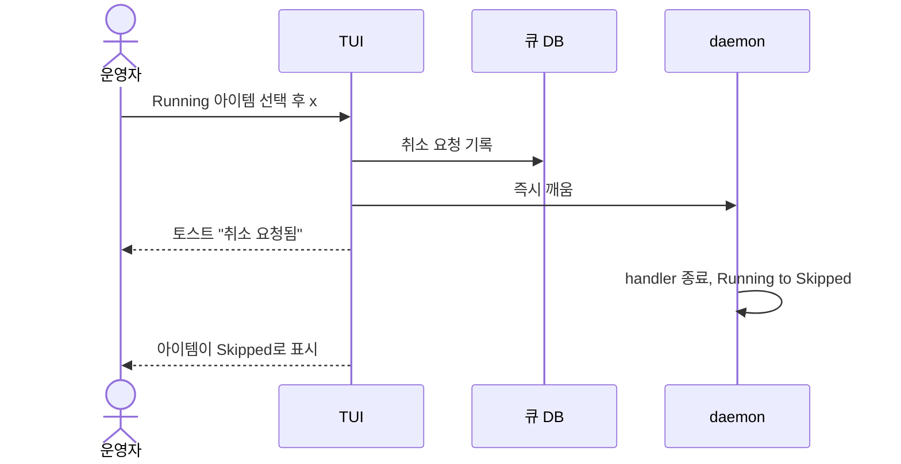

# Flow 5: 모니터링 — 칸반 보드 + 시각화

> 사용자가 다수 workspace의 큐 전체 진행 상황을 TUI, CLI, /agent 세션에서 일관되게 확인한다.

---

## 1. 인터페이스 3개 레이어

| 레이어 | 진입 | 특징 |
|--------|------|------|
| TUI Dashboard | `belt dashboard` | ratatui, 실시간 갱신, 키보드 네비게이션 |
| CLI 출력 | `belt status --format rich` | 정적 스냅샷, 코어 CLI |
| Agent 세션 | `belt agent` → "보드 보여줘" | 자연어, 읽기 전용 조회의 주 인터페이스 |

> **Phase 구분**: `status` 등 코어 CLI는 Phase 1로 직접 구현. `board`, `decisions`, `logs` 등 읽기 전용 조회는 `/agent`가 흡수 (Phase 2, 필요 시 독립 CLI 추가).

---

## 2. TUI Dashboard

### AllWorkspaces 뷰 (기본)

```
┌─ Workspaces ─────┐┌─ Active Items ─────────┐┌─ Runtime ─────────────┐
│ ● auth-project    ││ #42 Completed (eval)   ││ claude/sonnet  12 OK  │
│ ○ backend-tasks   ││ #44 Running            ││ Tokens: 45.2K / 1h   │
│                   ││                        ││ Avg: 4m 32s          │
├───────────────────┤├────────────────────────┤├───────────────────────┤
│ Logs              ││ DataSource             ││ Scripts (1h)          │
│ 14:30 done #42    ││ github ● connected     ││ on_done     8 ok      │
│ 14:25 eval ..     ││   scan: 30s ago        ││ on_fail     1 ok      │
│ 14:20 skip        ││                        ││ evaluate   12 ok      │
│ 14:15 ⚠ fail #39 ││                        ││ ⚠ failed    1        │
└───────────────────┘└────────────────────────┘└───────────────────────┘
```

### PerWorkspace 뷰 (Tab 전환)

```
┌─ Board ──────────────────────────────┐┌─ Active ──────────────┐
│ auth-v2  ████████░░ 60% (3/5)        ││ #44 Running           │
│   ✅ #42 JWT middleware               ││   claude/sonnet        │
│   ✅ #43 Token API                    ││   3m elapsed           │
│   🔄 #44 Session adapter (running)   ││                        │
│   ⏳ #45 Error handling (dep: #44)   ││ #42 Completed (eval)  │
│   ⚠ #39 Auth refactor (failed)      ││   evaluate 대기        │
│   ⏳ #46 Missing tests               ││                        │
├──────────────────────────────────────┤├────────────────────────┤
│ Orphan: 0 | HITL: 1 | Stag: 0       ││ Logs                   │
│ Kanban: 0P | 0Re | 1Ru | 1C | 2D   ││ ...                    │
└──────────────────────────────────────┘└────────────────────────┘
```

> Stagnation 카운터는 현재 stagnation이 감지된 아이템 수를 표시한다.
> **Kanban 약어**: P=Pending, Re=Ready, Ru=Running, C=Completed, D=Done, H=HITL, S=Skipped, F=Failed

### 처리 중 표시

daemon이 처리 중인 아이템은 처리 종류를 함께 보여준다. 처리 중인 아이템에 대한 외부 변경은 거절된다.

| 처리 종류 | 표시 | 의미 |
|-----------|------|------|
| handler | `Running · handler 실행 중` | handler가 실행 중이다. 취소 키로 취소를 요청할 수 있다 |
| 후처리 | `HITL · 해결됨 · 처리 중` | HITL 응답이 확정되어 daemon이 후처리 중이다. phase는 Hitl 그대로다 |

> 처리 중인 아이템에 변경(skip, done 등)을 요청하면 `busy` 토스트가 표시되고 phase는 바뀌지 않는다. 취소 키만 handler 처리 중인 아이템에서 받아들여진다. 후처리 중에는 취소도 `busy`다.

### 전이 타임라인 (ItemDetail 오버레이, Enter)

```
┌─ #42 JWT middleware ─────────────────────────┐
│ Phase: Done | Runtime: claude/sonnet         │
│                                               │
│ Timeline:                                     │
│  원본  ○ Skipped (파생됨 → auth:implement:2) │
│  14:00 ○ Pending  ← github 수집              │
│  14:00 ○ Ready    ← auto                     │
│  14:01 ○ Running                              │
│         ├ worktree: /tmp/belt/auth-42      │
│         └ handler: claude/sonnet (1.2K, 6m)  │
│  14:07 ○ Completed ← handlers 성공           │
│  14:07 ○ evaluate  → Done                    │
│  14:07 ○ on_done script (exit 0, 2s)         │
│  14:07 ● Done                                │
│         └ worktree 정리                       │
└───────────────────────────────────────────────┘
```

> 같은 이력은 `belt queue show <work_id>`로도 볼 수 있다. 거절 기록과 파생 원본이 함께 나온다.

### 실패 + Lateral Thinking 타임라인

```
┌─ #39 Auth refactor ──────────────────────────┐
│ Phase: HITL | Runtime: claude/sonnet         │
│ Stagnation: SPINNING (score: 0.95)           │
│                                               │
│ Timeline:                                     │
│  13:00 ○ Pending  ← github 수집              │
│  13:00 ○ Running  (attempt 1)                │
│         └ handler: compile error              │
│  13:08 ⟳ SPINNING detected (score: 0.95)     │
│         └ lateral: HACKER 페르소나 directive  │
│  13:08 ○ Running  (attempt 2, lateral)       │
│         └ handler: 다른 에러 (progress!)      │
│  13:18 ⟳ retry_with_comment (2/3)            │
│         └ lateral: CONTRARIAN 페르소나 directive │
│  13:18 ○ Running  (attempt 3, lateral)       │
│         └ handler: 컴파일 성공, 테스트 실패    │
│  13:28 ● HITL     (3/3)                      │
│         └ lateral 이력 첨부 (HITL 메모)       │
│         └ 2회 사고 전환 후에도 미해결          │
│                                               │
│ Actions: [d] done  [r] retry  [s] skip       │
│          [p] replan                           │
└───────────────────────────────────────────────┘
```

> 오버레이에서 액션 키로 직접 응답할 수 있다. 응답은 외부 channel 응답과 같은 경합에 참여하고, 먼저 확정된 응답만 반영된다. 이미 다른 응답이 확정됐으면 `already_handled` 토스트가 표시된다. 응답 직후 아이템은 `해결됨 · 처리 중`으로 보인다.

### 키보드

| 키 | 동작 |
|----|------|
| j/k, ↑/↓ | 아이템 이동 |
| ←/→ | workspace 전환 |
| Tab | AllWorkspaces ↔ PerWorkspace |
| Enter | 상세 / 전이 타임라인 |
| h | HITL 오버레이 (오버레이 안에서 응답 가능) |
| d | 판단 이력 |
| R | 새로고침 |
| x | 선택한 실행 중 아이템 취소 요청 |

HITL 오버레이 안에서는 다음 키가 응답 액션이다.

| 키 | 동작 |
|----|------|
| d | done 응답 |
| r | retry 응답 (지시 입력) |
| s | skip 응답 |
| p | replan 응답 |
| Esc | 오버레이 닫기 |

### 실행 중 아이템 취소

Running 아이템을 선택하고 취소 키(`x`)를 누르면 `belt queue skip`과 같은 취소 요청이 접수된다.



| 상황 | TUI 표시 |
|------|----------|
| daemon 동작 중 | "취소 요청됨" 뒤 Skipped |
| daemon 부재 또는 무응답 | 제한 시간 뒤 직접 Skipped 처리, 남은 handler 정리 |
| handler가 이미 끝남 | `too_late` 토스트, phase는 handler 결과를 따름 |
| HITL 후처리 중 | `busy` 토스트 |

---

## 3. CLI 출력

### `--format` 옵션 (CLI 공통)

| 값 | 용도 |
|---|------|
| `text` | 기본 텍스트 (기존 호환) |
| `json` | 구조화된 JSON (Agent 파싱용) |
| `rich` | 색상 + 박스 + 진행률 바 (터미널용) |

모든 CLI 서브커맨드(status, board, queue list 등)에 적용.

### `belt status --format rich`

```
● belt daemon (uptime 2h 15m)

Workspaces:
  auth-project  ● active   queue: 1P 1R 1C 2D 1F   stag: 0
  backend-tasks ● active   queue: 0P 0R 0C 5D       stag: 0

Runtime: claude/sonnet (45.2K tokens/1h)
HITL: 1 pending ⚠
Failed: 1 ⚠
Stagnation: 0
Next evaluate: 25s
```

---

## 4. TUI 추가 패널

```
┌─ Runtime ──────────────────┐  ┌─ DataSource ────────────────┐
│ claude/sonnet  12 runs  OK │  │ github  ● connected         │
│ claude/opus     2 runs  OK │  │   last scan: 30s ago        │
│ Tokens: 45.2K in / 12.1K  │  │                             │
│ Avg duration: 4m 32s      │  │                             │
└────────────────────────────┘  └─────────────────────────────┘

┌─ Scripts (1h) ───────────────────┐
│ on_done         8 ok             │
│ on_fail         1 ok             │
│ on_enter        3 ok             │
│ evaluate       12 ok  1 hitl     │
│ ⚠ on_done       1 failed        │
│ stagnation      2 detected       │
│ lateral         2 plans          │
└──────────────────────────────────┘

┌─ HITL 후처리 ────────────────────┐  ┌─ 알림 ───────────────────────────┐
│ 대기 1 · 처리 중 1               │  │ ⚠ HITL 요청 전달 실패 1          │
│ ⚠ #39 후처리 재시도 중 (2회)     │  │   team-chat · 시도 3회 · failed   │
└──────────────────────────────────┘  │ ⚠ 진행 알림 실패 2 (1h)          │
                                      └──────────────────────────────────┘
```

| 패널 | 내용 |
|------|------|
| HITL 후처리 | 해결됨 · 후처리 대기 / 처리 중 건수, 후처리 재시도 중인 아이템과 반복 실패 경고 |
| 전달 실패 | 상한 횟수를 넘겨 `failed`가 된 HITL 요청 전달 (channel별) |
| 알림 실패 | 진행 알림과 회신 발송 실패. 알림 실패는 아이템 phase에 영향을 주지 않는다 |

---

## 5. HITL 알림

HITL 요청이 열리면 사용자에게 다음 경로로 알린다. 응답은 어느 경로에서 오든 같은 경합에 참여하고 첫 확정 응답만 반영된다. 상세: [NotificationChannel](../concerns/notification.md)

| 경로 | 방법 | 응답 |
|------|------|------|
| TUI Dashboard | 설정과 무관하게 **항상** 표시. HITL 카운터 실시간 갱신 (`HITL: 1 pending ⚠`) | HITL 오버레이 액션 키 |
| CLI | `belt status`에 경고 표시, `belt hitl list`로 조회, `belt hitl show`로 해결·후처리·channel별 전달 상태 확인 | `belt hitl respond` |
| /agent 세션 | 진입 시 HITL 대기 목록 자동 표시 | 자연어 (제안 → 확인 후 확정) |
| origin channel | 출처 시스템에 요청 메시지 (예: GitHub 코멘트). 설정이 없으면 기본 대상 | `respond.allow`에 있는 응답자만 |
| 추가 channel | `notifications.channels`에 설정한 channel에 이벤트 필터대로 발송 | channel별 `respond.allow` |
| on_fail script | escalation=hitl 시 실행되는 사용자 정의 script. 사용자가 정한 방식으로 외부에 알릴 수 있다 | 없음 |

> daemon이 꺼져 있는 동안 일어난 전이의 진행 알림은 나중에도 보내지 않는다. HITL 요청 알림은 재시작 후 보낸다.

> Stagnation으로 HITL에 진입한 경우, lateral 이력(시도한 페르소나, 감지된 패턴, confidence)이 HITL 요청의 메모에 표시되어 사용자가 지금까지의 접근 전환 이력을 참고할 수 있다.

---

## 6. 데이터 요구사항

모든 전이 이벤트와 토큰 사용량은 DB에 기록된다. 스키마 상세: [Data Model](../concerns/data-model.md)

---

## 검증 시나리오

| 시나리오 | 입력 | 기대 동작 |
|---------|------|----------|
| TUI 실시간 갱신 | 아이템 상태 전이 발생 | phase별 카운터 즉시 갱신 |
| HITL 알림 표시 | HITL 요청 생성 | TUI/CLI/Agent 모두에서 경고 표시, 설정된 channel에 요청 전송 |
| TUI HITL 응답 | 오버레이에서 액션 키 | 응답 확정, 아이템은 `해결됨 · 처리 중`, 이후 daemon 후처리 결과 phase |
| 먼저 확정된 응답이 있음 | TUI 응답 시도 | `already_handled` 토스트 |
| 처리 중 표시 | handler 실행 중 또는 HITL 후처리 중 | 처리 종류(handler / 후처리)가 아이템에 표시됨 |
| 처리 중 변경 거절 | 처리 중 아이템에 skip 등 변경 | `busy` 토스트, phase 불변 |
| 실행 중 아이템 취소 (TUI 키) | Running 아이템에서 `x` | "취소 요청됨" 토스트 후 Skipped, 그 실행의 on_fail 없음 |
| daemon 부재 중 취소 | daemon 정지 상태에서 `x` | 제한 시간 뒤 직접 Skipped, 남은 handler 정리 |
| 후처리 중 취소 | 해결됨 · 처리 중 아이템에서 `x` | `busy` 토스트 |
| 후처리·전달·알림 실패 패널 | 후처리 재시도, 전달 실패, 알림 실패 발생 | 해당 패널에 경고 표시 |
| stagnation 카운터 | SPINNING 감지 | TUI에 stagnation 카운터 증가 |
| token 집계 | LLM 호출 완료 | belt status에 런타임별 토큰 사용량 표시 |
| --format json | `belt status --format json` | 구조화된 JSON 출력 (Agent 파싱 가능) |
| 전이 타임라인 | TUI에서 아이템 Enter | phase 전이 이력 + 시간 + 실행 정보 표시 |

---

### 관련 문서

- [DESIGN](../DESIGN.md) — 전체 구조와 상태 흐름
- [Stagnation Detection](../concerns/stagnation.md) — 반복 패턴 감지 시각화
- [실패 복구와 HITL](./04-failure-and-hitl.md) — HITL 응답, 실행 중 취소
- [NotificationChannel](../concerns/notification.md) — 알림 channel과 응답 수신
- [QueuePhase 상태 머신](../concerns/queue-state-machine.md) — 처리 중 잠금과 취소
- [CLI 레퍼런스](../concerns/cli-reference.md) — 전체 커맨드 트리
